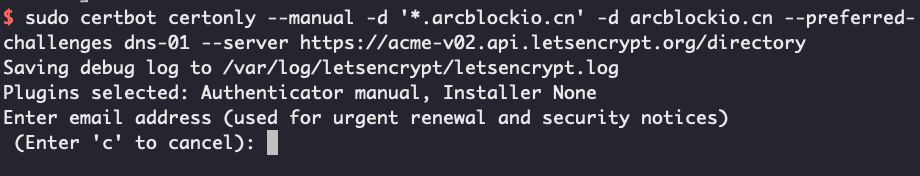
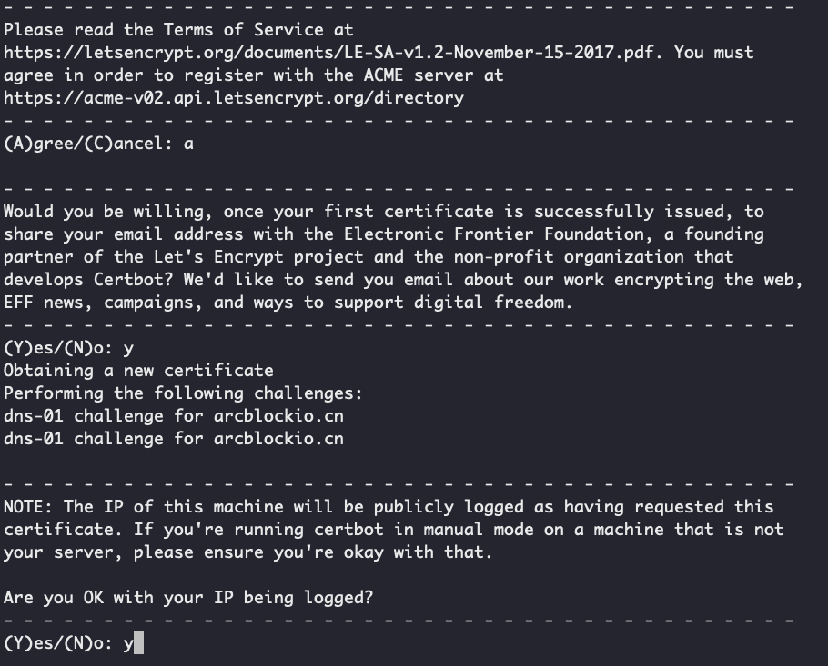
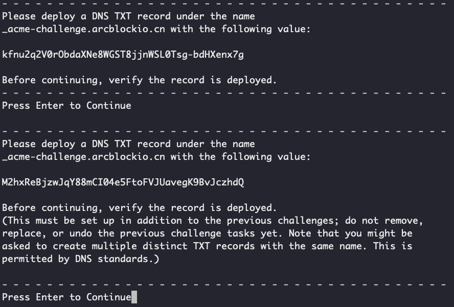
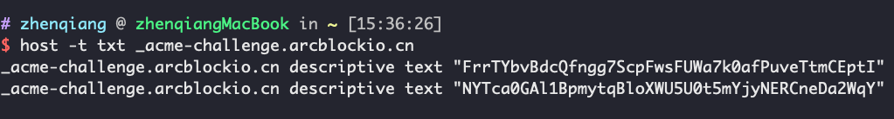

If you need to configure a subdomain for each Blocklet, and they are all under the same second-level domain name. Then you can generate wildcard certificates for these subdomains. For example, if the second-level domain names of our Blocklets are all `arcblockio.cn`, then we can generate a certificate with the domain name `*.arcblockio.cn`.

This article describes how to use [Certbot](https://certbot.eff.org/) and Alibaba Cloud DNS to generate a [Let’s Encrypt’s](https://letsencrypt.org/) wildcard certificate in CentOS.

## Note

`*.arcblockio.cn` will only match domain names like this:

- `a.arcblockio.cn`
- `b.arcblockio.cn`

Will not match domain names like these:

- `c.a.arcblockio.cn`
- `d.a.arcblockio.cn`

## Install Certbot

Because there is no Alibaba Cloud DNS in the official plugin list of Certbot, only certbot is installed here, and DNS needs to be configured manually.

```bash
sudo yum install certbot
```

Installation methods for other platforms can be found on [Official Website](https://certbot.eff.org/).

## Manually generate a certificate

We choose to generate a separate certificate instead of directly binding to the web service, so we need to specify `certonly` and `--manual` on the command line:

### 1. Execute the command

```bash
sudo certbot certonly --manual -d'*.arcblockio.cn' -d arcblockio.cn --preferred-challenges dns-01 --server https://acme-v02.api.letsencrypt.org/directory
```

- `-d`: Two values ​​are specified here: `*.arcblockio.cn, arcblockio.cn`, if only `*.arcblockio.cn` is set, then the domain name `www.arcblockio.cn` will not take effect
- `--preferred-challenges`: process domain name authentication using dns
- `--server`: Let's Encrypt's production server is used by default. If it is a test and there are more certificates generated, you can use this parameter to specify the test server: `--server https://acme-staging-v02 .api.letsencrypt.org/directory`

### 2. Enter the email address to receive updates and security notifications



### 3. Agree to the agreement

Need to agree to some agreements:



### 4. Verify domain name

Certbot will ask to configure two TXT records on the DNS server:



You can use the `host` command to verify that the record is valid:



After the DNS record takes effect, press the `Confirm` button to confirm the generation of the certificate.

_Alibaba Cloud DNS resolution cannot add multiple values ​​to a record, so you can only add two identical TXT records (\_acme-challenge.arcblockio.cn)_

### 5. Generate Certificate

The generated certificate is placed in the `/etc/letsencrypt/live/[domain name]` directory:


### 6. Example: Configure certificate in Nginx

```nginx
server {
    server_name abtnode.arcblockio.cn;
    listen 443 http2 ssl;
    ssl on;
    ssl_certificate /etc/letsencrypt/live/arcblockio.cn/fullchain.pem;
    ssl_certificate_key /etc/letsencrypt/live/arcblockio.cn/privkey.pem;

    location / {
      proxy_pass http://127.0.0.1:8080;
    }
}
```
