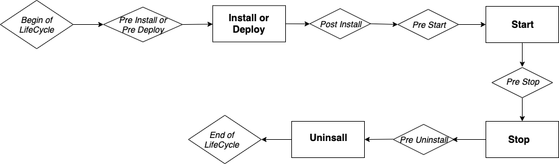

## DID

Bloklet DID represents the Bundle ID after the Blocklet is packaged, specified by `name` and `did`.

```yml
name: example
did: z8iZrkWYbi3JU3AP9NHJQbBUdrgiRbeorauqf
```

`name` is a human readable ID, `did` is derived from `name`. Unique `name` derives unique `did`.

**In general, `did` should not be modified manually, `name` and `did` should be automatically generated when the project is initialized via `create-blocklet`.**

The same DID represents the same Bloklet when uploaded to the Blocklet Store.

When installing a Blocklet to the Blocklet Server, the same DID represents the same Bloklet.

_Define Blocklet name please use title, do not use name_

`name` follows the NPM Package Name specification

- blocklet name length should be greater than zero
- all the characters in the blocklet name must be lowercase i.e., no uppercase or mixed case names are allowed
- blocklet name can consist of hyphens
- blocklet name must not contain any non-url-safe characters (since name ends up being part of a URL)
- blocklet name should not start with . or \_
- blocklet name should not contain any spaces
- blocklet name should not contain any of the following characters: ~)('!\*
- blocklet name length cannot exceed 214

## Version

`version` follows the [semver version](https://semver.org/) specification

```yml
version: 1.0.0
```

## Infomation

```yml
title: Example Demo
description: Demo blocklet that shows how to configure Blocklet Meta`
author:
  name: Bob
  email: bob@gmail.com
  url: 'https://bob.me'
contributors:
  - name: Alice
    email: alice@gmail.com
    url: 'https://alice.me'
maintainers:
  - name: Zhangsan
    email: zhangsan@gmail.com
    url: 'https://zhangsan.me'
community: 'https://github.com/orgs/blocklet/discussions'
documentation: 'https://developer.blocklet.io/docs'
homepage: 'https://www.blocklet.io'
license: MIT
keywords:
  - demo
  - example
  - blocklet
repository:
  type: git
  url: 'git+https://github.com/blocklet/blocklet-site.git'
support: support@arcblock.io
```

## Logo

App logo file

```yml
logo: logo.png
```

## Screenshots

The screenshots will be displayed on the introduction page of the store

```yml
screenshots:
  - 0.png
  - 1.png
  - 2.png
```

## Price

Blocklet price

```yml
payment:
  price: # can specify multiple currencies
    - address: z35n6UoHSi9MED4uaQy6ozFgKPaZj2UKrurBG # token address
      value: 8 # price
  share: # share
    - name: Bob # account alias
      address: z1QUDFzp6wKhLFjV4sG1ACY3J3ePcknrviy # Account DID
      value: 0.7 # split ratio
    - name: Store # Account alias
      address: zNKr4EeqcMk4W4TpBYD7MzGj6UEua53vJFx1 # Account DID
      value: 0.3 # split ratio
```

## Files

Which files need to be packaged into the bundle

```yml
files:
  - logo.png
  - screenshots
  - hooks
```

## Interfaces

Blocklet access interface (most of the following configurations do not need to be concerned, just focus on the auth configuration)

```yml
interfaces:
  - type: web # access interface type
    services:
      - name: auth # Auth service for this access interface
        config:
          whoCanAccess: all # Who can access
          blockUnauthenticated: false # Whether to automatically intercept unauthenticated requests and jump to the login page
          blockUnauthorized: false # Whether to automatically intercept unauthorized requests
          allowSwitchProfile: true # Whether to support switching profiles
          profileFields: # Information to provide when logging in
            - fullName
            - email
            - avatar
          ignoreUrls: [] # Which interfaces allow any request to access
    protocol: http # access interface type
    name: publicUrl # usually does not need to be modified
    port: BLOCKLET_PORT # Environment variable for receiving port (port number is generated by Blocklet Server)
    path: / # Default prefix when Bloclet receives requests
    prefix: '*' # Blocklet is mounted prefix
```

## Environments

runtime environment variables

```yml
environments:
  - name: key # variable name
    description: xxxx # variable description
    default: '' # default value
    required: false # Is it required
    secure: false # Whether it is sensitive information
    shared: true # Is it public. Defaults to true, shared must be false when secure is true
```

## Scripts

Configuring Blocklet Hook Directives

```yml
scripts:
  dev: npm run start # The command actually executed when `blocklet dev` is executed
  preInstall: node hooks/pre-install.js # hooks before installation
  preDeploy: node hooks/pre-deploy.js # pre-deployment hooks (install `blocklet deploy` in deployment mode)
  postInstall: node hooks/post-install.js # hook after installation
  preStart: node hooks/pre-start.js # hook before startup
  preStop: node hooks/pre-stop.js # hook before stop
  preUninstall: node hooks/pre-uninstall.js # Hook before deletion
```



Blocklet Server provides hook functionality to do something during the execution life cycle. Currently includes: `pre-deploy, post-install, pre-start, pre-stop, pre-install, pre-uninstall` These Hooks.

For example, a blocklet has hardware requirements for the machine to run on: the memory cannot be less than 1G, and the available disk capacity cannot be less than 500 MB. At this time, you can use the pre-install hook to detect whether the target machine has met the requirements, if so, install it normally, otherwise throw an error message and terminate the installation.

Hooks are actually some shell scripts, and these scripts may refer to files in Blocklets. During the process of packaging Blocklets, the Blocklet Server packaging tool (Blocklet Server CLI) will package the files used by hooks separately. Therefore, developers need to Declare in `hookFiles` which files are referenced by hooks.

## Requirements

Configure required resources and operating environment constraints

```yml
requirements:
  server: '>=1.8.0' # server version constraints
  os: '*'
  cpu: '*'
  fuels: # Fuel needed before starting (token)
    endpoint: xxx # The address of the chain
    address: xxx # token address
    value: xxx # price
    reason: xxx # The reason for the need (for example, because the NFT Factory needs to be created before the first boot)
```

#### Specify the fuel needed before starting (token)

```yml
requirements:
  fuels:
    endpoint: xxx # The address of the chain
    adress: xxx # token address
    value: xxx # price
    reason: xxx # The reason for the need (for example, because the NFT Factory needs to be created before the first boot)
```

#### Specify the minimum Blocklet Server version number

```yml
requirements:
  server: '>=1.8.0' # server version must be greater than or equal to 1.8.0
```

## Capabilities

```yml
capabilities:
  clusterMode: false # Can blocklet be started in cluster mode
  component: true # Can blocklet become a component and be composed by other blocklets
```

## Children

Demo: [Component Demo](https://github.com/blocklet/component-demo/blob/main/blocklet.yml)

```yml
children: # Usually no manual maintenance is required, it can be maintained through `blocklet add/remove`
  - name: xxx # Human readable ID (required)
    source: # installation source
      # install via url
      url: xxx
      # install via store
      store: xxx # store address
      name: xxx # Blocklet ID
      version: xxx # Blocklet version
    mountPoint: /path/to # mount point
    title: xxx # name
    description: xxx # description
```

#### Config Source

```yml
children:
  - name: c1
    mountPoint: /c1

    # source has two types

    # 1. url: equivalent to the previous resolved, can be any bundle url, no need to serve in the store, such as
    # can serve in a github release, or in a local disk
    source:
      url:
- https://store.blocklet.dev/api/blocklets/z8ia4e5vAeDsQEE2P26bQqz9oWR1Lxg9qUMaV/blocklet.json
- file:///Users/wangshijun/Develop/arcblock/nft-store/.blocklet/release/blocklet.json
  - name: c2
    mountPoint: /c2
    # 2. The bundle served in the store can control the version: you can specify the latest version (default) or a fixed version. Later, if necessary, it can support more forms `^x.x.x`, `~x.x.x`, etc.
    # Because the store is decentralized, you need to specify the store
    source:
      store: https://store.blocklet.dev
      name: static-demo # bundle name
      version: latest # latest, 1.3.0
  - name: c3
    mountPoint: /c3
    # url can be set to one or more, when the first url is abnormal, it can be downgraded to the following url
    source:
      url:
        - <primary url>
        - <redundant url>
  - name: c4
    mountPoint: /c4
    # Store can be set to multiple, when the first store is abnormal, it can be downgraded to the following store
    source:
      store:
        - https://store.blocklet.dev
        - https://another-store.blocklet.dev
      name: static-demo
      version: latest
```

## Navigation, Theme, Copyright

```yml
navigation: # navigation information (app map)
  - title: xxx name
    # link to a url
    link: xxx
    # link to child component
    child: xxx # child name or child did
    section: # where I want to show
      - header
      - footer
    icon: mdi:home # icon
theme: # theme
  background: '#f5f5f5' # background color
copyright: # Copyright information
  owner: Arcblock # owner
  year: 2022 # If not written, take the current year
```

A more complete example: [Component Demo](https://github.com/blocklet/component-demo/blob/main/blocklet.yml)

#### i18n support

```yml
title: xxx
```

or

```yml
title:
	zh: xxx
	en: xxx
```

#### header and footer show different information

```yml
navigation:
  - title: a # appears in the header (default)
  - title: c
    section: footer # only in footer
  - title: d
    section: # both in header and footer
      - header
      - footer
  - title: e
    section: social # in footer's social media
  - title: f
    section: bottom # at the bottom of the footer
```

#### Show Icon

```yml
navigation:
  - title: a
    icon: mdi:home # iconify style
  - title: a
    icon: 'https://xxx' # url
  - title: b
    icon: '/path/to/xxx' # icon serve in app
```

#### Show Copyright

```yml
copyright:
  owner: xxx
  year: xxx # If not written, take the current year
```

#### Different backgrounds

```yml
background: xxx
```

or

```yml
background:
  header: xxx
  footer: xxx
  default: xxx
```

## Types

Configure blocklet type and startup entry through `group` and `main`

There are three types of Blocklets

### Type: Dapp

Blocklet containing backend services

```yml
group: dapps
main: api/index.js # startup file
```

### Type: Static

Blocklets that contain only static web resources

```yml
group: static
main: dist # The path of static resources, you need to ensure that dist/index.html exists
```

### Type: Gateway

This type of Blocklet itself will not contain any code and services, it will only compose other Blocklets together

```yml
group: gateway
```

## Others

```yml
timeout:
  start: 60 # Start timeout. Unit: second. Default time: 1 minute.
```
