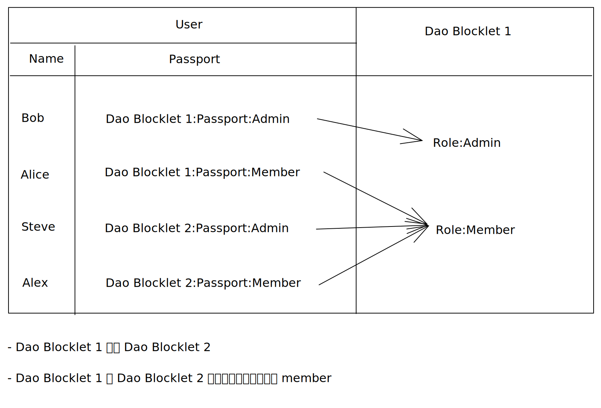

Blocklet Service 为 Blocklet 提供的访问控制基于 [RBAC](https://en.wikipedia.org/wiki/Role-based_access_control)(Role-based access control)

Blocklet Service 将角色包装为 Passport(通行证), Passport 本质是 VC(可验证的凭据)

Passport 使得用户角色不必存储在 Server 端，并且用户可以使用其他 Blocklet 颁发的 Passport

## Passport 和 Role 的关系

