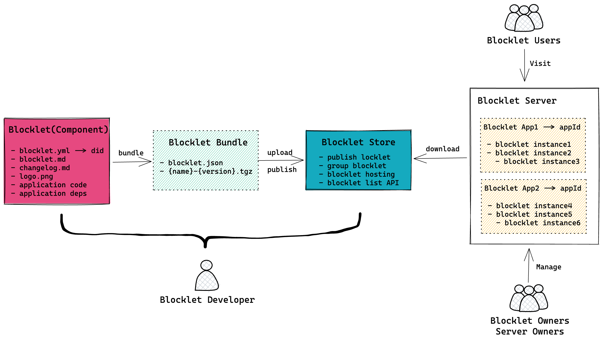

The core concepts in the Blocklet ecosystem and the relationships between the concepts are shown in the following diagram.



## What is Blocklet?

- Blocklets are the basic unit of application development, delivery, and operation
- Blocklets follow the same [protocol](/reference/blocklet-spec), enjoy the same services, and when combined together can perform very powerful functions
- Blocklets are combinable, in a way very similar to Lego blocks
- Blocklets are uniquely identified by a Blocklet DID, and the DIDs in each [Blocklet Store](https://store.blocklet.dev) are non-repeatable

## What is Blocklet Component?

- A Blocklet Component is specifically a Blocklet that can be used in combination, or not, as declared in [blocklet.yml](/reference/blocklet-spec#capabilities)
- Blocklet Components can usually be used both independently and in combination, and can behave differently in both modes
- Blocklet Components can [contain other Blocklet Components](/reference/blocklet-spec#components), and this containment relationship can be nested, just as a codebase published in an NPM can depend on other codebases published on the NPM. However, from a performance point of view, there is a limit to the depth of nesting of Blocklet Components.

## What is Blocklet Server?

- Blocklet Server is the software that provides the complete runtime environment, basic services, and management functions for Blocklet
- The data generated when Blocklet Server is running belongs to the owner of Blocklet Server only.
- Blocklet Server is uniquely identified by an immutable DID generated at the time of Blocklet Server creation and displayed in the Blocklet Server Console
- Anyone can run their own Blocklet Server on their own computer without license and without payment

## What is Blocklet Bundle?

- A Blocklet Bundle is a package built using [blocklet bundle](/reference/blocklet-cli#bundle) that can be consumed by Blocklet Server
- Blocklet Bundles are usually uploaded and hosted by developers in the [Blocklet Store](https://store.blocklet.dev), and can be hosted on any accessible network.
- A Blocklet Bundle typically contains the following two files.

  ```text
  .blocklet/release
  ├── blocklet.json
  └── static-demo-blocklet-1.4.0.tgz
  ```

  - `blocklet.json` Blocklet description file calculated from [blocklet.yml](/reference/blocklet-spec)
  - `{name}-{version}.tgz` contains the various files needed for the blocklet runtime, including the source code after the build, external dependencies
  - Theoretically, the two files could be hosted in different places, as long as `blocklet.json` contains the correct zip address

## What is Blocklet App?

- A Blocklet App is an entity that is installed, runs in the Blocklet Server, and can provide services to the public.
- The service behind a Blocklet App can consist of a single or multiple Blocklet Instances
- The unique identifier of a Blocklet App is the appId, which can be obtained from [Blocklet SDK](/reference/blocklet-sdk#environment) and [blocklet.js](/reference/blocklet-js)
- The same Blocklet Bundle running in a different Blocklet Server belongs to a different Blocklet App
- The same Blocklet Bundle running in the same Blocklet Server also belongs to a different Blocklet App
- A Blocklet App can have any number of users depending on the use case
- A Blocklet App can have only one blocklet owner, but can have multiple administrators

## What is Blocklet Instance?

- Each component of a running Blocklet App is a Blocklet Instance, which is like an instance generated from a class
- Each Blocklet Instance runs in its own separate process, with its own process identity, environment variables, and data directory

Translated with www.DeepL.com/Translator (free version)
