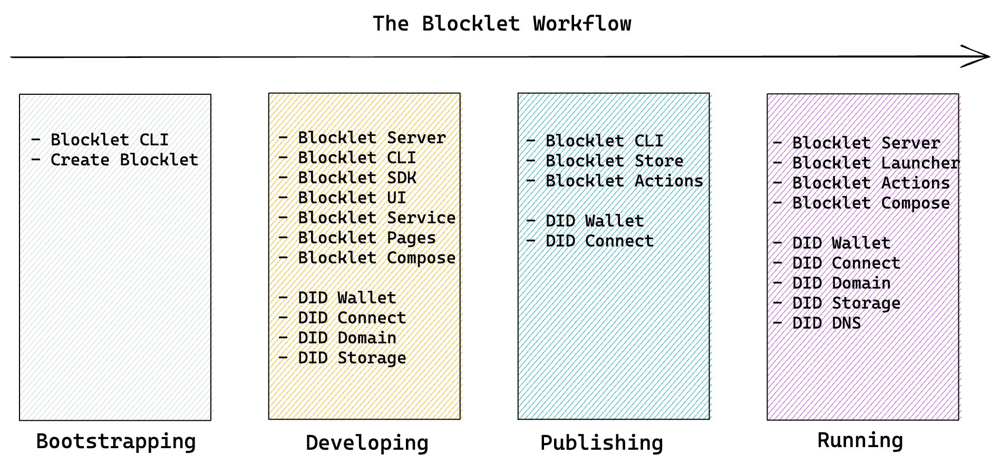

:::Alert
this page is a draft and need to be updated
:::

## Bootstrapping

- [Create Blocklet](https://createblocklet.dev) Your assistant on creating new blocklet project or monorepo.

## Developing

- [Blocklet Server](/) The blocklet runtime and management console.
- [Blocklet Services](/reference/blocklet-service) Authentication and notification service that works out of the box.
- [Blocklet CLI](/reference/blocklet-cli) Command line tool for developing blocklet in blocklet server
- [Blocklet SDK](/reference/blocklet-sdk) Development kit for connecting blocklets with blocklet services, and handling common blocklet best practice library.
- [Blocklet UI](/reference/blocklet-ui) Component library for providing a unified user experience for composition blocklets.
- [Blocklet Pages](https://pages.blocklet.io) Content engine for blocklet that makes it easy to create website and documentation site for your application.
- [Blocklet Compose](/) Compose your blocklet with other blocks to avoid reinventing wheels.
- [DID Wallet](https://didwallet.io) Used to manage blocklet and server passport
- [DID Connect](https://didconnect.io) Protocol and SDK for connecting decentralized identity with decentralized applications.
- [DID Domain](https://domain.didlags.org) Uniq domain with HTTPS enabled to ease the development process.

## Publishing

- [Blocklet CLI](/reference/blocklet-cli) Command line tool for bundling and uploading blocklets.
- [Blocklet Store](https://store.blocklet.dev) Decentralized app store for blocklets.
- [Blocklet Actions](/reference/blocklet-actions) GitHub actions for connecting your development pipeline to blocklet store.
- [DID Wallet](https://didwallet.io) Used to manage blocklet release on blocklet store.

## Running

- [Blocklet Server](/) The production ready blocklet runtime and management console.
- [Blocklet Launcher](https://launcher.arcblock.io) The decentralized blocklet server manager that works on various cloud providers.
- [Blocklet Actions](/) GitHub actions for connecting your development pipeline to production servers.
- [Blocklet Compose](/) Compose blocklets on the fly to make an awesome service.
- [DID Wallet](https://didwallet.io) Used to purchase and manage server ownership NFT.
- [DID Domain](https://domain.didlags.org) Uniq domain with HTTPS enabled to ease the setup process.
