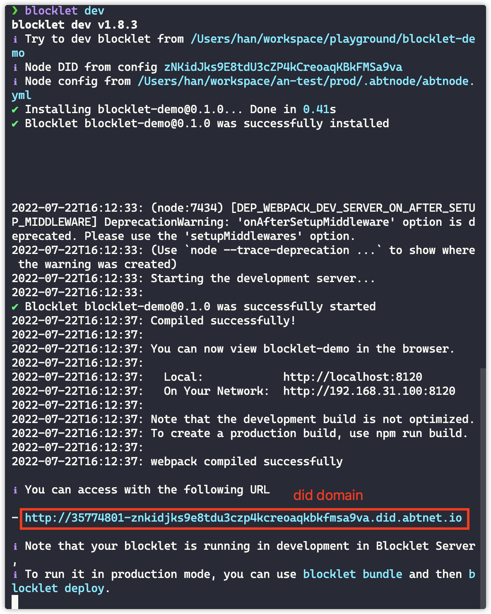

> <p style={{color:"red"}}>TODO: this page should be updated</p>

This section will show you how to quickly create a Blocklet.

## Dependency Preparation

First you need to make sure that your development environment has [Blocklet Server](path-to-blocklet-server) installed and started.

## Initialize a project

A Blocklet can be created quickly with the `blocklet create` command.
The following is an example of creating a `React` project.

Call the `blocklet create` command from the terminal


Enter the project name `blocklet-demo` and enter


Select `webapp` and enter


Select `react`, then enter your name and email


At this point, a Blocklet project has been created.

## Start development

Go to the project directory and execute the following command to install the project dependencies.

```bash
npm i
# yarn
# pnpm i
```

Next, execute the following command to access the development preview.

```bash
npm run dev
# yarn dev
# pnpm dev
# blocklet dev
```



The terminal will print out a `did domain` address, which you can access directly to preview the current application.
