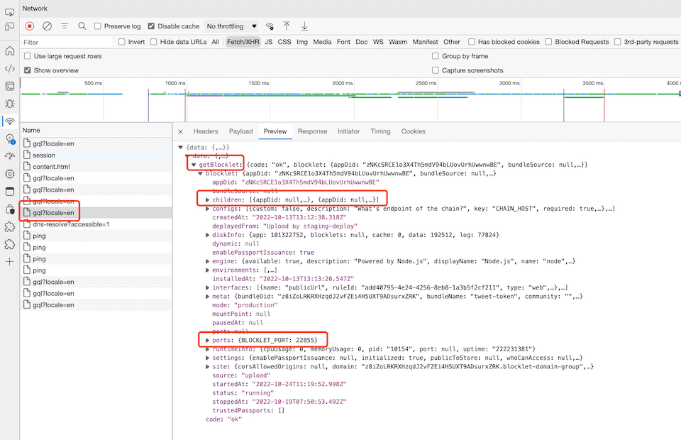

## How the documentation is organized?

Blocklet has a lot of documentation. A high-level overview of how it’s organized will help you know where to look for certain things:

- [Getting Started](/docs/quick-start) take you by the hand through a series of steps to create a website. Start here if you’re new to Blocklet.
- [Conceptual guides](/docs/conceptual/overview) discuss key concepts at a fairly high level and provide useful background information and explanation.
- [Reference guides](/docs/reference/blocklet-spec) contain technical reference various aspects of Blocklet machinery. They describe how it works and how to use it but assume that you have a basic understanding of key concepts.
- [How-to guides](/docs/how-to/create) are recipes. They guide you through the steps involved in addressing key problems and use-cases. They are more advanced than Getting Started and assume some knowledge of how Blocklet works.

## What is a Blocklet?

A Blocklet is a collection of applications that can run in Blocklet Server.

- It can be a Reactjs application, created by CRA
- It can be a Vuejs application, created by vite
- It can be an express application
- ...

In short, any application can be turned into a Blocklet application and can run in the Blocklet Server.

### Composable Blocklet

In common development models, an application is usually developed as a standalone application, and when the application needs to interact with other applications, it needs to do so through a CORS-configured interface. As you can imagine, this breaks the integration of development and makes it more difficult to deploy in production environments.

If you choose to develop a Blocklet, you can develop a combination of applications in a more relaxed mode, and you can easily combine multiple applications together after development to make them look like one application.

## What is Blocklet Server?

Blocklet Server is the hosting platform of Blocklet, which provides the running environment and basic services for Blocklet.

## What is Blocklet Service?

Blocklet Service is a series of services provided by Blocklet Server for Blocklet. Blocklet Server provides Blocklet with a lot of out-of-the-box features through Blocklet Service.

- Domain: Each Blocklet can be accessed through a unique DID Domain
- Authentication Service: DID based Authentication Service
- Access Management Service: Access Management Service based on DID Passport and RBAC
- Notification service: Blocklet can send messages to DID wallet

## What is Blocklet Store?

Blocklet Store is the distribution platform for Blocklets. The Blocklet Store allows you to discover, buy and install Blocklets.

ArcBlock officially provides 2 Blocklet Store:

1. [https://store.blocklet.dev](https://store.blocklet.dev): Provides production-ready Blocklets
2. [https://dev.store.blocklet.dev](https://dev.store.blocklet.dev): Provide sample/demo Blocklets for learning and experience

**Blocklet store is decentralized, you can deploy your own Blocklet store on your own Blocklet Server!**

## How to check the component service port in Blocklet?

Developers should **NOT** use the service port of Blocklet components directly in their code.

If developers need to communicate with internal components, please use [Blocklet SDK: Component](/reference/blocklet-sdk#component)

If you need to check for other reasons (such as troubleshooting), you can open the developer tools in your browser, visit the Server Dashboard -> Blocklet details page, and view it in the getBlocklet GQL interface

