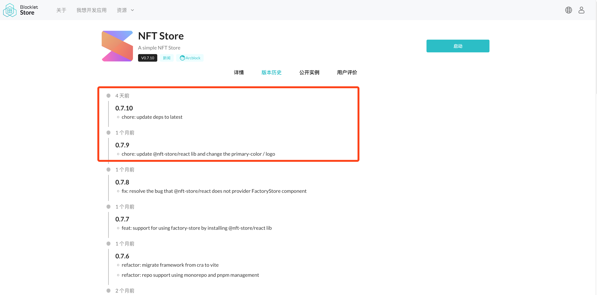

## Introduction

We only need to know where the program's startup entry is to start this `blocklet`.

### 1. What is bundle

The essence of packaging is to transform an existing project structure into another project structure.
After the blocklet is packaged successfully, the system will generate a `.blocklet` directory under the project root directory. The directory structure is as follows:

```md
.blocklet
├── bundle
│   ├── LICENSE
│   ├── README.md
│   ├── api
│   ├── blocklet.js
│   ├── blocklet.md
│   ├── blocklet.yml
│   ├── blocklet.zip
│   ├── dist
│   ├── logo.png
│   ├── media
│   ├── package.json
│   └── screenshots
└── release
    ├── blocklet.json
    └── demo1-0.1.0.tgz
```

### 2. Why do we need bundle

You need to package your blocklet (just like Apple developers package Apple apps), to publish blocklets to the `blocklet store` (just like publishing Apple apps to the app store) and to deploy to the `blocklet server` (just like Apple Apps are installed on Apple phones).

## Preparation

### 1. Program entry (required)

#### 1. Define the entry file of the program

You need to define the `main` field in the `blocklet.yml` file to declare the entry point of the program, for example:

```yml
main: api/index.js
```

#### 2. Define the files required for the program to run

You need to define the `files` field in the `blocklet.yml` file to declare the files required for the program to run, for example:

```yml
files: -dist
```

The above configuration means that when bundling, the dist directory will simply be copied to the `.blocklet/bundle` directory.

You can also define the following pattern to include only a subset of files.

```yml
files:
  - migration/*.js
```

The bundle result will include all files in the `migration` directory.

You can also define the following negation pattern to exclude some files.

```yml
files:
  - "!server/ignored.js"
```

Following files are always included in the blocklet bundle:

- blocklet.yml
- blocklet.md or README.md
- CHANGELOG.md
- LICENSE

Files that are ignored by default when bundling is the same as: https://docs.npmjs.com/cli/v9/configuring-npm/package-json#files

### 2. Logo (required)

A well-designed logo can improve the recognition of the application, and for each blocklet that is `bundled`, the logo file is also necessary.

#### prerequisites

- The width and height of the logo must be the same
- The pixel of the logo cannot be smaller than 256px \* 256px (except for svg files)
- The file size of the logo must not exceed 100KB
- The format of the logo must be a mainstream image format (support svg, jpg, png, etc.)

#### Define the logo field

You can define the path where the logo file is stored in the `blocklet.yml` file.

```yml
logo: logo.png
```

### 3. Use documentation (required)

#### prerequisites

Each blocklet should have its own documentation, and an easy-to-use documentation can attract users to use it.
Like markdown, we can place [text](https://test.store.blocklet.dev/blocklets/z8iZwyBfqwNcGbLCiUnFAQLEzT8sJd2TSjbM2), [image](https://test.store.blocklet.dev/blocklets/ z8iZwyBfqwNcGbLCiUnFAQLEzT8sJd2TSjbM2), videos, etc.

#### Write usage documentation

Now, you only need to use markdown syntax to create a `blocklet.md` file in the project root directory, no need to declare this file in `blocklet.yml`, the system will automatically recognize this file when packaging.

```markdown
#My Blocklet

Welcome to my blocklet
```

In addition, if there is no `blocklet.md` file in the project root directory, the system will continue to match `blocklet.en.md`, `README.md` files in the project root directory in an orderly manner.
If the system finally fails to find it, it will throw an error during packaging and interrupt the current packaging behavior.

### 4. Screenshot (optional)

Text may not be enough when introducing blocklets to users.
In order to better show the effect of the product running, you can also use screenshots to show users your blocklet at this time.

#### Define the screenshots field

You can define screenshots field in `blocklet.yml` file:

```yml
screenshots:
  - screenshot-0.png
  - screenshot-1.png
  - screenshot-2.png
  - screenshot-3.png
```

After packaging and publishing to the `blocklet store`, you can see your screenshot on the blocklet details page ([view example](https://test.store.blocklet.dev/blocklets/z8iZqkCjLP6TZpR12tT3jESWxB8SGzNsx8nZa)), the default is to follow the file The lexicographical order of the names is in ascending order, displayed in the form of a carousel.

### 5. Change log (optional)

Every time a blocklet is updated, we may need to log changes.
For developers, usually by updating the `CHANGELOG.md` file to record the changes of the project, the display effect in the `blocklet store` is shown in the following figure:



#### Writing `CHANGELOG.md`

You can create a `CHANGELOG.md` file in the project root directory, for example:

```md
# 0.7.10 (October 18, 2022)

- chore: update deps to latest

# 0.7.9 (October 17, 2022)

- chore: update @nft-store/react lib and change the primary-color / logo
```

After packaging and publishing to `blocklet store`, you can see your change record on the blocklet details page ([view example](https://test.store.blocklet.dev/blocklets/z8iZqkCjLP6TZpR12tT3jESWxB8SGzNsx8nZa?tab=version)).

## Package the application

<!-- @see: https://github.com/blocklet/blocklet-site/pull/60#issuecomment-1281723839 -->

### Default packaging mode

If the blocklet is created via `blocklet create` or `create-blocklet`, then the built-in packaging command can be executed in the terminal:

```shell
yarn bundle
```

After the packaging command is executed successfully, you should be able to see the generated `.blocklet/bundle` directory in the project root directory.

### Package a single application (custom)

#### 1. Based on zip packaging (recommended)

Different from the packaging method of webpack, the zip packaging mode does not package the project into a single file, but analyzes the dependencies of the program from the program entry, and compresses all dependencies into a zip file according to the original project interface.

```shell
blocklet bundle --zip --create-release
```

The above command mainly does 2 things:

1. Package the blocklet in zip mode, generate a `.blocklet/bundle` directory under the project root directory, and generate a `blocklet.zip` file
2. Put the packaged files in the `.blocklet/release` directory under the project root directory

#### 2. Packaging based on webpack (deprecated)

Packing through the webpack mode will analyze the dependencies of the program from the program entry and package the dependencies into a single file (blocklet.js).

```shell
blocklet bundle --create-release
```

The above command mainly does 2 things:

1. Package the blocklet in webpack mode, and generate a `.blocklet/bundle` directory under the project root directory
2. Put the packaged files in the `.blocklet/release` directory under the project root directory

### Package monorepo application (custom)

```shell
blocklet bundle --create-release --monorepo
```

The above command mainly does 2 things:

1. Package the blocklet in monorepo mode, and generate a `.blocklet/bundle` directory under the project root directory
2. Put the packaged files in the `.blocklet/release` directory under the project root directory

So far, we have successfully packaged our blocklet.
Next, you can [publish](/zh/how-to/publish) the packaged blocklet to `blocklet store` or [deploy](/zh/how-to/deploy) to `blocklet server`.

### Dynamically set the Source Store of the component when packaging

Before your blocklet is officially released, you can publish the blocklet to the test store first, and then publish it to the official store after the test is completed.

If you want the blocklet in the test store to depend on the components in the test store, and the blocklet in the official store to depend on the components in the official store, you can leave the source store in blocklet.yml and pass it in dynamically when packaging.

```yml
components:
  - name: component-a
    mountPoint: /component-a
    source:
      name: component-a
      version: latest
  - name: component-b
    mountPoint: /component-b
    source:
      store: https://store.blocklet.dev # After the source store is declared, it will not be overwritten when packaging
      name: component-b
      version: latest
```

Execute `blocklet bundle --store-url "https://your-test-store.com"`, the packaged blocklet.yml is

```yml
components:
  - name: component-a
    mountPoint: /component-a
    source:
      store: https://your-test-store.com
      name: component-a
      version: latest
  - name: component-b
    mountPoint: /component-b
    source:
      store: https://store.blocklet.dev
      name: component-b
      version: latest
```

Execute `blocklet bundle --store-url "https://your-prod-store.com"`, the packaged blocklet.yml is

```yml
components:
  - name: component-a
    mountPoint: /component-a
    source:
      store: https://your-prod-store.com
      name: component-a
      version: latest
  - name: component-b
    mountPoint: /component-b
    source:
      store: https://store.blocklet.dev
      name: component-b
      version: latest
```

You can also set source store via environment variable: `COMPONENT_STORE_URL=https://your-prod-store.com blocklet bundle`
