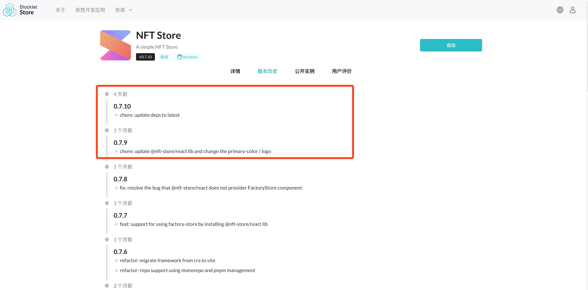

## 简介

我们只有需要知道程序的启动入口在哪，才能启动这个 `blocklet`。

### 1. 打包是什么?

打包的本质就是将现有项目结构转化为另一种项目结构。
blocklet 打包成功后，系统将会在项目根目录下生成一个 `.blocklet` 目录，目录结构如下:

```md
.blocklet
├── bundle
│   ├── LICENSE
│   ├── README.md
│   ├── api
│   ├── blocklet.js
│   ├── blocklet.md
│   ├── blocklet.yml
│   ├── blocklet.zip
│   ├── dist
│   ├── logo.png
│   ├── media
│   ├── package.json
│   └── screenshots
└── release
    ├── blocklet.json
    └── demo1-0.1.0.tgz
```

### 2. 为什么要打包？

你需要打包你的 blocklet，才能将 blocklet 发布到 `blocklet store` 和 部署到 `blocklet server`。


## 准备工作

### 1. 程序的入口（必要）
#### 1. 定义程序的入口文件

你需要在 `blocklet.yml` 文件中定义 `main` 字段，以声明程序的入口，例如：

```yml
main: api/index.js
```

#### 2. 定义程序运行所需的文件

你需要在 `blocklet.yml` 文件中定义 `files` 字段，以声明程序运行所需的文件，例如：

```yml
files:
  - dist 
```

上面的配置意味着，在 bundle 的时候，会简单地把 dist 目录复制到 `.blocklet/bundle` 目录下。

### 2. Logo（必要）

一个设计精美的 logo 可以提高应用的辨识度，而对于每一个被 `bundle` 的 blocklet 而言，logo 文件同样是必要的。

#### 先决条件

- logo 的宽高必须相同
- logo 的像素不能小于 256px \* 256px（svg 文件除外）
- logo 的文件大小不得超过 100KB
- logo 的格式必须是主流的图片格式（支持 svg, jpg, png等）

#### 定义 logo 字段

你可以在 `blocklet.yml` 文件中定义 logo 文件存放的路径。

```yml
logo: logo.png
```

### 3. 使用文档（必要）

#### 先决条件

每个 blocklet 都应该有自己的使用文档，简单易上手的使用文档更能吸引用户去使用它。
与 markdown 一样，我们可以在使用文档上放置[文字](https://test.store.blocklet.dev/blocklets/z8iZwyBfqwNcGbLCiUnFAQLEzT8sJd2TSjbM2)，[图片](https://test.store.blocklet.dev/blocklets/z8iZwyBfqwNcGbLCiUnFAQLEzT8sJd2TSjbM2)，视频等。

#### 编写使用文档

现在，你只需要使用 markdown 语法在项目根目录下创建一个 `blocklet.md` 文件，无需在 `blocklet.yml` 声明这个文件，打包的时候会系统会自动识别这个文件。

```markdown
# My Blocklet

Welcome to my blocklet
```

另外，如果项目根目录下不存在 `blocklet.md` 文件，系统会有序地在项目根目录下继续匹配 `blocklet.en.md`，`README.md` 文件。
如果系统最终查找失败，会在打包时抛出错误并中断当前的打包行为。

### 4. 截图（可选）

在向用户介绍 blocklet 时，只有文字可能还是不够的。
为了更好的呈现产品运行的效果，这时候你还可以使用屏幕截图向用户展示你的 blocklet。

#### 定义 screenshots 字段

你可以在 `blocklet.yml` 文件中定义 screenshots 字段:

```yml
screenshots:
  - screenshot-0.png
  - screenshot-1.png
  - screenshot-2.png
  - screenshot-3.png
```

打包发布到 `blocklet store` 之后，你可以在 blocklet 详情页（[查看示例](https://test.store.blocklet.dev/blocklets/z8iZqkCjLP6TZpR12tT3jESWxB8SGzNsx8nZa)）面看到你的屏幕截图，默认是按照文件名的字典序升序，以轮播图的方式展示的。

### 5. Change log（可选）

每次更新 blocklet 的时候，我们可能需要记录变更的日志。
对于开发者而言，通常是通过更新 `CHANGELOG.md` 文件来记录项目的变更，在 `blocklet store` 的展示效果如下图所示:



#### 编写 `CHANGELOG.md`

你可以在项目根目录下创建 `CHANGELOG.md` 文件，例如:

```md

# 0.7.10 (October 18, 2022)

- chore: update deps to latest

# 0.7.9 (October 17, 2022)

- chore: update @nft-store/react lib and change the primary-color / logo
```

打包发布到 `blocklet store` 之后，你可以在 blocklet 详情页（[查看示例](https://test.store.blocklet.dev/blocklets/z8iZqkCjLP6TZpR12tT3jESWxB8SGzNsx8nZa?tab=version)）面看到你的变更记录。


## 打包应用

<!-- @see： https://github.com/blocklet/blocklet-site/pull/60#issuecomment-1281723839 -->

### 默认的打包模式

如果 blocklet 是通过 `blocklet create` 或 `create-blocklet` 创建的，那么可以在终端执行内置的打包命令:

```shell
yarn bundle
```

打包命令执行成功后，应该可以在项目根目录下看到生成的 `.blocklet/bundle` 目录。

### 打包单个应用（自定义）

#### 1. 基于 zip 打包（推荐）

与 webpack 的打包方式不同的是，zip 打包模式不会将项目打包成单个文件，而是会从程序入口开始分析程序的依赖，并将全部依赖按照原有的项目接口压缩到一个 zip 文件中。

```shell
blocklet bundle --zip --create-release
```

上面的命令主要做了 2 件事:
1. 以 zip 模式打包 blocklet，在项目根目录下生成 `.blocklet/bundle` 目录，并会生成一个 `blocklet.zip` 文件
2. 将打包后的文件放在项目根目录下 `.blocklet/release` 目录

#### 2. 基于 webpack 打包（弃用）

通过 webpack 模式打包，会从程序入口开始分析程序的依赖，并将依赖打包到单个文件（blocklet.js）中。

```shell
blocklet bundle --create-release
```

上面的命令主要做了 2 件事:
1. 以 webpack 模式打包 blocklet，在项目根目录下生成 `.blocklet/bundle` 目录
2. 将打包后的文件放在项目根目录下 `.blocklet/release` 目录

### 打包 monorepo 应用（自定义） 

```shell
blocklet bundle --create-release --monorepo
```

上面的命令主要做了 2 件事:
1. 以 monorepo 模式打包 blocklet，在项目根目录下生成 `.blocklet/bundle` 目录
2. 将打包后的文件放在项目根目录下 `.blocklet/release` 目录

至此，我们已经顺利地打包好了我们的 blocklet。
接下来，你可以将打包好的 blocklet [发布](/zh/how-to/publish)到 `blocklet store` 或者[部署](/zh/how-to/deploy)到 `blocklet server`。

