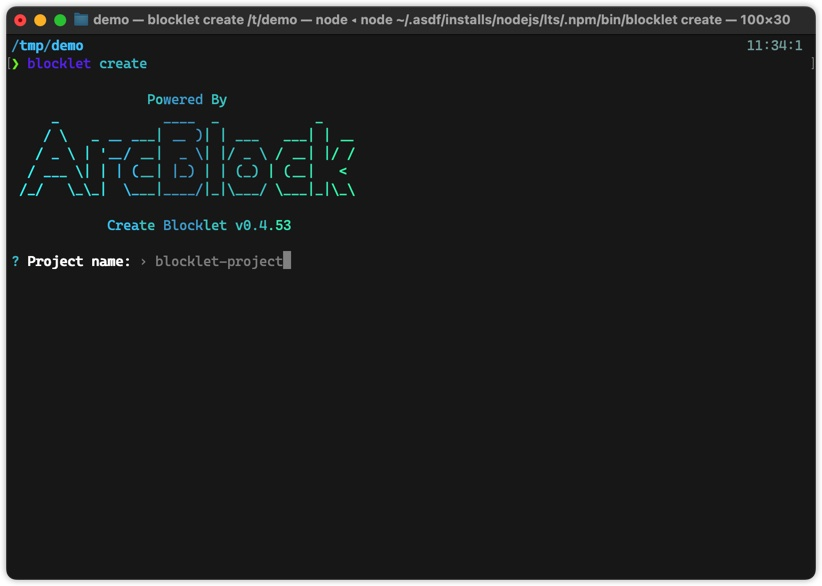
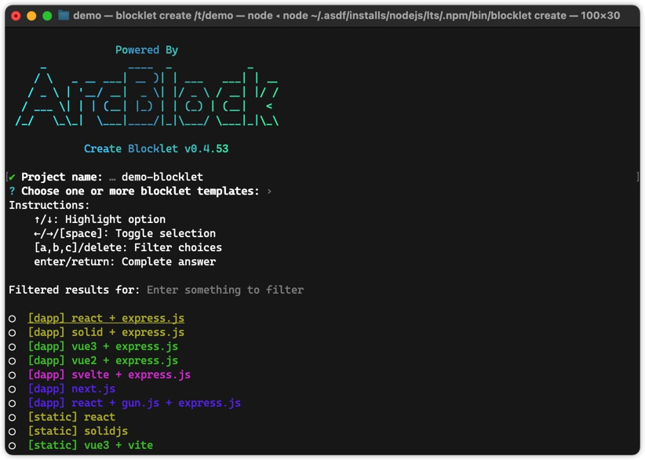
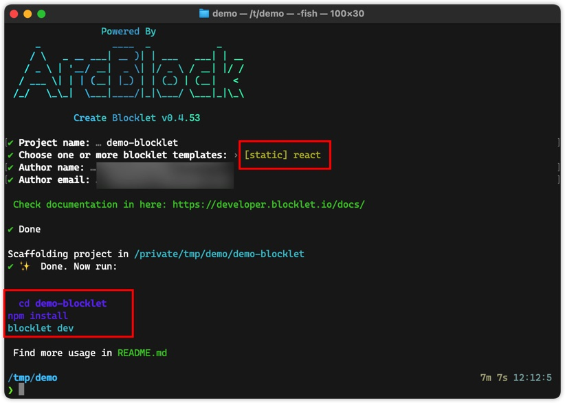
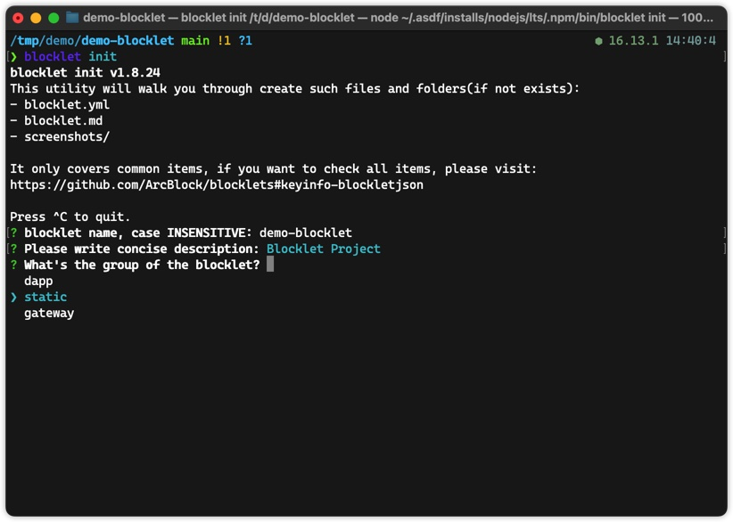
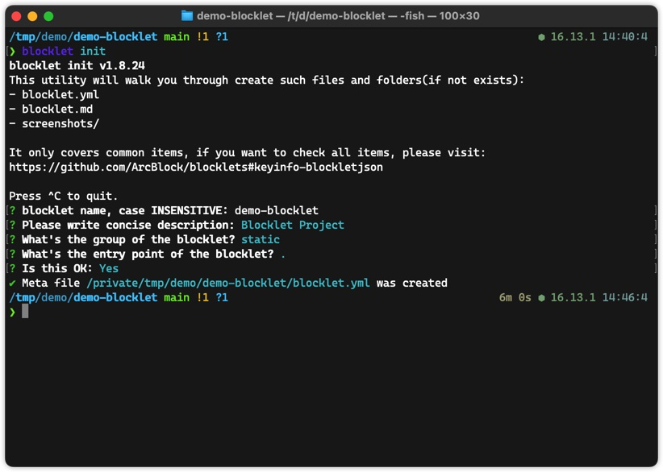

## Blocklet Types

Based on common development patterns, all applications can be broadly classified into three categories: static site projects, back-end API service projects, and full-stack projects.

What are some characteristics of each type of application?

### Static site projects
Static site projects usually only contain some front-end project files, and the project itself can be deployed through a static resource server. Common applications that fall into this category are `React`, `Vue`, `Svelte`, `Solidjs`, etc.

[create-blocklet](http://www.createblocklet.dev/) is an official command line tool maintained by the Blocklet platform and is mainly used to quickly create a Blocklet application.

In create-blocklet tool, the following static site project templates are provided for quick creation.
- [static] html
- [static] react
- [static] vue3 + vite
- [static] vue2 + @vue/cli
- [static] solidjs
- [static] svelte
- [static] blocklet pages
- [static] doc site

### Backend API service projects

Backend API service projects are usually used as a service to provide API calls and are commonly used to provide data for static site projects, mobile APP clients, etc.

In create-blocklet tool, the following backend API service project templates are provided for quick creation.
- [api] express.js

### Full-stack project
Full-stack projects combine the sum of a static site project and a back-end API service project, merging the two together to provide a more complete service in a single project. Often, when you need a fully functional site, then the full-stack project is the right choice.

In create-blocklet tool, the following full-stack project templates are provided for quick creation.
- [dapp] react + express.js
- [dapp] vue3 + express.js
- [dapp] vue2 + express.js
- [dapp] solidjs + express.js
- [dapp] svelte + express.js
- [dApp] react + gun.js + express.js
- [dapp] next.js

## Create a Blocklet project with the create-blocklet tool

The `blocklet create` command allows you to invoke the above tools to quickly create a Blocklet application (provided that the [blocklet-server](/prerequisites/server) environment is installed locally)



After entering the project name, you can enter the stage of selecting a template, and you can enter keywords to search in this page.

Use the space bar to select the template you want to create (you can select multiple templates, which will be automatically combined into a monorepo)



Next select `[static] react` as an example



The program will automatically create the directory structure of the corresponding template, and you can install the dependencies according to its prompts to enter the development mode of the project.

For more information about `create-blocklet`, please refer to [create-blocklet](http://www.createblocklet.dev)

## Creating a Blocklet project based on an existing project

The above has described the process of creating a Blocklet from 0. Create Blocklet can help us to eliminate the complicated creation process.

Then sometimes we are faced with the need to convert a project into a Blocklet when it is already in development, and the following will describe how to convert a project that is already developed (or in development) into a Blocklet project

### Dependency preparation

Have the [blocklet-server](/prerequisites/server) environment installed on the local machine

### Generate `blocklet.yml` file

Go to the project directory, execute the `blocklet init` command in the terminal, and enter the project name, project description, and so on



In the step of selecting the project type, select `static` if the current project is a `static site project`, or `daily` if the current project is a `backend API service project` or a `full-stack project ", then select `dapp`



Then follow the subsequent steps and confirm in order to generate the `blocklet.yml` file for the project

### Configuration script commands

In the above steps, we have got a `blocklet.yml` file that can be used for Blocklet Server. Next, we configure some script commands to make it faster to develop and deploy with Blocklet Server.


1. **Configure the development commands in `blocklet.yml`**

   Starting a Blocklet application development environment requires the `blocklet dev` command, which relies on the configuration in `blocklet.yml`.

   The following configuration needs to be added to `blocklet.yml`.
   ```yaml
   scripts:
     dev: npm run start
   ```

   To invoke development commands in a more familiar way, you can also add the command `"dev": "blocklet dev"` to `scripts` in the `package.json` file, and then you can use `npm run dev` to enter the Blocklet application development environment.

   For more information on `blocklet dev`, see [blocklet dev](/reference/blocklet-cli#Develop)
2. **Configure package command**

   We can use the `blocklet bundle` command to package the Blocklet application, but we need to use the project's original command to package it once before executing the command.

   Assuming the project's original package command is `npm run build`, we can add `"bundle": "npm run build && blocklet bundle --create-release"` to the `scripts` in the `package.json` file, and then we can use the ` npm run bundle` to quickly package Blocklet applications

   For more information about `blocklet bundle`, please refer to [blocklet bundle](/reference/blocklet-cli#Bundle)
3. **Configure deployment commands**

   Add `"deploy": "npm run bundle && blocklet deploy"` to `scripts` in `package.json` file, then you can use `npm run deploy` command to package and deploy with one click.

   For more information about `blocklet deploy`, you can refer to [blocklet deploy](/reference/blocklet-cli#Deploy)
4. **Configure the deploy command**

   Add a `"upload": "npm run bundle && blocklet upload"` to `scripts` in `package.json` file, then you can use `npm run upload` command to package and publish with one click.

   For more information about `blocklet upload`, see [blocklet upload](/reference/blocklet-cli#Upload)

