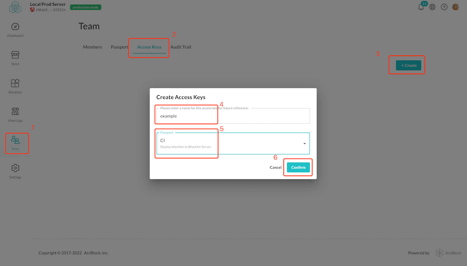

Before you can deploy, you need to make sure you have a release bundle file that can be used for deployment. Generally, release bundle files can be obtained by bundle from the project's source code, see here: [Bundle](/how-to/bundle), or someone else can share the release bundle with you.

With the release bundle file in place, you can deploy the blocklet directly to your Blocklet Server

## Deploy your blocklet to Blocklet Server

### STEP 1

Create Access Key in your Blocklet Server



### STEP 2

Execute the `blocklet deploy` command to deploy the blocklet to the Blocklet Server

```bash
blocklet deploy <blocklet-bundle-folder> --endpoint xxxxxx --access-key xxxxxx --access-secret xxxxxx
```

- blocklet-bundle-folder: The directory after building with [blocklet bundle](/how-to/bundle), or if you are currently in the root of the project, the value is `.blocklet/bundle`.
- `--endpoint`: The address of the server, ending with /admin. For example, the address of your local Blocklet Server is `http://127.0.0.1/admin`
- `--access-key`: The Access Key created in the first step
- `--access-secret`: Access Secret created in the first step

## Deploy your blocklet to local Blocklet Server

If you want to deploy the Blocklet to the local Blocklet Server, you can directly execute `blocklet deploy <blocklet-bundle-folder>`

## Deploy component blocklet to Blocklet Server

Deploying a component blocklet to Blocklet Server is the same command as deploying a Blocklet, but you need to add additional parameters

```
blocklet deploy <blocklet-bundle-folder> --endpoint xxxxxx --access-key xxxxxx --access-secret xxxxxx --app-id <blocklet-app-id> --mount-point /xxx`
```

- `--app-id`: AppID of the application, available in the blocklet details page
- `--mount-point`: Mount points for components
