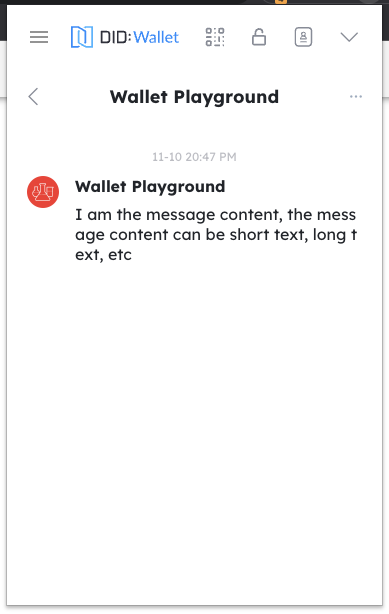
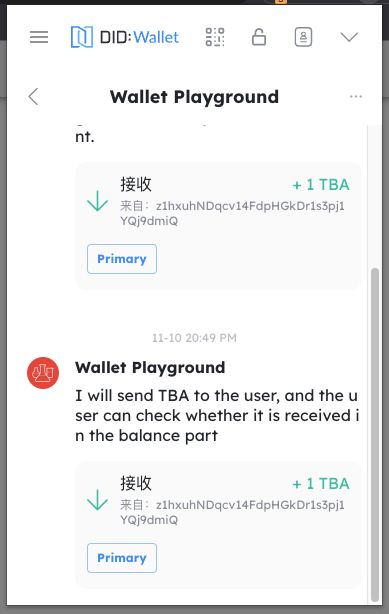
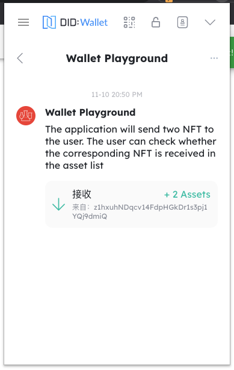
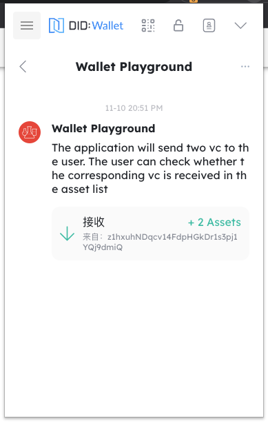
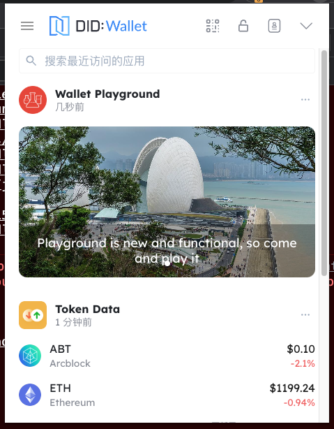
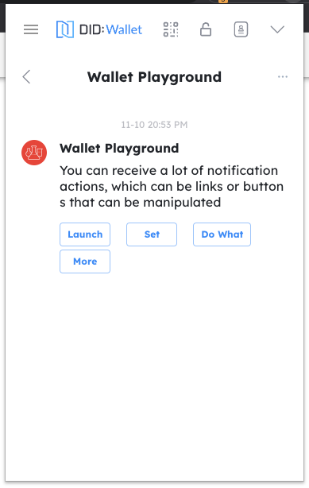

## Establish connection with DID Wallet

Before the Blocklet communicates with the wallet, a Websocket connection needs to be established. There are two ways for Blocklet to establish a Websocket connection with the DID Wallet:

**Method 1**: After the DID Wallet logs in to the Blocklet through the [Auth service](/how-to/auth) provided by the Blocklet Service, it automatically establishes a Weboscket connection with the Blocklet.

**Method 2**: After DID Wallet connects to Blocklet through Blocklet using the DID Connect service implemented by [Blocklet SDK](/reference/blocklet-sdk#did-connect), it automatically establishes a Weboscket connection with Blocklet.

You can learn the implementation through [https://github.com/blocklet/notification-demo](https://github.com/blocklet/notification-demo).

## Send message to DID Wallet

After Blocklet and DID Wallet establish a Websocket connection, notifications can be sent to DID Wallet through Blocklet SDK.

### Send message to specified user

**Method 1**: Send a 1-to-1 message to the user. If the user is not online, the message will be temporarily stored for a week, and the user will receive the message when he is online.

`Notification.sendToUser(userDid, )`

**Method 2**: Send messages to specified users through public channels. If the user is not online, messages are not staged.

`Notification.broadcast(notification, { socketDid })`

For details, see [Blocklet SDK](/reference/blocklet-sdk#notification)

### Broadcast message to all online users

`Notification.broadcast(notification, { socketDid })`

Broadcast time to all online users, if the user is not online, the message will not be temporarily stored.

For details, see [Blocklet SDK](/reference/blocklet-sdk#notification)

### Message Format

Message are in a similar format to emails, including text, attachments, and actions.

#### Text: Contains title and body text

You can also send just the body, which is a simple text message.

```javascript
// Send Text

await Notification.sendToUser(userDid, {
  title: "I'm the message title",
  body: 'I am the message content, the message content can be short text, long text, etc',
});
```

The wallet can receive notifications on the message page



#### Attachment: Send different types of attachments

The types include Asset(NFT), VC, and Token

```javascript
// Send Token

await Notification.sendToUser(userDid, {
  title: 'I am the title that sent the Token',
  body: 'I will send TBA to the user, and the user can check whether it is received in the balance part',
  attachments: [
    {
      type: 'token',
      data: {
        address: 'z35n6UoHSi9MED4uaQy6ozFgKPaZj2UKrurBG',
        amount: '1000000000000000000',
        symbol: 'TBA',
        senderDid: senderDid,
        chainHost: chainHost,
        decimal: 18,
      },
    },
  ],
});
```

The wallet can receive notifications on the message page



```javascript
// Send NFT

await Notification.sendToUser(userDid, {
  title: 'I am sending the title of the NFT',
  body: 'The application will send two NFT to the user. The user can check whether the corresponding NFT is received in the asset list',
  attachments: [
    {
      type,
      data: {
        did: asset.address,
        chainHost: env.chainHost,
      },
    },
    {
      type,
      data: {
        did: asset2.address,
        chainHost: env.chainHost,
      },
    },
  ],
});
```

The wallet can receive notifications on the message page



```javascript
// Send VC

const { create } = require('@arcblock/vc');

const vc = create({
  type: 'EmailVerificationCredential',
  issuer: {
    wallet: w,
    name: 'ArcBlock.KYC.Email',
  },
  subject: {
    id: userDid,
    emailDigest: toBase64(emailDigest),
    method: 'SHA3',
  },
});

await Notification.sendToUser(userDid, {
  title: 'I am sending the title of the VC',
  body: 'The application will send two vc to the user. The user can check whether the corresponding vc is received in the asset list',
  attachments: [
    {
      type,
      data: {
        credential: vc,
        tag: vt.email,
      },
    },
    {
      type,
      data: {
        credential: vc,
        tag: passport.title,
      },
    },
  ],
});
```

The wallet can receive notifications on the message page



```javascript
// send feed message
const feedTitles = ['Playground is new and functional, so come and play it'];
const feedCovers = ['https://www.arcblock.io/blog/static/e764f965cad5b051eea9616da31e87ce/11382/cover.jpg'];
await Notification.sendToUser(userDid, {
  type: 'feed',
  feedType: 'graphic',
  data: {
    cardTitle: 'Playground Promotion',
    items: [
      {
        title: feedTitles[0],
        cover: feedCovers[0],
        link: 'https://www.arcblock.io',
      },
    ],
  },
});
```

Wallets can be received on the Explore page



#### Operation: Send operation

You can attach actions to a message (such as clicking to jump to a connection) that will be displayed as buttons in the wallet.

```javascript
// Send with operations

await Notification.sendToUser(userDid, {
  title: "I'm the message title",
  body: 'You can receive a lot of notification actions, which can be links or buttons that can be manipulated',
  actions={[
    { name: 'launch', title: 'Launch', link: 'https://arcblock.io' },
    { name: 'Set', title: 'ABT', link: 'https://arcblock.io' },
    { name: 'Do What', title: 'Node', link: 'https://arcblock.io' },
    { name: 'More', title: 'More Action', link: 'https://arcblock.io' },
  ]}
});
```

The wallet can receive notifications on the message page



For details, see [Blocklet SDK](/reference/blocklet-sdk#notification)

## Receive messages from DID Wallet

Each time a connection is established with the DID Wallet, Blocklet will receive a 'hi' message from the wallet, which can be received by Blocklet through the Blocklet SDK.

After receiving this message, the Blocklet can send a separate message to the user.

For details, see [Blocklet SDK](/reference/blocklet-sdk#notification)
