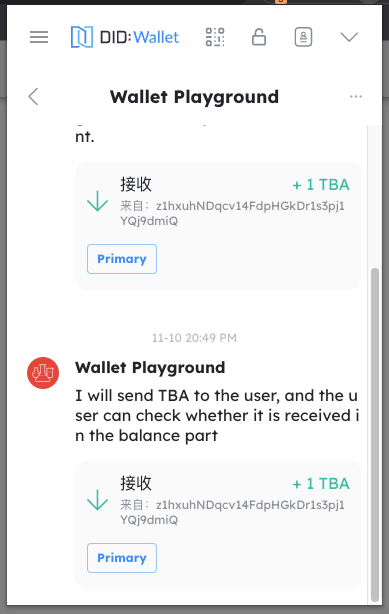
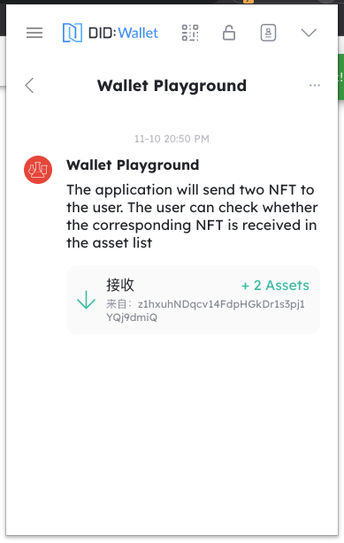
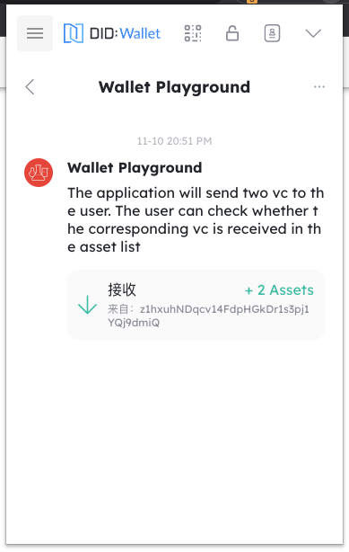

## 和 DID 钱包建立连接

Blocklet 和钱包通信前，需要建立 Websocket 连接。Blocklet 有两种方式 和 DID 钱包建立 Websocket 连接：

**方式 1**: DID 钱包通过 Blocklet Service 提供的 [Auth 服务](/how-to/auth) 登录 Blocklet 后，自动和 Blocklet 建立 Weboscket 连接。

**方式 2**: DID 钱包通过 Blocklet 使用 [Blocklet SDK](/reference/blocklet-sdk#did-connect) 自己实现的 DID Connect 服务连接至 Blocklet 后，自动和 Blocklet 建立 Weboscket 连接。

你可以通过 [https://github.com/blocklet/notification-demo](https://github.com/blocklet/notification-demo) 了解具体的实现方式。

## 发送通知给 DID 钱包

Blocklet 和 DID 钱包建立 Websocket 连接后，可以通过 Blocklet SDK 向 DID Wallet 发送通知。

### 向指定用户发送消息

**方式 1**: 向用户发送 1 对 1 消息。如果用户没有在线，消息会暂存一周，用户上线后会接收到该消息。(发送时可以带上下面的消息格式)

`Notification.sendToUser(userDid)`

**方式 2**: 通过公共频道向指定用户发送消息。如果用户没有在线，消息不会暂存。

`Notification.broadcast(notification, { socketDid })`

详见 [Blocklet SDK](/reference/blocklet-sdk#notification)

### 向所有在线用户广播消息

`Notification.broadcast(notification, { socketDid })`

向所有在线用户广播通时，如果用户没有在线，消息不会暂存。

详见 [Blocklet SDK](/reference/blocklet-sdk#notification)

### 消息格式

通知采用和邮件类似的格式，包含文本，附件，操作。

#### 文本：包含标题和正文

你也可以只发送正文，则是一条简单的文本消息。

```javascript
// 发送文本

await Notification.sendToUser(userDid, {
  title: "I'm the message title",
  body: 'I am the message content, the message content can be short text, long text, etc',
});
```

钱包在消息页面可以接收到通知


#### 附件：发送不同类型附件

类型包括 Asset(NFT), VC, Token

```javascript
// 发送 Token

await Notification.sendToUser(userDid, {
  title: 'I am the title that sent the Token',
  body: 'I will send TBA to the user, and the user can check whether it is received in the balance part',
  attachments: [
    {
      type: 'token',
      data: {
        address: 'z35n6UoHSi9MED4uaQy6ozFgKPaZj2UKrurBG',
        amount: '1000000000000000000',
        symbol: 'TBA',
        senderDid: senderDid,
        chainHost: chainHost,
        decimal: 18,
      },
    },
  ],
});
```

钱包在消息页面可以接收到通知



```javascript
// 发送 NFT

await Notification.sendToUser(userDid, {
  title: 'I am sending the title of the NFT',
  body: 'The application will send two NFT to the user. The user can check whether the corresponding NFT is received in the asset list',
  attachments: [
    {
      type,
      data: {
        did: asset.address,
        chainHost: env.chainHost,
      },
    },
    {
      type,
      data: {
        did: asset2.address,
        chainHost: env.chainHost,
      },
    },
  ],
});
```

钱包在消息页面可以接收到通知



```javascript
// 发送 VC

const { create } = require('@arcblock/vc');

const vc = create({
  type: 'EmailVerificationCredential',
  issuer: {
    wallet: w,
    name: 'ArcBlock.KYC.Email',
  },
  subject: {
    id: userDid,
    emailDigest: toBase64(emailDigest),
    method: 'SHA3',
  },
});

await Notification.sendToUser(userDid, {
  title: 'I am sending the title of the VC',
  body: 'The application will send two vc to the user. The user can check whether the corresponding vc is received in the asset list',
  attachments: [
    {
      type,
      data: {
        credential: vc,
        tag: vt.email,
      },
    },
    {
      type,
      data: {
        credential: vc,
        tag: passport.title,
      },
    },
  ],
});
```

钱包在消息页面可以接收到通知



#### 操作：发送操作

你可以为消息附加操作（比如点击跳转到某连接），操作将以按钮形式展示在钱包中。

```javascript
// 发送时带有附加操作

await Notification.sendToUser(userDid, {
  title: "I'm the message title",
  body: 'You can receive a lot of notification actions, which can be links or buttons that can be manipulated',
  actions={[
    { name: 'launch', title: 'Launch', link: 'https://arcblock.io' },
    { name: 'Set', title: 'ABT', link: 'https://arcblock.io' },
    { name: 'Do What', title: 'Node', link: 'https://arcblock.io' },
    { name: 'More', title: 'More Action', link: 'https://arcblock.io' },
  ]}
});
```

钱包在消息页面可以接收到通知


详见 [Blocklet SDK](/reference/blocklet-sdk#notification)

## 接收 DID 钱包的消息

每次和钱包建立连接后，Blocklet 会收到钱包钱包发来的 'hi' 消息，Blocklet 可通过 Blocklet SDK 接收到该消息。

接收到该消息后，Blocklet 可向该用户单独发送一条消息。

详见 [Blocklet SDK](/reference/blocklet-sdk#notification)
