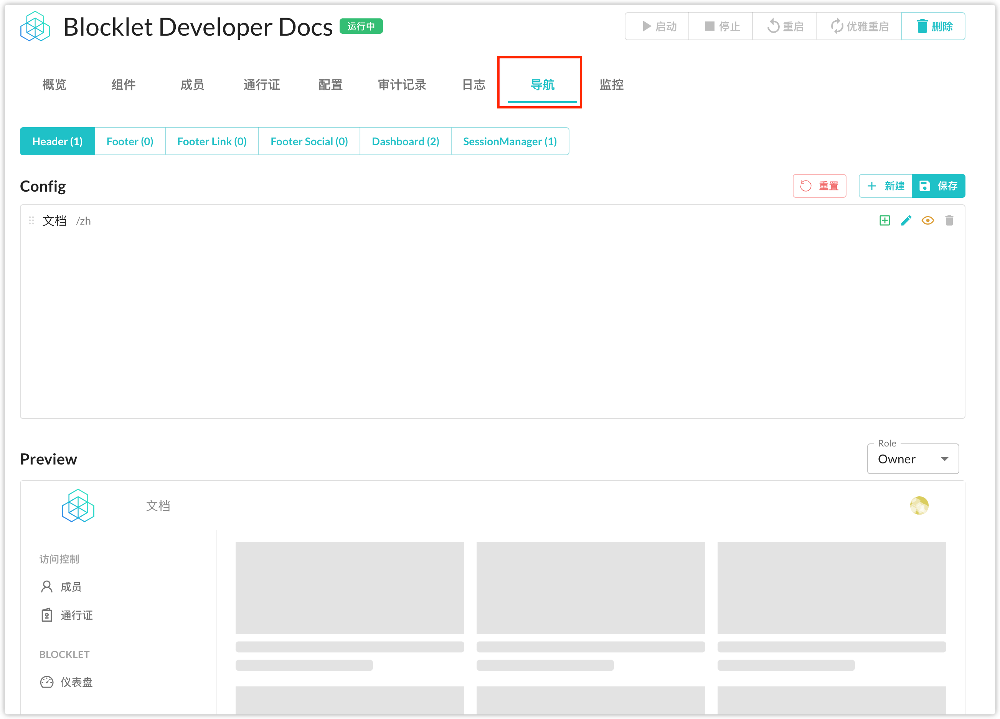
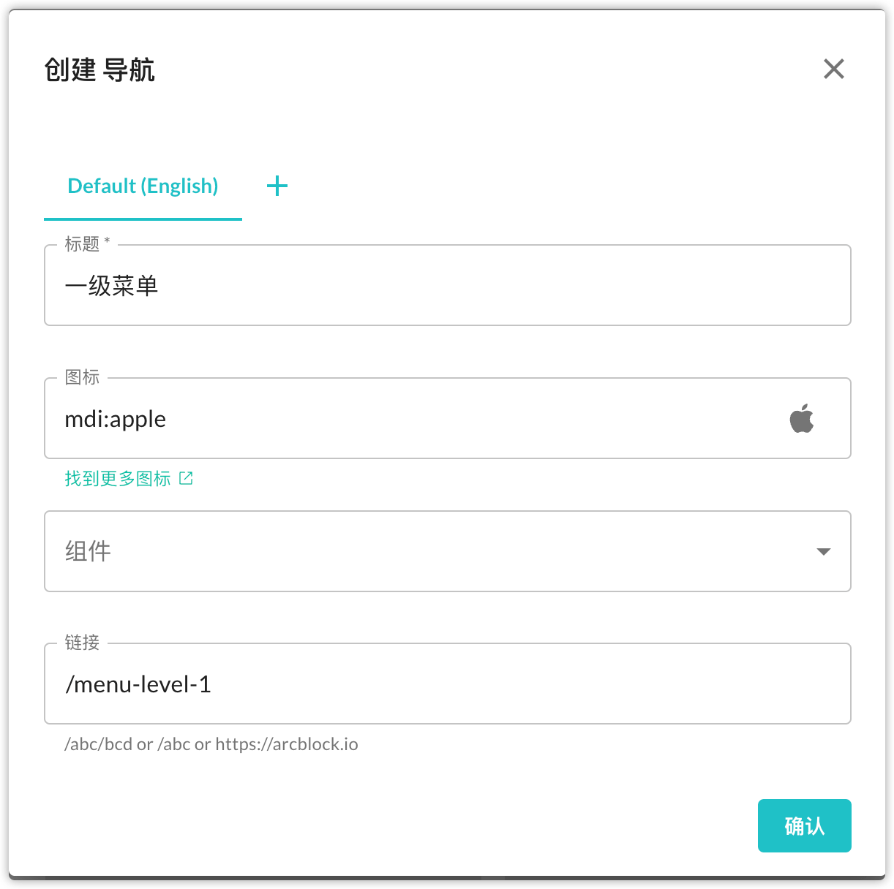
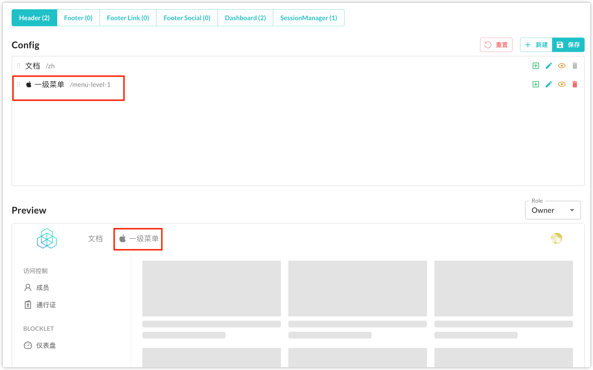
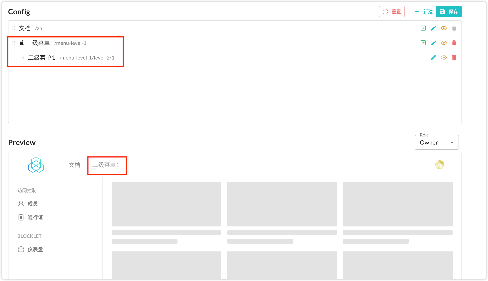
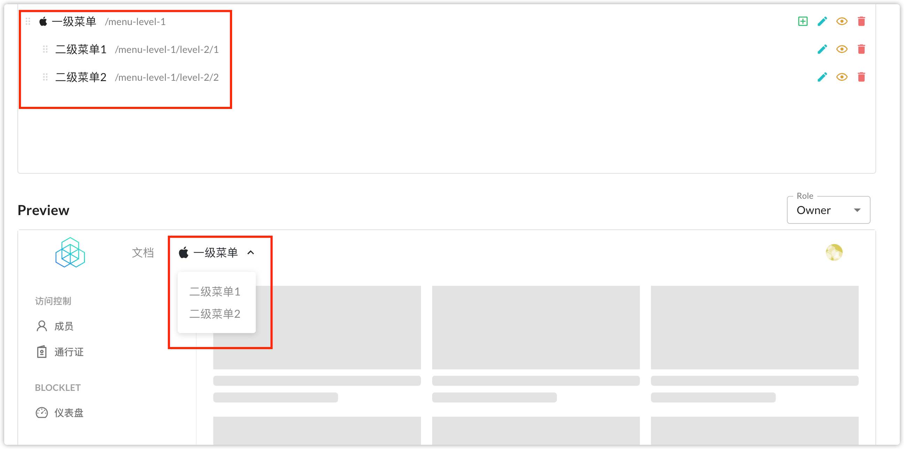
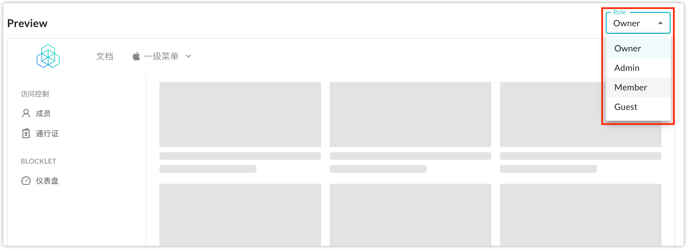

## How to customize Blocklet Logo

When the Blocklet is installed, you can change the default logo of the Blocklet in Blocklet Dashboard.

There are 3 types of Blocklet Logos:

- Square (or round) Logo: The most commonly used logo.
- Horizontal Logo: If your page uses Blocklet UI, the horizontal logo will be displayed in the header and footer. The default horizontal logo is the Square Logo.
- favicon: You can also customize the favicon of your site. The favicon defaults to the Square Logo.

> Tips:
>
> When the Blocklet developer does not set the favicon in index.html, or sets the standard favicon (`<link rel="shortcut icon" href="/favicon.ico">`), the user can customize the favicon from Dashboard.
>
> When the Blocklet developer sets a non-standard favicon (`<link rel="shortcut icon" href="/custom-path/xxx/favicon.ico">`), the user cannot customize the favicon

## How to setup a better blocklet navigation
Blocklet Server provides a default navigation generation policy that ensures users get a good out-of-the-box result. When the default generated navigation does not meet the needs, the navigation can be configured to enable custom navigation.

### Rules for default navigation generation
The core of the default generated navigation is the handling of composite blocklets. When multiple blocklets are combined, a merged navigation menu is created based on the `navigation` configured in each `blocklet.yml`

- If an application does not combine any other blocklets, then the default generated navigation matches the result configured in the navigation field declared in `blocklet.yml` for that application
- If an application combines other blocklets, the `navigation` declared in the combined blocklet will present a different merge result depending on the section it belongs to.
  - When section is header, footer, dashboard, the navigation provided in the combined blocklet will be presented in the final navigation as a first-level menu with multiple second-level menus
  - When section is social, bottom, sessionManager, the navigation provided in the combined blocklet will be elevated to the first level of the menu and presented in the final navigation.

### Customized navigation menu
In the Blocklet Server's blocklet details, the system provides an ability to visually edit the navigation menu, as shown below.

Here you can add, edit, delete and hide any menu at will (some built-in menus are not allowed to be deleted)

The page is divided into three areas: section selection area, editing area, preview area

First of all, you need to select a section to operate in the section selection area, and then the editing area will appear in the corresponding area contains the current menu items

You can click the "New" button in the upper right corner of the edit area to add a first-level menu.

Once saved, the navigation menu you just added will appear in the edit and preview areas

Click the plus button to the right of this menu to add a secondary menu to it, but since only one secondary menu item will be elevated to a primary menu, the original primary menu is not visible in the preview area at this time

You can try to add another secondary menu to revert to a primary menu with two secondary menus

If you just want to hide some menu items or if the corresponding menu items cannot be deleted, you can add the small eye icon on the right to hide the menu items.

When you have configured different menu items for different role users, you can switch the role on the right side of the preview area to see the different effects

Finally, click the Save button on the right side of the editing area to save all the changes, and users will be able to see your customized navigation menu when they open your app again
