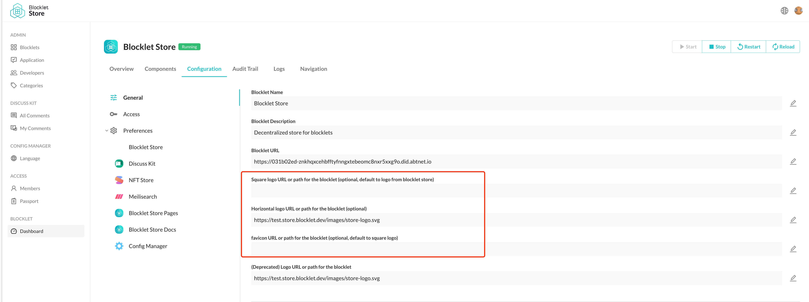

## How to customize Blocklet Logo

When the Blocklet is installed, you can change the default logo of the Blocklet in Blocklet Dashboard.

There are 3 types of Blocklet Logos:

- Square (or round) Logo: The most commonly used logo.
- Horizontal Logo: If your page uses Blocklet UI, the horizontal logo will be displayed in the header and footer. The default horizontal logo is the Square Logo.
- favicon: You can also customize the favicon of your site. The fanicon defaults to the Square Logo.

