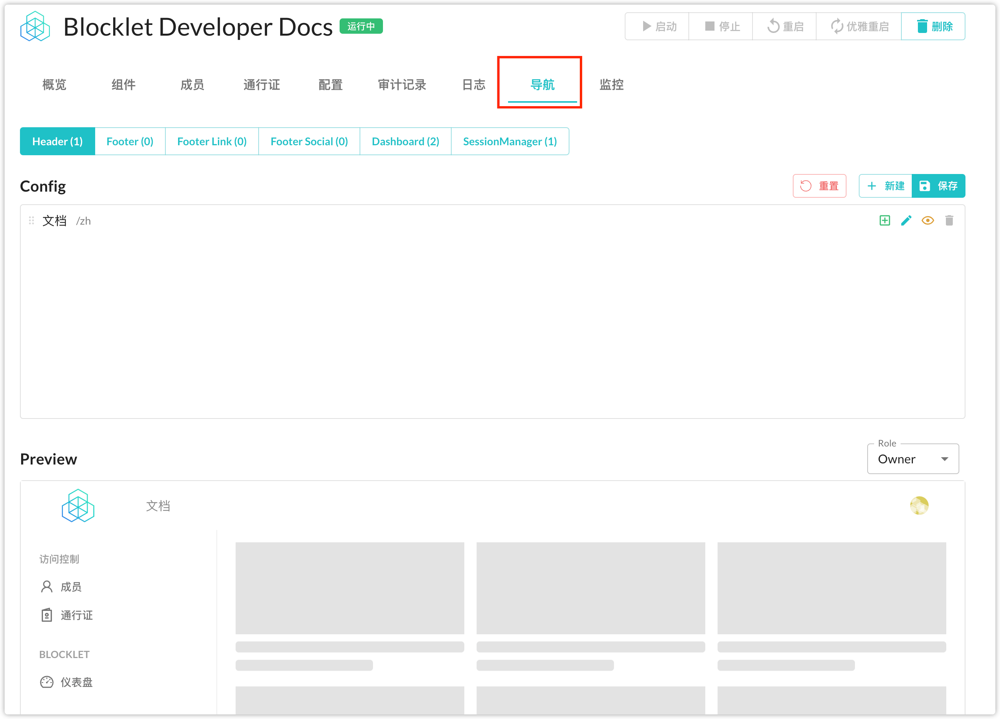
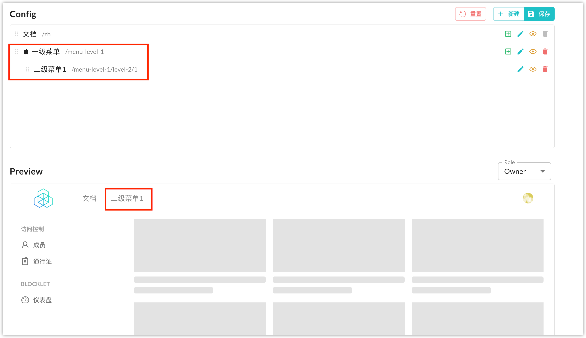

## 如何自定义 Blocklet Logo

当 Blocklet 安装后，你可以在 Blocklet Dashboard 中修改 Blocklet 的默认 logo.

Blocklet Logo 有 3 中类型：

- 方形（或圆形） Logo: 最常用的 logo.
- 横版 Logo: 如果你的页面使用了 Blocklet UI, 横版 Logo 将被展示在 header 和 footer 中. 横版 Logo 默认为方形 Logo.
- favicon: 你也可以自定义站点的 favicon. favicon 默认为方形 Logo.

> 提示:
> 
> 当 Blocklet 开发者没有在 index.html 中设置 favicon, 或设置了标准 favicon (`<link rel="shortcut icon" href="/favicon.ico">`) 时, 使用者可以在 Dashboard 中自定义 favicon.
>
> 当 Blocklet 开发者设置了非标准 favicon (`<link rel="shortcut icon" href="/custom-path/xxx/favicon.ico">`) 时, 使用者无法自定义 favicon 

## 如何更好的设置 Blocklet 导航
Blocklet Server 提供了一个默认的导航生成策略，能够确保用户获得良好的开箱即用的效果。当默认生成的导航不满足需求时，可以通过配置来实现自定义导航的导航。

### 默认生成导航的规则
默认生成的导航的核心在于处理 composite blocklet，当多个 blocklet 组合在一起时，会根据各个 `blocklet.yml` 中配置的 `navigation` 组合出一个合并后的导航菜单

- 如果一个应用没有组合任何其他 blocklet，那么默认生成的导航与该应用在 `blocklet.yml` 中声明的 navigation 字段配置的结果一致
- 如果一个应用组合了其他的 blocklet，那么被组合的 blocklet 中声明的 `navigation` 会根据其所属的 section，呈现出不同的合并结果。
  - section 为 header、footer、dashboard 时，被组合的 blocklet 中提供的导航会以一个包含了多个二级菜单的一级菜单呈现在最终的导航中
  - section 为 social、bottom、sessionManager 时，被组合的 blocklet 中提供的导航会提升为一级菜单呈现在最终的导航中

### 自定义导航菜单
在 Blocklet Server 的基石程序详情中，系统提供了一种可视化编辑导航菜单的能力，如下图所示：

在这里你可以随意增加、编辑、删除、隐藏任意菜单（某些内置的菜单不允许被删除）

页面共被划分为三个区域：section 选择区域、编辑区域、预览区域

首先需要在 section 选择区域选择一个要操作的 section，接着编辑区域会出现对应区域中当前包含的菜单项

可以点击编辑区域右上角的 “新建” 按钮来添加一个一级菜单

保存后，编辑区与预览区便会出现刚刚添加的导航菜单

点击该菜单右侧的加号按钮，可以为它添加一个二级菜单，但由于只有一个二级菜单的菜单项会被提升为一级菜单，所以此时预览区看不到原本的一级菜单

可以尝试再添加一个二级菜单，即可恢复为一级菜单中包含两个二级菜单的模样

点击右侧的小垃圾桶图标可以删除多余的菜单项，如果只是想隐藏某一些菜单或对应的菜单无法被删除时，可以添加右侧的小眼睛图标进行隐藏菜单的操作

当你为不同角色用户配置了不同的菜单项时，可以通过切换预览区右侧的角色来查看不同的效果

最后，点击编辑区右侧的保存按钮，即可将所有的变更保存下来，用户再次打开你的应用时，就能看到你自定义的导航菜单了
