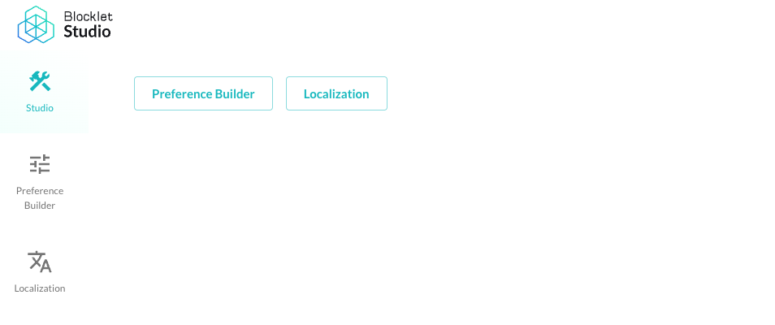
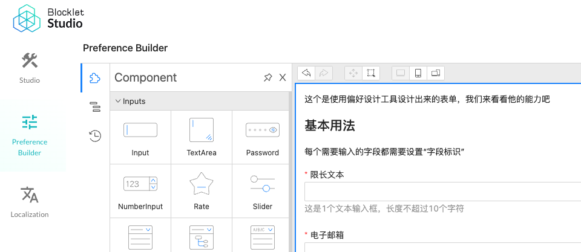
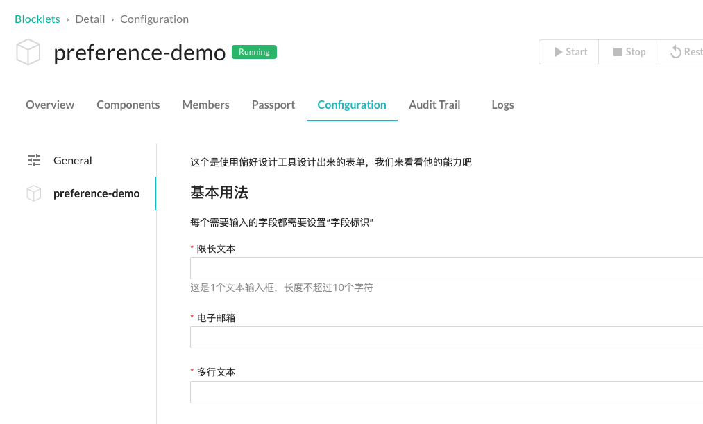
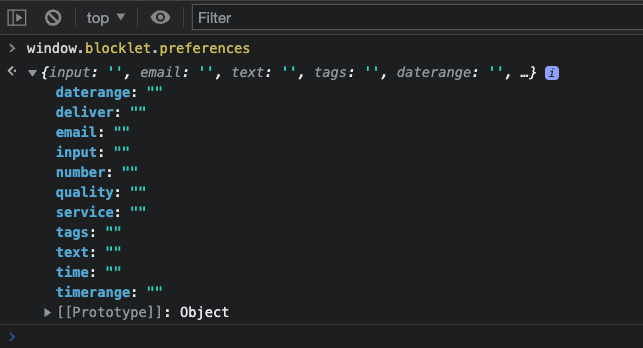
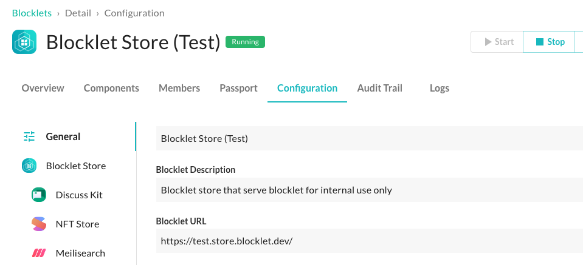

## What are Blocklet Preferences?

Serious developers should make their Blocklets more flexible and adaptable with configurable items that can be customized. Blocklet preferences are the end-to-end capabilities provided by the Blocklet Toolkit to easily define and store preference structures and to easily modify, save, and load preference data.

The basic workflow of Blocklet preferences is

- Define: Information about which behaviors can be customized at Blocklet runtime and how to do so is stored in the `blocklet.prefs.json` file
- Design: `blocklet.prefs.json` file can be modified visually in Blocklet Studio
- Bundle: `blocklet.prefs.json` will be automatically included in the Blocklet Bundle
- Edit/Save: `blocklet.prefs.json` will be loaded into the Server with the Blocklet installation for easy modification and saving by the user
- Load: User preferences will be available on both the front-end and back-end of the Blocklet runtime, see [Blocklet SDK](/reference/blocklet-sdk/#environment) and [blocklet.js](/reference/blocklet-js) for details

## How to use Blocklet preferences?

### Designing preference forms with Blocklet Studio

In development mode, switch to your Blocklet root directory and execute: `blocklet dev studio`, which will open the following screen.

Click on `Preference Builder`, and you will see the following interface.

If you are opening it for the first time, the form you see may be empty. Just drag and drop the input controls from the left side to the form design area according to your needs. After designing the form, click Save in the upper right corner and it will be written to or update the `blocklet.prefs.json` file on your disk.

:::Alert
Please do not modify `blocklet.prefs.json` manually unless you know what you are doing.
:::

### Bundle and ship Blocklet

`blocklet.prefs.json` will be included automatically when your blocklet is packaged, so you don't need to do anything extra.

### Installing and configuring Blocklet preferences

Once your blocklet is installed into the Server, you can cut to the blocklet configuration page and find your blocklet to adjust the preferences as follows.

### Using Blocklet Preference Data

If your application is a full-stack application, you can load the use of blocklet preferences on both the front-end and the back-end, as follows

#### Using Blocklet Preferences on the front-end

You can use `window.blocklet.preferences` directly in the browser environment to get all the preferences, see [blocklet.js](/reference/blocklet-js).

#### Using Blocklet preferences on the backend

You can use the `env` module of `@blocklet/sdk` directly in the Node.js environment to get all the preferences, see [Blocklet SDK](/reference/blocklet-sdk).

## Blocklet Preferences FAQ

### What are the preferences for a modular Blocklet?

Preferences for all components in a composition blocklet are managed independently, as follows.

