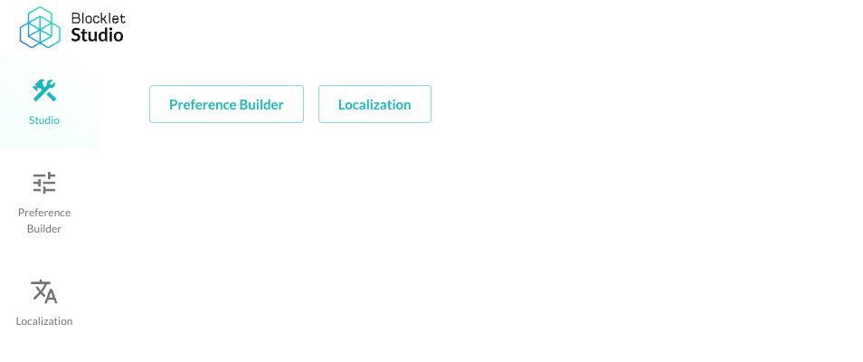
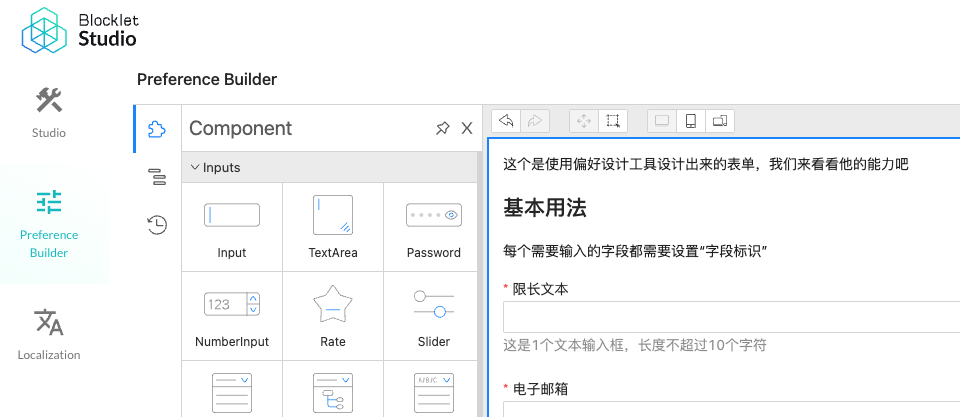
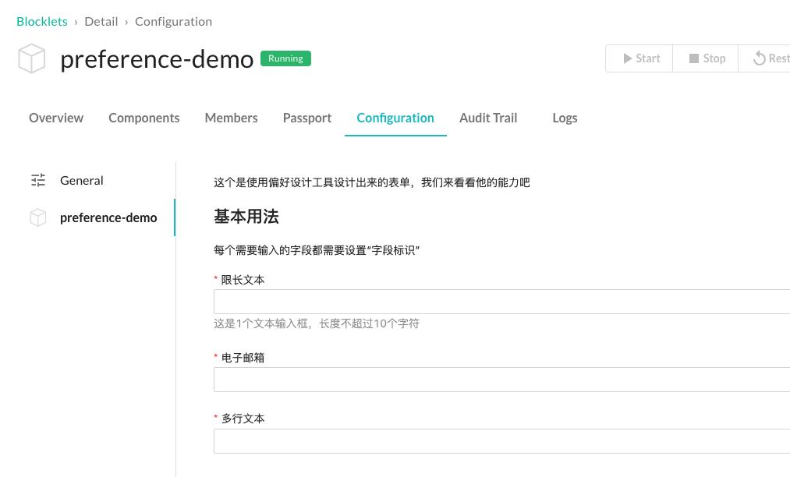
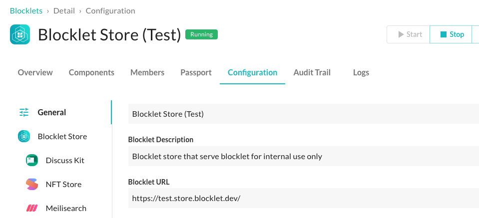

## 什么是 Blocklet 偏好？

严肃的开发者都会通过可以自定义的配置项来让自己的 Blocklet 更具灵活性和适应能力，Blocklet 偏好是 Blocklet 工具箱提供的方便定义、存储偏好结构，方便修改、保存、加载偏好数据的端到端能力。

Blocklet 偏好的基本工作流是：

- 定义：Blocklet 运行时哪些行为可以被自定义，如何自定义的信息保存在 `blocklet.prefs.json` 文件中
- 设计：`blocklet.prefs.json` 文件可以用可视化的方式在 Blocklet Studio 中修改
- 打包：`blocklet.prefs.json` 会自动被包含到 Blocklet 打包结果中
- 渲染：`blocklet.prefs.json` 会随着 Blocklet 安装被加载到 Server 中，方便用户修改、保存
- 加载：用户的偏好设置会在 Blocklet 运行时的前端和后端都可以拿到，详见 [Blocklet SDK](/reference/blocklet-sdk#Environment) 和 [blocklet.js](/reference/blocklet-js)

## 如何使用 Blocklet 偏好？

### 用 Blocklet Studio 设计偏好表单

开发模式下，切换到你的 Blocklet 根目录，执行：`blocklet dev studio`，会打开如下界面：

点击 "Preference Builder"，会看到如下界面：

如果你是第一次打开，看到的表单可能是空的，根据你的需要从左侧拖拽输入控件到表单设计区即可。设计完表单之后，点击右上角的保存就会被写入或更新你磁盘上的 `blocklet.prefs.json` 文件。

:::Alert
请不要手动修改 `blocklet.prefs.json` 除非你知道自己在做什么。
:::

### 打包和分发 Blocklet

`blocklet.prefs.json` 会在 Blocklet 打包时自动被包含，因此你无需额外做什么事情。

### 安装并配置 Blocklet 偏好

当你的 Blocklet 被安装到 Server 中后，可以切到 Blocklet 配置页面，找到自己的 Blocklet，即可调整偏好设置，如下图：

### 使用 Blocklet 偏好数据

如果你的应用是全栈的应用，在前端和后端都可以加载使用 Blocklet 偏好，具体方法：

#### 在前端使用 Blocklet 偏好

在浏览器环境中可以直接使用 `window.blocklet.preferences` 来获取所有的偏好设置，具体参见 [blocklet.js](/reference/blocklet-js)。

#### 在后端使用 Blocklet 偏好

在 Node.js 环境中可以直接使用 `@blocklet/sdk` 的 `env` 模块来获取所有的偏好设置，具体参见 [Blocklet SDK](/reference/blocklet-sdk)。

## Blocklet 偏好常见问题

### 组合型 Blocklet 的偏好设置是怎样的？

组合型 Blocklet 中的所有组件的偏好设置是相对独立的，如下图：

