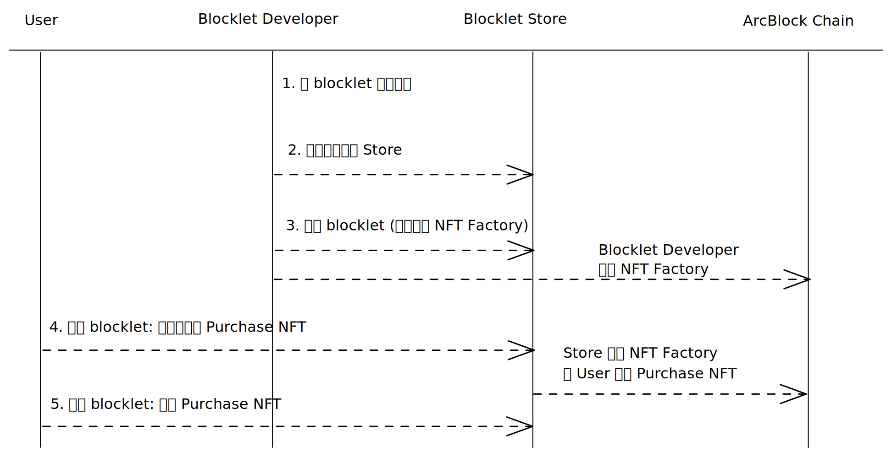

## 设置价格

在 `blocklet.yml:payment.price` 中为 blocklet 设置价格。

见 [blocklet.yml: price](/reference/blocklet-spec#price)

## 价格分成

blocklet 售卖所得收入默认会按照 7:3 的比例分给商店和开发者。

你也可以在 `blocklet.yml:payment.share` 中自定义 blocklet 分成方式（商店分成比例不能小于商店要求的最小分成比例）

见 [blocklet.yml: price](/reference/blocklet-spec#price)

## 付费 Blocklet 发布过程

如果你为 blocklet 设置了费用并上传到某个商店, 当你在商店发布 blocklet 时，你需要为 blocklet 创建一个 NFTFactory.



## 设置组件价格

在 `blocklet.yml:payment.componentPrice` 设置组件销售价格。

组件销售价格可设置为 "固定价格" 和 "按比例分成"。

组件可根据应用的价格区间分别设置不同的价格。比如 “当应用售价小于 10 ABT 时，价格为 2 ABT，当应用售价大于 10 ABT 时，价格为 20%”

见 [blocklet.yml: component price](/reference/blocklet-spec#price)

## 为组合 Blocklet 设置价格

当 blocklet 组合了付费组件时，blocklet 价格不的小于依赖的付费组件的价格之和。组件价格可在组件详情页中查看。

#### 举例

**组合 Blocklet 结构为**

```
App
 |_ Com1
 |   |_ Com2
 |_ Com2
```

**各组件价格**

- App 售价：20 ABT
- Com1 售价：4 ABT
- Com2 售价
  - 父组件价格小于 10 时: 2 ABT
  - 父组件价格大于 10 时：20%
- Store 分成比例：30%

**App 售卖后各组件分成**

- Store 获得 20 \* 30% = 6 ABT
- App 开发者获得 (20 - 4 - 20 \* 20%) \* 70% = 8.4 ABT
- Com1 开发者获得 (4 - 2) \* 70% = 1.4 ABT
- Com2 开发者获得 (20 \* 20% + 2) \* 70% = 4.2 ABT
