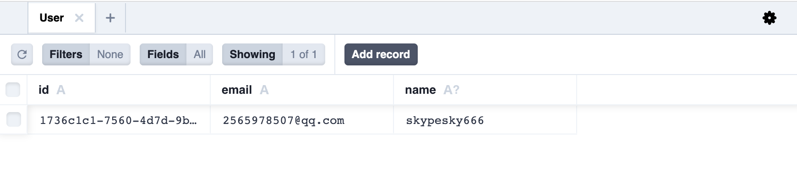

## Using local database

### Local Storage

你可以使用 Blocklet SDK 获取 blocklet 的存储目录

```js
const fs = require('fs');
const { env } = require('@blocklet/sdk');

fs.writeFileSync(path.join(env.dataDir, 'data.txt'), 'blocklet data');
```

### File Database

Blocklet SDK 为 blocklet 提供一个基于文件的数据库

见 [Blocklet SDK: Database](/reference/blocklet-sdk#database)

<!-- ## Using browser database -->

<!-- ## Using Remote database -->

<!-- ## Using decentralized data store -->


## Using ORM

### Prisma + SQLite 

#### Prerequisites 

You need Node.js v14.17.0 or higher for this guide (learn more about [system requirements](https://www.prisma.io/docs/reference/system-requirements)).

#### 1. Initialization prisma

The first step is to install the `prisma` dependency in your project:

```shell
yarn add prisma -D
```

Execute the following command to initialise `prisma` and use SQLite as your database:

```shell
npx prisma init --datasource-provider sqlite
```

At this point, a new `prisma` directory and `.env` file will be created in the project root, and SQLite will be configured as your database。

#### 2. Database modelling

We now need the database to be modelled in order to describe the data we store.

Add the user model to the file `prisma/schema.prisma` with the following content:

```typescript
// This is your Prisma schema file,
// learn more about it in the docs: https://pris.ly/d/prisma-schema

generator client {
  provider = "prisma-client-js"
  // Note, please do not customise the output parameters of the generator, there is currently a bug, see: https://github.com/prisma/prisma/issues/13233
}

datasource db {
  provider = "sqlite"
  url      = env("DATABASE_URL")
}

// 添加用户模型
model User {
  id    String  @id @default(uuid())
  email String  @unique
  name  String?
}
```

If you are using vscode as your development tool, you can install the [prisma plugin](https://marketplace.visualstudio.com/items?itemName=Prisma.prisma) to get a better coding experience when modelling.

You can use the `npx prisma format` command to help you format the `schema.prisma` file and verify where the error occurred.

:::Alert{type='warning' icon="true" title="Warning"}
Note, please do not customize the generator's [output](https://www.prisma.io/docs/reference/api-reference/prisma-schema-reference#generator) parameter, it is currently buggy, see: https://github.com/prisma/prisma/issues/13233
:::

#### 3. Creating databases and data tables

At this point, you already have a model of the database, but you have not yet created the data and data tables. You will need to run the following command to create the database and data tables:

```shell
npx prisma migrate dev --name init // Execution in local environment only
```

This order does two things:

1. it creates a new SQL migration file `prisma/migrations` in the directory for this migration. 2. it runs the SQL migration file against the database.
2. It runs the SQL migration file against the database.

Since the SQLite database file did not exist before, the command also created it in the `prisma` directory with the name `dev.db` defined by the environment variable in the `.env` file.

Congratulations, you have now created your database and data tables. Now let's start learning how to manipulate the data using the `Prisma Client`.

#### 4. Adding, deleting and checking data using Prisma Client

To manipulate the database you can import `@prisma/client` to do this, create the `test.js` file and add the following code to it:

```typescript
const { PrismaClient } = require("@prisma/client");
const prismaClient = new PrismaClient();

async function main() {
  // Delete records 
  const batchPayload = await prismaClient.user.deleteMany();
  console.log("delete", batchPayload.count);

  // Create a record
  const user = await prismaClient.user.create({
    data: {
      email: "2565978507@qq.com",
      name: "skypesky",
    },
  });
  console.log("create", user);

  // Update records
  const updatedUser = await prismaClient.user.update({
    where: {
      email: "2565978507@qq.com",
    },
    data: {
      name: "skypesky666",
    },
  });
  console.log("update", updatedUser);

  // Query records
  const users = await prismaClient.user.findMany();
  console.log("find", users);
}

main();
```

Then, execute the script using the following command:

```shell
node test.js
```

You can see the following output in the terminal:

```shell
delete 0
create {
  id: '1736c1c1-7560-4d7d-9b04-dcc6dd1dd1fb',
  email: '2565978507@qq.com',
  name: 'skypesky'
}
update {
  id: '1736c1c1-7560-4d7d-9b04-dcc6dd1dd1fb',
  email: '2565978507@qq.com',
  name: 'skypesky666'
}
find [
  {
    id: '1736c1c1-7560-4d7d-9b04-dcc6dd1dd1fb',
    email: '2565978507@qq.com',
    name: 'skypesky666'
  }
]
```

If you want to know more about the usage of `CRUD`, please refer to: https://www.prisma.io/docs/concepts/components/prisma-client/crud

#### 5. Visualisation of data in Prisma

Prisma comes with a built-in GUI for viewing and editing data in the database. You can open it using the following command:

```shell
npx prisma studio
```

At this point, the terminal will output the address of prisma studio: 

```shell
Environment variables loaded from .env
Prisma schema loaded from prisma/schema.prisma
Prisma Studio is up on http://localhost:5556
```

Use your browser to access `prisma studio` and you should be able to see all the records in the `user` data table:



#### 6. Deployment to the official environment 

First we need to generate the Prisma Client using the following command:

```shell
npx prisma generate // Generate @prisma/client client, recommended under pre-install hook
```

Next, we need to execute the following command in the terminal to complete the migration of the generated environment database:

```shell
npx prisma migrate deploy // All migration scripts will be applied in the official environment and it is recommended that this is done under the pre-install hook
```

The code for the `pre-install.js` file can be found in the following example:

```typescript
require('dotenv-flow').config();
const { name } = require('../../package.json');
const urljoin = require('url-join');
const exec = require('shelljs.exec');
const { logger } = require('../../libs/logger');
const env = require('@blocklet/sdk/lib/env');

async function createSqliteDatabase() {
  const schemaUrl = urljoin(process.cwd(), 'prisma/schema.prisma');
  exec(`npx prisma generate --schema ${schemaUrl}`);

  if (process.env.DATABASE_URL) {
    return;
  }

  process.env.DATABASE_URL = `file:${urljoin(env.dataDir, 'db/prd.db')}`;

  // @see: https://www.prisma.io/docs/concepts/components/prisma-migrate/db-push#can-i-use-prisma-migrate-and-db-push-together
  exec(`npx prisma migrate deploy --schema ${schemaUrl}`);
}

(async () => {
  try {
    await createSqliteDatabase();
  } catch (err) {
    logger.error(`${name} pre-start error`, err.message);
    process.exit(1);
  }
})();
```

This completes the deployment of prisma and SQLite in the official environment!
