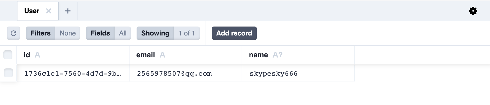

## Using local database

### Local Storage

你可以使用 Blocklet SDK 获取 blocklet 的存储目录

```js
const fs = require('fs');
const { env } = require('@blocklet/sdk');

fs.writeFileSync(path.join(env.dataDir, 'data.txt'), 'blocklet data');
```

### File Database

Blocklet SDK 为 blocklet 提供一个基于文件的数据库

见 [Blocklet SDK: Database](/reference/blocklet-sdk#database)

<!-- ## Using browser database -->

<!-- ## Using Remote database -->

<!-- ## Using decentralized data store -->

## 使用 ORM 

### Prisma + SQLite 

#### 先决条件

本指南需要 Node.js v14.17.0 或更高版本（了解有关[系统要求](https://www.prisma.io/docs/reference/system-requirements)的更多信息）。

#### 1. 初始化 prisma 

第一步，在你的项目安装 `prisma` 依赖:

```shell
yarn add prisma -D
```

执行以下命令初始化 `prisma`，并使用 SQLite 作为你的数据库:

```
npx prisma init --datasource-provider sqlite
```

此时，项目根目录下会生成一个新的 `prisma` 目录 和 `.env` 文件，并将 SQLite 配置为你的数据库。

#### 2. 数据库建模

我们现在需要数据库进行建模，以描述我们存储的数据。

添加用户模型到文件 `prisma/schema.prisma` 中，添加后的内容如下:

```typescript
// This is your Prisma schema file,
// learn more about it in the docs: https://pris.ly/d/prisma-schema

generator client {
  provider = "prisma-client-js"
  // 注意，请不要自定义 generator 的 output 参数，目前有bug，详见：https://github.com/prisma/prisma/issues/13233
}

datasource db {
  provider = "sqlite"
  url      = env("DATABASE_URL")
}

// 添加用户模型
model User {
  id    String  @id @default(uuid())
  email String  @unique
  name  String?
}
```

如果你使用的开发工具是 vscode，你可以安装 [prisma 插件](https://marketplace.visualstudio.com/items?itemName=Prisma.prisma) 以在建模的时候获得更好的编码体验。

你可以使用 `npx prisma format` 命令帮助你格式化 `schema.prisma` 文件，并校验出发生错误的位置。

:::Alert{type='warning' icon="true" title="警告"}
注意，请不要自定义 generator 的 [output](https://www.prisma.io/docs/reference/api-reference/prisma-schema-reference#generator) 参数，目前有bug，详见：https://github.com/prisma/prisma/issues/13233
:::

#### 3. 创建数据库和数据表

此时，你已经有了数据库的模型了，但是还没有创建数据和数据表。需要运行以下命令以创建数据库和数据表:

```shell
npx prisma migrate dev --name init // 只在本地环境执行
```

这个命令做了两件事：

1. 它会在目录中为此迁移创建一个新的 SQL 迁移文件 `prisma/migrations`。
2. 它针对数据库运行 SQL 迁移文件。

因为 SQLite 数据库文件以前不存在，所以该命令还在 `prisma` 目录中创建了它，其名称 `dev.db` 通过 `.env` 文件中的环境变量定义。

恭喜，您现在已创建好数据库和数据表。现在让我们开始学习如何使用 `Prisma Client` 操纵数据。

#### 4. 使用 Prisma Client 对数据增删改查

要操纵数据库你可以导入 `@prisma/client` 来完成,创建 `test.js` 文件并添加以下代码到文件中:

```typescript
const { PrismaClient } = require("@prisma/client");
const prismaClient = new PrismaClient();

async function main() {
  // 删除记录
  const batchPayload = await prismaClient.user.deleteMany();
  console.log("delete", batchPayload.count);

  // 创建记录
  const user = await prismaClient.user.create({
    data: {
      email: "2565978507@qq.com",
      name: "skypesky",
    },
  });
  console.log("create", user);

  // 更新记录
  const updatedUser = await prismaClient.user.update({
    where: {
      email: "2565978507@qq.com",
    },
    data: {
      name: "skypesky666",
    },
  });
  console.log("update", updatedUser);

  // 查询记录
  const users = await prismaClient.user.findMany();
  console.log("find", users);
}

main();
```

然后，使用以下命令执行脚本:

```shell
node test.js
```

你可以在终端看到以下输出:

```shell
delete 0
create {
  id: '1736c1c1-7560-4d7d-9b04-dcc6dd1dd1fb',
  email: '2565978507@qq.com',
  name: 'skypesky'
}
update {
  id: '1736c1c1-7560-4d7d-9b04-dcc6dd1dd1fb',
  email: '2565978507@qq.com',
  name: 'skypesky666'
}
find [
  {
    id: '1736c1c1-7560-4d7d-9b04-dcc6dd1dd1fb',
    email: '2565978507@qq.com',
    name: 'skypesky666'
  }
]
```

如果你想了解更多关于 `CRUD` 的用法，请参考: https://www.prisma.io/docs/concepts/components/prisma-client/crud

#### 5. 可视化查看 Prisma 中的数据

Prisma 带有一个内置的 GUI，用于查看和编辑数据库中的数据。您可以使用以下命令打开它：

```shell
npx prisma studio
```

此时，终端会输出 prisma studio 的地址

```shell
Environment variables loaded from .env
Prisma schema loaded from prisma/schema.prisma
Prisma Studio is up on http://localhost:5556
```

使用浏览器访问 `prisma studio`，你应该可以看到 `user` 数据表下所有的记录:



#### 6. 部署到正式环境

首先我们需要使用以下命令生成 Prisma Client:

```shell
npx prisma generate // 生成 @prisma/client 客户端，建议在 pre-install hook下完成
```

接下来，我们需要在终端执行以下命令，以完成

```shell
npx prisma migrate deploy // 会在正式环境应用所有的迁移脚本，建议在 pre-install hook下完成
```

`pre-install.js` 文件的代码可以参考以下示例:

```typescript
require('dotenv-flow').config();
const { name } = require('../../package.json');
const urljoin = require('url-join');
const exec = require('shelljs.exec');
const { logger } = require('../../libs/logger');

async function createSqliteDatabase() {
  const schemaUrl = urljoin(process.cwd(), 'prisma/schema.prisma');
  exec(`npx prisma generate --schema ${schemaUrl}`);

  if (process.env.DATABASE_URL) {
    return;
  }

  process.env.DATABASE_URL = `file:${urljoin(process.env.BLOCKLET_DATA_DIR, 'db/did-storage.db')}`;

  // @see: https://www.prisma.io/docs/concepts/components/prisma-migrate/db-push#can-i-use-prisma-migrate-and-db-push-together
  exec(`npx prisma migrate deploy --schema ${schemaUrl}`);
}

(async () => {
  try {
    await createSqliteDatabase();
  } catch (err) {
    logger.error(`${name} pre-start error`, err.message);
    process.exit(1);
  }
})();
```

至此，在正式环境部署 prisma 和 SQLite 的工作就大功告成了!


