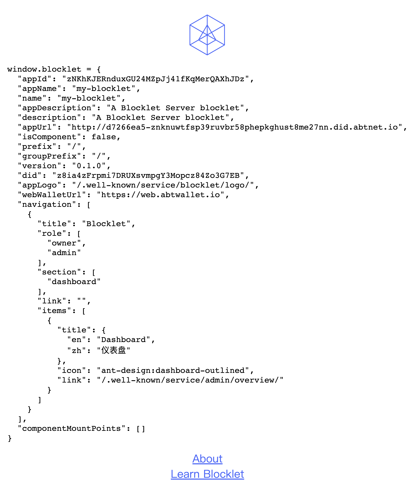

通常我们有两种创建 Blocklet 应用的方式: [Create Blocklet](https://www.createblocklet.dev/) 和 `blocklet create` 命令，后者是由 [`@blocklet/cli`](/quick-start/blocklet-server) 提供的一个命令，并且在前者的基础上构建而成。

`blocklet create` 提供了[多种类型的 Blocklet 模板](https://www.createblocklet.dev/docs/en/templates) 以满足不同的使用场景，包括:

- static 和 dapp 类型的 Blocklet
- 基于 React, Vue 等常用前端框架构建的应用
- 基于 Blocklet Pages 构建的网页站点或文档站点

本章节将以 _[static] react_ 模板为例介绍如何使用 `blocklet create` 命令快速创建一个 Blocklet 应用。

## 准备工作

- [安装 Node.js 14+](/quick-start/nodejs)
- [安装并初始化 Blocklet Server](/quick-start/blocklet-server)

## 创建 Blocklet 应用

1\. 在终端中执行 `blocklet create` 命令，根据提示输入项目名称:


2\. 根据需要选择 Blocklet 模板，这里以 `[static] react` 模板为例:


3\. 接下来输入作者名称和邮箱


等待命令执行完成后，一个全新的 Blocklet 项目就创建好了。

## 开发 Blocklet

在终端中执行 `cd my-blocklet` 命令进入之前创建的 my-blocklet 目录，并执行以下命令安装依赖:

```shell
npm i
# yarn
# pnpm i
```

然后执行以下命令启动 Blocklet 开发模式 (确保本地的 Blocklet Server 已初始化并且可以正常访问):

```shell
blocklet dev
# npm run dev
# yarn dev
# pnpm dev
```

应用启动后，终端会输出一个 DID Domain 地址，如下:


使用浏览器访问该地址可以看到如下页面，页面中的 `window.blocklet` 对应的是 [Blocklet Meta](/reference/blocklet-spec) 数据:



## 部署 Blocklet

当你需要将 Blocklet 部署到生产环境时，只需要执行 deploy 命令:

```shell
npm run deploy
# yarn deploy
# pnpm deploy
```

上面的命令首先会将你的 Blocklet 进行打包 ([Bundling](/how-to/bundle))，然后将其[部署到 Blocklet Server 中](/how-to/deploy)。在 Blocklet 部署后，你就可以登录 Blocklet Server 对 Blocklet 进行管理，比如启动、停止、配置域名、配置环境变量、配置用户权限以及查看运行日志 等。

## 进一步阅读

- [应用开发指南](/how-to/develop)
- [应用发布指南](/how-to/publish)
- [应用运行指南](/how-to/operation)
