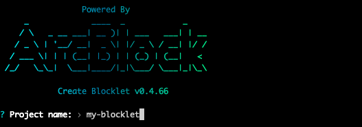
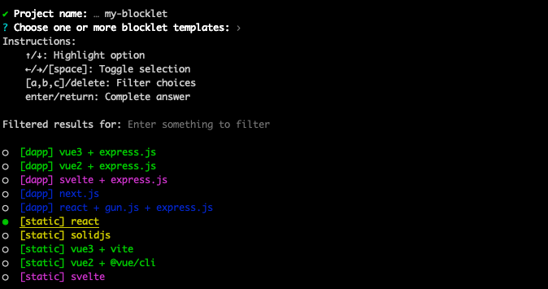
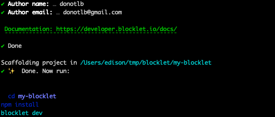
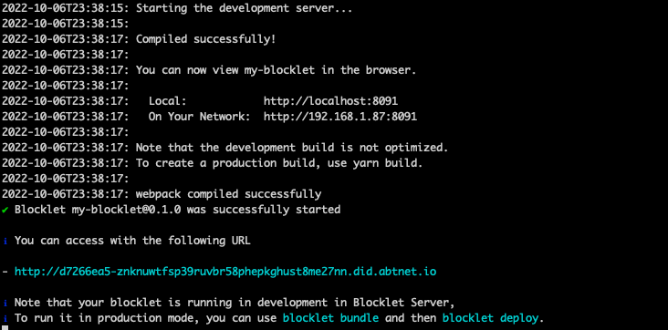
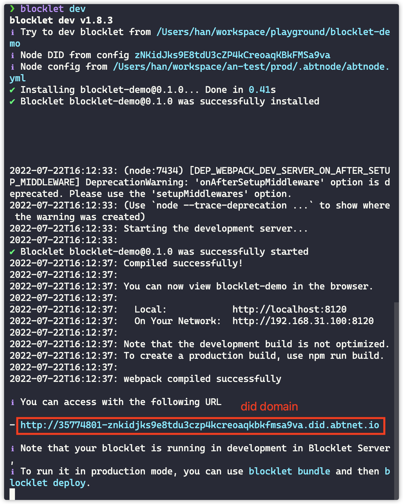

本小节将为你介绍如何快速创建一个 Blocklet。

## 依赖准备

首先你需要确保你的开发环境已经安装并启动了 [Blocklet Server](path-to-blocklet-server)

## 初始化一个项目

可以通过 `blocklet create` 命令来快速创建一个 Blocklet。
以下内容以创建一个 `React` 项目为例：

在终端调用 `blocklet create` 命令


输入项目名称 `blocklet-demo`，回车


选择 `webapp` 后回车


选择 `react`，后面再输入自己的名称和邮箱即可


至此，一个 Blocklet 项目已经创建完毕。

## 启动开发

进入到项目的目录中，执行以下命令安装项目依赖：

```bash
npm i
# yarn
# pnpm i
```

接着执行以下命令进入开发预览：

```bash
npm run dev
# yarn dev
# pnpm dev
# blocklet dev
```



终端中会打印出一个 `did domain` 的地址，直接访问这个地址就能预览当前的应用了。
