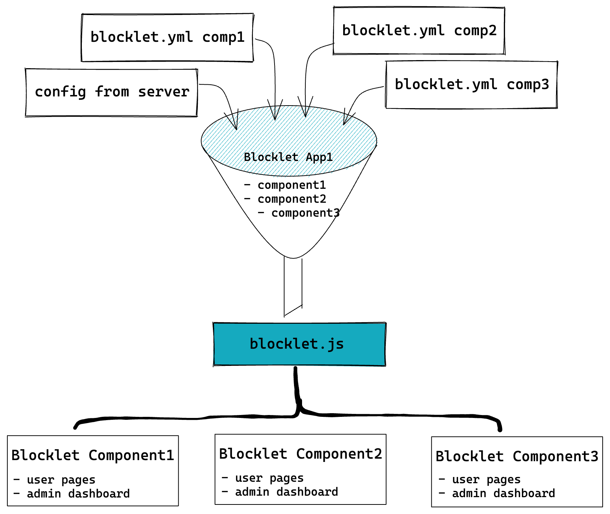

## What is blocklet.js?

- `blocklet.js` is used to **load blocklet info** that can be used in browser environment
- `blocklet.js` is an endpoint **served by blocklet server**
- `blocklet.js` is **available from any path**, you get the same response with following requests:
  - https://developer.blocklet.io/__blocklet__.js
  - https://developer.blocklet.io/docs/__blocklet__.js
- `blocklet.js` can return info in **javascript or json format**
  - When requested as javascript, which is the default mode, you can use `window.blocklet`
  - When requested as json, you must explicitly specify `type=json` in the query string
- `blocklet.js` is **adaptive** to any blocklet composition, both static and dynamic composition
- `blocklet.js` **content may change** with blocklet composition updates

## How is blocklet.js composed?

The following diagram describes how `blocklet.js` is created in blocklet server.



## How to use blocklet.js?

To use `blocklet.js`, you must include the following `script` tag in your html file **before any other script tags**:

```html
<script src="__blocklet__.js"></script>
```

Please <strong className="color-red">do not</strong> add a beginning slash to the script `src` attribute, since `blocklet.js` can be loaded form any endpoint.

Then you can access `window.blocklet` in your javascript code:

The response from `https://developer.blocklet.io/__blocklet__.js` is like following:

```javascript
window.blocklet = {
  // basic app info, appName, appDescription, appUrl, appLogo can be configured in blocklet server
  appId: 'zNKh7m9JccKmZY8vCSbkdYVoXem5CceAiYD1',
  appName: 'Blocklet Developer',
  appDescription: 'Blocklet Developer portal and documentation',
  appUrl: 'https://developer.blocklet.io',
  appLogo: '/.well-known/service/blocklet/logo/',

  // whether current blocklet is a component, differs when requesting from different path
  isComponent: false,

  // the blocklet app version === the version of the root blocklet
  version: '0.1.77',
  did: 'z8iZrq2YrLLWUz6X77bfFL4wBfZuEfXuj1R2m',

  // the blocklet group mountPoint
  prefix: '/',
  groupPrefix: '/',

  webWalletUrl: 'https://web.abtwallet.io',

  // the navigation of the composed service
  // it's parsed and merged from all components
  navigation: [
    { title: { en: 'Guides', zh: '指南' }, link: { en: '/docs/en/', zh: '/docs/zh/' } },
    {
      title: { en: 'ToolKit', zh: '工具箱' },
      link: '',
      items: [
        {
          title: 'Blocklet SDK',
          link: { en: '/docs/en/reference/blocklet-sdk/', zh: '/docs/zh/reference/blocklet-sdk/' },
        },
      ],
    },
  ],

  // component blocklet mounted in this app
  componentMountPoints: [
    {
      title: 'Meilisearch',
      name: 'meilisearch',
      did: 'z8iZorY6mvb5tZrxXTqhBmwu89xjEEazrgT3t', // the component blocklet did
      mountPoint: '/meilisearch', // the component path
    },
    {
      title: 'Blocklet Developer Docs',
      name: 'blocklet-developer-docs',
      did: 'z8iZwU5C5Y5SfSqC7LqKAbY9NiqFNjUjcJfPK',
      mountPoint: 'docs',
    },
  ],
};
```
