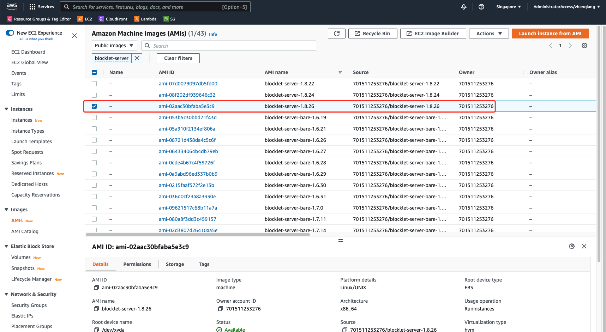
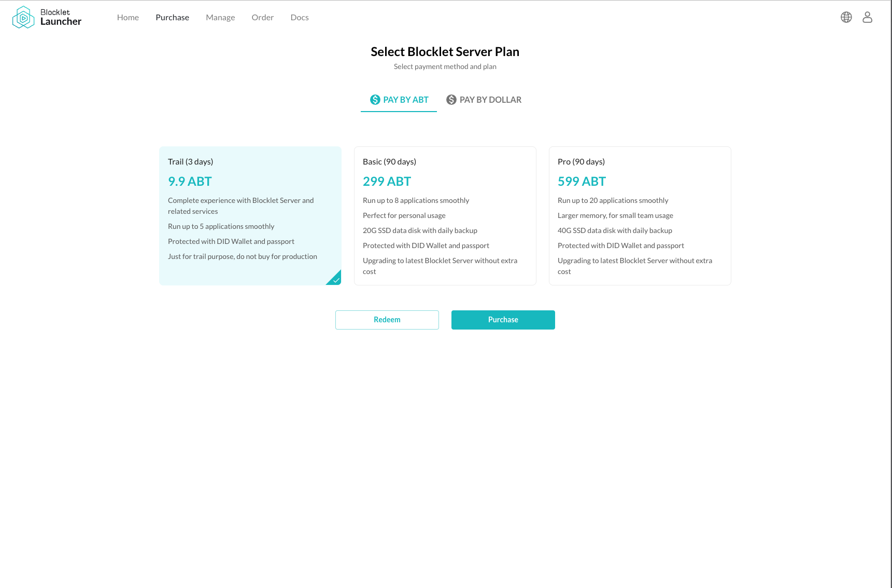

This document allows you to learn about running a Blocklet Server instance in different environments, including:

- Running in Docker
- Running with an AMI image when launching EC2 in AWS
- Purchasing a Blocklet Server from the ArcBlock Launcher service

**Related Tutorials**

- If you wish to run Blocklet Server on your own computer you can refer to this tutorial: [Setup Local Blocklet Server](/quick-start/blocklet-server)

## Starting a server with Docker

### Step 1: Pull the mirror

```bash
$ docker pull arcblock/blocklet-server:latest
```

### Step 2: Start the container

```bash
$ docker run --name test-server -d -p 80:80 -p 443:443 -v /tmp/test:/data arcblock/blocklet-server
```

Parameter explanation:

- `--name` Specify the name of the container.
- `-d` Let the container run in the background.
- `-p` Specify the ports exposed by the container. Blocklet Server will run on ports 80 and 443, so the container needs to be exposed to these two ports.
- `-v` Mount the disk directory. data in Blocklet Server will be stored in the `/data` directory, to prevent data loss, so the best practice is to mount the data directory in Docker to a directory on the host.

If everything is fine, Blocklet Server will start successfully within a minute, and you can use the `docker logs {container name}` command to view the startup information in the container during the startup process:

```bash
$ docker logs test-server
                 Powered By
     _             ____  _            _
    / \   _ __ ___| __ )| | ___   ___| | __
   / _ \ | '__/ __|  _ \| |/ _ \ / __| |/ /
  / ___ \| | | (__| |_) | | (_) | (__|   <
 /_/   \_\_|  \___|____/|_|\___/ \___|_|\_\
            Blocklet CLI v1.8.22
blocklet server v1.8.22
Blocklet Server instance already exists in /data, now starting...
✔ Blocklet Server DB Proxy ready on port 40404
ℹ Node DID from config zNKZ5v8AqMfNrZoTrdComvjZdGKkjrDqALPx
ℹ Node config from /data/.blocklet-server/config.yml
✔ Blocklet Server Event Hub ready on port 40407
✔ Blocklet Server Updater ready on port 40405
✔ Fetch wildcard certificates successfully
- Starting Blocklet Service...
✔ Starting Blocklet Service... Done in 21.351s
- Starting Blocklet Server Daemon...
✔ Starting Blocklet Server Daemon... Done in 29.49s
```

### Step 3: Access the server via IP Echo address

IP Echo is a DNS that maps IPs in URLs, and the domain name served by IP Echo is `ip.abtnet.io`. For example, `https://192-168-1-1.ip.abtnet.io` DNS resolves the IP to `192.168.1.1`.

The server can be accessed through the IP Echo address after the server is successfully started. For example, if the local IP is `192.168.0.10`, then the IP Echo address is `https://192-168-0-10.ip.abtnet.io/`.

## Running in AWS

We provide a Blocklet Server AMI image to quickly run a server based on our AMI image when creating EC2.

### Step 1: Find Blocklet Server AMI

1. Open the Amazon EC2 console page at https://console.aws.amazon.com/ec2/
1. Select the `Images -> AMI` page in the sidebar
1. Select `Public Mirror` in the filter criteria
1. Enter `Blocklet Server` to search
1. Select the latest version of the mirror, the latest version is blocklet-server-1.8.26 as shown below:
   

   **!!!Note: Do not select the blocklet-server-bare-xxx image**，

1. Click on "Launch instance from AMI"

### Step 2: Set up security groups and other basic information

1. Fill in the instance name
1. Select the instance type, the minimum memory requirement for Blocklet Server is 1G
1. Select the secret key pair
1. Configure the network security group, Blocklet Server requires open ports 80 and 443
1. Configure storage, the recommended minimum storage is 20G
1. Other configurations can be set according to the actual situation
1. Click "Launch Instance", wait for the instance to start successfully

### Step 3: Access the server via IP Echo address

EC2 instances can be accessed through their public IP Echo addresses after they are started. For example, if the public IP is `192.168.0.10`, then the IP Echo address is `https://192-168-0-10.ip.abtnet.io/`.

## Launching a server via ArcBlock Launcher

ArcBlock Launcher is a service that allows you to purchase Blocklet Server servers via ABT, credit card and other payment methods. This service eliminates the need to install environments or dependencies such as Node.js/Blocklet CLI/Nginx, and allows you to fill in simple configuration information to get a running server.
Service Address: https://launcher.arcblock.io/

### Step 1: Purchase NFT

1. Selecting the right type of NFT
   
1. Select payment type: ABT
1. Click "Buy" to pay, after successful payment, it will automatically jump to the start page

### Step 2: Start the server

1. Fill in the server information and click "Agree to the EULA and continue"
1. Wait for a successful startup. The startup process takes about three minutes, and will automatically jump to the newly started server after a successful startup.

## Next steps

After running a server, there may be a few more things that need to be done:

- Set a domain name for the server: [Operation and maintenance your blocklet](/how-to/operation)
