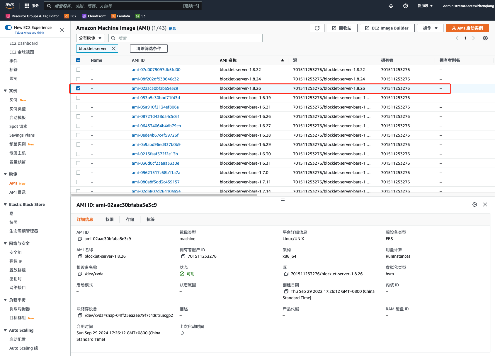
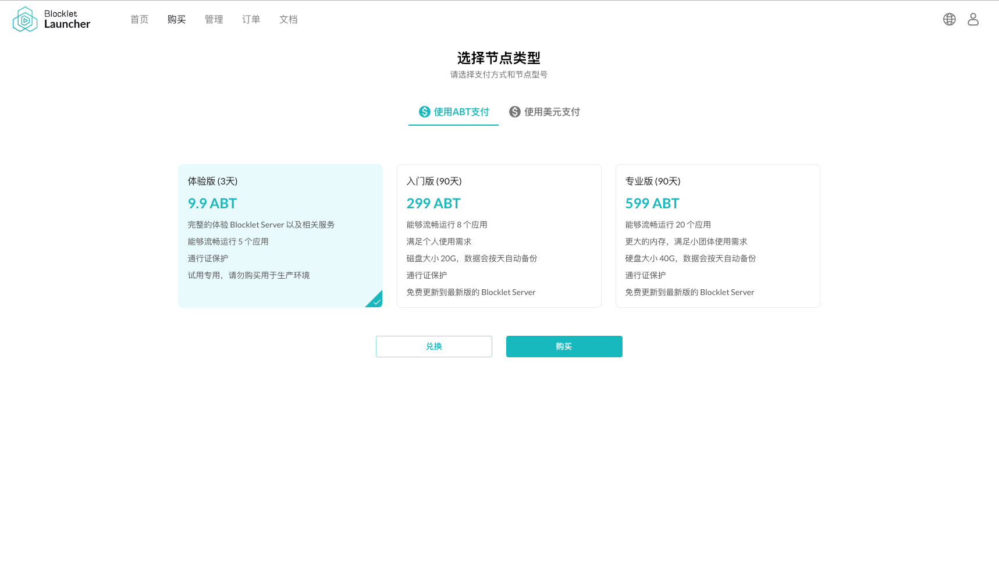

通过本文档您可以了解到在不同的环境中运行一个 Blocklet Server 节点，包括:

- 在 Docker 中运行
- 在 AWS 中启动 EC2 时使用 AMI 镜像运行
- 在 ArcBlock Launcher 服务购买一个节点

**相关教程**

- 如果你希望在自己的电脑上运行 Blocklet Server 可以参考这篇教程: [在本机启动 Blocklet Server](/zh/quick-start/blocklet-server)

## 使用 Docker 启动节点

### 第一步: 拉取镜像

```bash
$ docker pull arcblock/blocklet-server:latest
```

### 第二步: 启动容器

```bash
$ docker run --name test-server -d -p 80:80 -p 443:443 -v /tmp/test:/data arcblock/blocklet-server
```

参数解释:

- `--name` 指定容器的名称。
- `-d` 让容器在后台运行。
- `-p` 指定容器暴露的端口，Blocklet Server 会运行在 80 和 443 端口，所以需要容器暴露这来这两个端口。
- `-v` 挂载磁盘目录。Blocklet Server 中的数据会存储在 `/data` 目录中，为了防止数据丢失，所以最佳实践是将 Docker 中的数据目录挂载到主机的一个目录中。

如果一切正常，Blocklet Server 会在一分钟内启动成功，在启动的过程中可以使用 `docker logs {容器名称}` 命令查看容器内的启动信息:

```bash
$ docker logs test-server
                 Powered By
     _             ____  _            _
    / \   _ __ ___| __ )| | ___   ___| | __
   / _ \ | '__/ __|  _ \| |/ _ \ / __| |/ /
  / ___ \| | | (__| |_) | | (_) | (__|   <
 /_/   \_\_|  \___|____/|_|\___/ \___|_|\_\
            Blocklet CLI v1.8.22
blocklet server v1.8.22
Blocklet Server instance already exists in /data/abtnode, now starting...
✔ Blocklet Server DB Proxy ready on port 40404
ℹ Node DID from config zNKZ5v8AqMfNrZoTrdComvjZdGKkjrDqALPx
ℹ Node config from /data/abtnode/.blocklet-server/config.yml
✔ Blocklet Server Event Hub ready on port 40407
✔ Blocklet Server Updater ready on port 40405
✔ Fetch wildcard certificates successfully
- Starting Blocklet Service...
✔ Starting Blocklet Service... Done in 21.351s
- Starting Blocklet Server Daemon...
✔ Starting Blocklet Server Daemon... Done in 29.49s
```

### 第三步: 通过 IP Echo 地址访问节点

IP Echo 是一个映射 URL 中 IP 的 DNS, IP Echo 的服务域名是 `ip.abtnet.io`. 比如 `https://192-168-1-1.ip.abtnet.io` DNS 解析后的 IP 是 `192.168.1.1`.

节点启动成功后可以通过 IP Echo 地址访问该节点。比如，如果本机 IP 是 `192.168.0.10`, 那么 IP Echo 地址就是 `https://192-168-0-10.ip.abtnet.io/`.

## 在 AWS 中启动节点

我们提供了一个 Blocklet Server AMI 镜像，在创建 EC2 时可以基于我们的 AMI 镜像快速启用一个节点。

### 第一步: 查找 Blocklet Server AMI

1. 打开 Amazon EC2 控制台页面 https://console.aws.amazon.com/ec2/
1. 在侧边栏选择`镜像 -> AMI` 页面
1. 在筛选条件中选择`公有镜像`
1. 输入`Blocklet Server`进行搜索
1. 选中当前最新版本镜像, 如下图的最新版本是 blocklet-server-1.8.26:
   

   **!!!注意：不要选择 blocklet-server-bare-xxx 镜像**，

1. 点击”从 AMI 启动实例“

### 第二步：设置安全组和其它基本信息

1. 填写实例名称
1. 选择实例类型， Blocklet Server 要求的最低内存要求是 1G
1. 选择秘钥对
1. 配置网络安全组, Blocklet Server 要求打开 80 和 443 端口
1. 配置存储，建议最小的存储是 20G
1. 其它配置根据实际情况设置即可
1. 点击"启动实例", 等待实例启动成功即可

### 第三步: 通过 IP Echo 地址访问节点

EC2 实例启动后可以通过其公网 IP Echo 地址访问。比如，如果公网 IP 是 `192.168.0.10`, 那么 IP Echo 地址就是 `https://192-168-0-10.ip.abtnet.io/`.

## 通过 ArcBlock Launcher 启动节点

ArcBlock Launcher 是一个可以通过 ABT, 信用卡等支付方式购买 Blocklet Server 节点的服务。通过该服务可以省去 Node.js/Blocklet CLI/Nginx 等环境或依赖的安装，只需要填写简单的配置信息就可以得到一个运行的节点。
服务地址: https://launcher.arcblock.io/

### 第一步：购买 NFT

1. 选择合适的 NFT 类型
   
1. 选择支付类型：ABT
1. 点击"购买"支付，支付成功后会自动跳转到启动页面

### 第二步：启动节点

1. 填写服务器信息后点击"同意协议并继续"
1. 等待启动成功。 启动过程大概需要三分钟, 启动成功后会自动跳转到新启动的节点

## 后续步骤

在运行一个节点后，可能还需要做一些事情:

- 给节点设置一个域名: [应用管理和维护](/how-to/operation)
