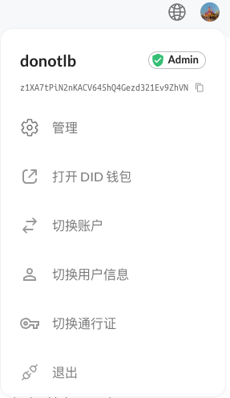

Blocklet UI 是一个用于快速构建 Blocklet 的前端组件库。区别于一般的 UI 组件库，Blocklet UI 提供的组件通常需要工作在 Blocklet 环境中，在页面渲染时，Blocklet UI 会读取 Blocklet 运行时信息 (称为 Blocklet Meta), 比如 Blocklet Logo，应用名称，导航菜单 等信息，然后基于这些信息来渲染用户界面。

Blocklet UI 有 2 个核心目的:

1. 根据 Blocklet 运行时信息自动渲染用户界面，以快速、便捷地开发 Blocklet 应用。
2. 在组合式 Blocklet 的场景中，为各个 Blocklet 组件 (父/子 Blocklet) 提供更一致的用户界面。

Blocklet UI 目前主要提供了 Header, Footer 和 Dashboard 三个组件，Header 和 Footer 是应用中不可缺少的元素，而 Dashboard 主要用于构建管理端用户界面，本文后续会有专门的章节来讲述如何使用这些组件。

## Blocklet UI 与 Blocklet Meta

前面提到了 Blocklet UI 组件的渲染依赖于 Blocklet 运行时信息，即 Blocklet Meta，那么 Blocklet Meta 的来源是什么 ？答案是 blocklet.yml。blocklet.yml 配置对于 Blocklet 来说是必不可少的，它用来描述 Blocklet 的元数据，甚至可以影响 Blocklet 的运行行为。当一个 Blocklet 被部署到 Blocklet Server 上时，后者会解析前者的 blocklet.yml 配置，并将该信息 (Blocklet Meta) 存储到某个地方，当我们访问这个 Blocklet 时，Blocklet Server 会将 Blocklet Meta 嵌入到 Blocklet 应用中，因此，在 Blocklet 程序中可以访问 Blocklet Meta。

Blocklet Meta 中包含的数据非常多，Blocklet UI 只关心其中与用户界面相关的数据，比如：

- appId  
  Blocklet 的唯一标识，一个 DID 地址
- appName  
  Blocklet 应用的名称
- appLogo  
  Blocklet 应用的 Logo (URL)
- navigation  
  导航菜单数据，可以用于配置 Header、Footer 以及 Dashboard 中的导航菜单

进一步了解 Blocklet Meta 请参考[这里](/reference/blocklet-spec)。

## 安装

> 目前 Blocklet UI 只提供了 react 版本 - `@blocklet/ui-react`。

```shell
npm install @blocklet/ui-react
# or yarn
yarn add @blocklet/ui-react
```

## Header 组件

Header 是网页中必不可少的重要元素，它出现在网页的顶部区域，一般用于显示品牌信息，提供应用导航。

### 使用

```jsx
import Header from '@blocklet/ui-react/lib/Header';

function App() {
  return (
    <div className="page">
      <Header />
      ...
    </div>
  );
}
```

在 Blocklet 应用中使用 `<Header />` 可以为页面渲染一个标准化的 Header 元素 (下图)。它包含的元素有:

- 应用 Logo
- 应用名称
- 应用 DID
- 导航菜单
- 语言选择器
- 会话管理器 (Session Manager)


<p align="center">Fig.1 - Header</p>

### 配置导航菜单

Blocklet UI Header 在运行时会读取 blocklet.yml 中的 navigation 配置并渲染一个导航菜单。上图 (Fig.1) 中的导航菜单就是 Header 基于下面的 navigation 配置渲染而成。
navigation 配置由 1 个或多个条目组成，在这里一个条目代表一个菜单项，菜单项的主要属性有：

- title: 菜单项的标题文本，支持多语言
- link: 菜单项的链接, 支持多语言
- icon: 菜单项的图标, 支持 2 种形式的值
  - iconify: `<prefix>:<icon-name>`
  - image url
- section: 菜单项所出现的位置，可以配置多个值 (数组形式), 目前支持以下几种 section:
  - header: Header 区域的导航菜单
  - footer: Footer 区域的导航菜单
  - social: Footer 社交媒体图标相关的链接
  - bottom: Footer 底部区域相关链接，比如法律法规、隐私政策 等链接
  - dashboard: 管理控制台中侧边栏中的导航菜单
  - sessionManager: Session Manager 中的菜单
- role: 允许菜单项被访问的用户角色，可以配置 1 个或多个值，每个值应该与 Blocklet Server Passport 对应，Blocklet Server 内置的 Passport 有 owner、admin、member 和 guest，进一步了解请参考 [User and Passport](/guide/auth)
- items: 子菜单 (支持嵌套)

```yaml
# blocklet.yml
navigation:
  - title:
      en: Home
      zh: 首页
    link: '/'
    icon: mdi:home
    section: header # This menu item will be displayed in Header Navigation
  - title:
      en: Discuss
      zh: 讨论
    link: '/discussion/'
    icon: mdi:chat-processing
    section: header
  - title: Profile
    link:
      en: '/profile/en'
      zh: '/profile/zh'
    icon: mdi:text-box
    section: header
  - title: Test
    icon: mdi:alpha-t-box
    section: header
    items: # Sub navigation menu
      - title: Sub1
        link: https://store.blocklet.dev
      - title: Sub2
        link: https://dev.store.blocklet.dev
      - title: Sub3
        link: '/profile/'
```

### 定制 Session Manager 菜单

Blocklet UI Header 组件在渲染时会检测上下文中是否存在 Session Context, 如果存在, 会在 Header 的 Addons 区域 (Header 最右侧的区域) 渲染一个 Session Manager。Session Manager 主要提供用户登录、用户注销、切换 profile、切换 passport 等功能，参考下图。


如果需要定制 Session Manager 的菜单, 比如添加一个 "管理控制台" 菜单项，我们可以在 blocklet.yml navigation 中添加如下配置:

```yaml
# blocklet.yml
navigation:
  - title:
    en: Manage
    zh: 管理
  icon: ion:settings-outline
  link: /admin/blocklets?from=sm
  section:
    - sessionManager
  role:
    - admin
    - owner
```

注意这里的 role 配置，表示仅在当前用户是 admin 或 owner 角色时才会将该菜单项渲染到 Session Manager 中，配置后的 Session Manager 渲染结果如下图:



## Footer 组件

Footer 是指网页最底部的内容部分。它通常包含品牌介绍、应用导航、版权声明、隐私政策链接、社交媒体图标 等信息。

### 使用

```jsx
import Footer from '@blocklet/ui-react/lib/Footer';

function App() {
  return (
    <div className="page">
      ...
      <Footer />
    </div>
  );
}
```

### 布局

Blocklet UI 目前支持 标准布局 和 简单布局，并根据 Blocklet 运行时数据自动选择一种合适的布局。


<p align="center">Fig.2 - 标准布局</p>


<p align="center">Fig.3 - 简单布局</p>

标准布局中包含的重要元素有：

- 应用 Logo
- 导航
- 社交媒体图标
- 版权声明
- 底部链接 (法律法规、隐私政策等链接)

其中导航、社交媒体图标、底部链接 都可以通过 navigation 进行配置，为导航条目指定相应的 section 就可以将其渲染到合适的位置，下面的配置将产生上图 (Fig.2) 中的效果:

```yaml
# blocklet.yml
# Navigation links in footer
navigation:
  - title:
      en: PRODUCT
      zh: 产品
    icon: mdi:home
    section:
      - footer
    items:
      - title: Overview
        link: https://www.arcblock.io/en/platform
        icon: mdi:home
    # ...
  # Social media icons in footer
  - icon: mdi:twitter
    link: https://github.com
    section: social
  - icon: mdi:telegram
    link: https://github.com
    section: social
  - icon: mdi:github
    link: https://github.com
    section: social
  - icon: mdi:wechat
    link: https://github.com
    section: social
  # Utility links in footer
  - title: Terms of Service
    link: https://www.arcblock.io/en/termsofuse
    section: bottom
  - title: Privacy
    link: https://www.arcblock.io/en/privacy
    section: bottom
  - title: Service Level
    link: https://www.arcblock.io/en/sla
    section: bottom
  - title: Site Map
    link: https://www.arcblock.io/sitemap.xml
    section: bottom
```

## Dashboard 组件

Dashboard 组件用于搭建管理控制台页面，主要包含 Header、Footer、Side Nav、Main Content 几个部分，其中前 3 个部分由 Blocklet UI Dashboard 组件根据 Blocklet 运行时数据自动渲染，应用的业务功能页面会显示在 main content (主内容区) 区域。

### 使用

```jsx
import Dashboard from '@blocklet/ui-react/lib/Dashboard';

function App() {
  return (
    <Dashboard>
      <div className="content">...</div>
    </Dashboard>
  );
}
```

渲染结果如下:


<p align="center">Fig.4 - Dashboard</p>

### 配置导航菜单

Dashboard 导航菜单的配置方式与 Header 组件相似，不同之处是导航条目的 section 属性需要设置为 "dashboard"，下面的配置将产生上图 (Fig.4) 中的效果:

```yaml
# blocklet.yml
# Navigation menu items in Dashboard Side Nav
navigation:
  - title: Profile
    link: '/profile'
    icon: charm:person
    section: dashboard # This menu item will be displayed in Dashboard Side Nav
  - title: Account
    link: '/account'
    icon: material-symbols:settings-outline
    section: dashboard
  - title: Appearance
    link: '/appearance'
    icon: la:paint-brush
    section: dashboard
    role: owner # Only owner can access this menu item
  - title: Notification
    link: '/notification'
    icon: ri:notification-2-line
    section: dashboard
  - title: Access
    icon: fluent:accessibility-16-regular
    items: # Grouped menu items
      - title: Billing and plans
        link: '/billing-and-plans'
        icon: ant-design:credit-card-outlined
      - title: Emails
        link: '/emails'
        icon: ic:outline-email
      - title: Authentication
        link: '/authentication'
        icon: ri:shield-keyhole-line
      - title: SSH and GPG keys
        link: '/ssh-and-gpg-keys'
        icon: ph:key-bold
    section: dashboard
  - title: Code
    icon: material-symbols:code
    items:
      - title: Branches
        link: '/branches'
        icon: charm:git-branch
      - title: Tags
        link: '/tags'
        icon: uil:tag-alt
      - title: Repositories
        link: '/repositories'
        icon: octicon:repo-16
      - title: Packages
        link: '/packages'
        icon: octicon:package-24
      - title: Pages
        link: '/pages'
        icon: icon-park-outline:web-page
    section: dashboard
    role:
      - developer
      - owner
  - title: Archives
    icon: mdi:archive-outline
    items:
      - title: Security log
        link: '/security-log'
        icon: ph:scroll
        role:
          - owner
      - title: Sponsorship log
        link: '/sponsorship-log'
        icon: ph:scroll
        role: # User with developer or owner roles can access this menu item
          - developer
          - owner
    section: dashboard
```

### 定制 Session Manager 菜单

与 Header 组件一样，Dashboard 组件会在 Header 区域自动渲染一个 Session Manager，Session Manager 的菜单也可以通过 blocklet.yml navigation 进行配置，配置方式参考上面 Header 章节。

## Header 内置 Addons

Blocklet UI Header (包括 Dashboard 中的 Header) 右侧部分是 Addons 区域，用于放置常用的功能按钮，因为语言选择器 (LocaleSelector) 和会话管理器 (SessionManager) 使用频率很高，所以 Blocklet UI Header 将它们作为内置 addons 进行渲染，默认情况下，Blocklet UI Header 只要检测到 Locale Context (或 Session Context)，就会自动在 addons 区域渲染 LocaleSelector (或 SessionManager)。

因此，如果你的 Blocklet 应用依赖于多语言和用户体系，需要在应用入口处提供 LocaleProvider 和 SessionProvider，在真实的 Blocklet 应用中通常会使用下面的代码片段:

```jsx
import { LocaleProvider, useLocaleContext } from '@arcblock/ux/lib/Locale/context';
import { createAuthServiceSessionContext } from '@arcblock/did-connect/lib/Session';
import Header from '@blocklet/ui-react/lib/Header';
import Footer from '@blocklet/ui-react/lib/Footer';

const { SessionProvider } = createAuthServiceSessionContext();

function App() {
  return (
    <LocaleProvider translations={...}>
      <SessionProvider serviceHost={...}>
        <div className="page">
          <Header />
          ...
          <Footer />
        </div>
      </SessionProvider>
    </LocaleProvider>
  );
}
```

## Storybook 参考

- [Header](https://arcblock.github.io/ux/?path=/story/blocklet-ui-react-header--basic)
- [Footer](https://arcblock.github.io/ux/?path=/story/blocklet-ui-react-footer--footer)
- [Dashboard](https://arcblock.github.io/ux/?path=/story/blocklet-ui-react-dashboard--basic)
