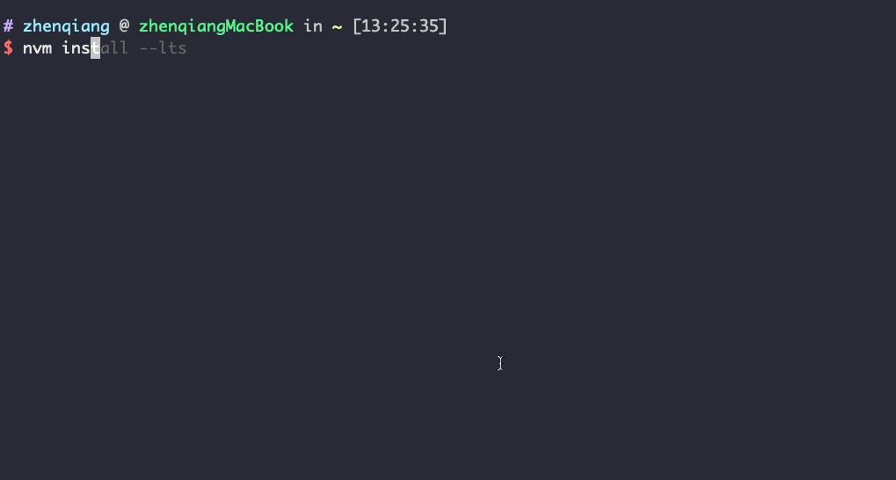
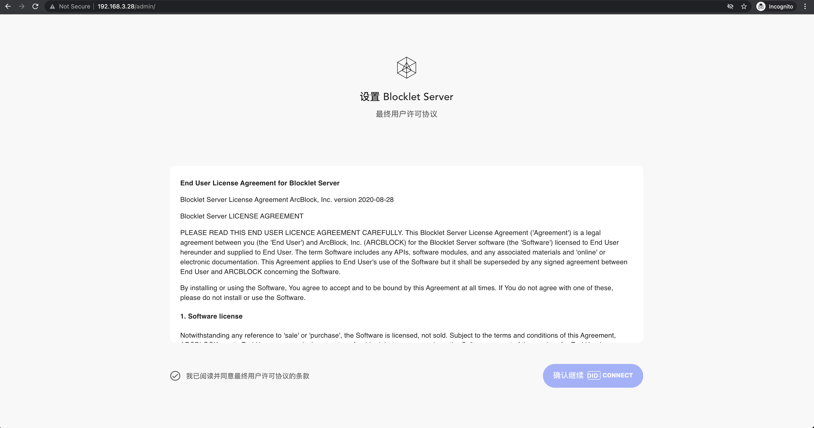

目前，只能在 [Linux] 和 [macOS] 安装。如果你想使用别的操作系统比如 Windows，你可以使用虚拟机，不过需要确保 ABT 钱包可以访问到你的虚拟机 IP 地址。

### 环境设置

#### 第一步: 安装 [nvm]

执行下面命令，即可安装 [nvm]：

```bash
/bin/bash -c "$(curl -fsSL https://raw.githubusercontent.com/nvm-sh/nvm/master/install.sh)"
```

<details>
<summary>输出示例</summary>


</details>

#### 第二步: 安装 [Node.js] 和 [npm]

Blocklet Server 会在第一时间适配 Node.js LTS 版本, 所以我们推荐安装 LTS 版本 Node.js.

只要安装完 [Node.js]，[npm] 也会被自动安装完成。

```bash
nvm install --lts
```

<details>
<summary>输出示例</summary>



</details>

注意：你可以通过运行命令 `nvm install-latest-npm` 安装最新的 [Node.js]

#### 第三步：安装 Nginx

Blocklet Server 的网关依赖于 Nginx, 所以我们需要安装 Nginx.

**版本 >= 1.18.0**

##### 在 Mac 上安装

使用 Homebrew 安装:

`brew install nginx`

参考: https://formulae.brew.sh/formula/nginx

##### 在 Linux 上安装

参考: https://www.nginx.com/resources/wiki/start/topics/tutorials/install/

#### 第四步：安装并初始化 ABT 钱包

从 [ABT 钱包官网](http://abtwallet.io) 找到下载入口完成 ABT 钱包的安装。然后打开钱包跟随钱包指引完成钱包的初始化。

### 安装 Blocklet CLI

现在，使用 [npm] 执行下面命令即可安装 Blocklet CLI ：

```bash
npm install -g @blocklet/cli
```

<details>
<summary>输出示例</summary>

```
LinkdeMacBook-Pro:demo linchen$ npm install -g @blocklet/cli

/Users/linchen/.nvm/versions/node/v14.17.1/bin/blocklet -> /Users/linchen/.nvm/versions/node/v14.17.1/lib/node_modules/@blocklet/cli/bin/blocklet.js

+ @blocklet/cli@1.6.1
added 7 packages from 3 contributors, removed 7 packages and updated 125 packages in 123.454s
```

</details>

### 创建并运行 Blocklet Server

安装 Blocklet CLI 后，您可以使用一个空目录存储配置并初始化 Blocklet Server。

1. 运行 `mkdir -p ~/blocklet-server-data && cd ~/blocklet-server-data` 命令进入目录。 可以将 `~/blocklet-server-data` 替换为任何其他目录

2. 运行 `blocklet server init` 命令初始化 Blocklet Server

3. 执行初始化命令后，系统将确认您要存储配置的目录。

4. 确认后，系统将自动生成您的 Blocklet Server 配置。

5. 执行 `blocklet server start` 启动 Blocklet Server

<details>
<summary>输出示例</summary>

```
linchen@LinkdeMacBook-Pro demo % blocklet server init
blocklet server v1.6.1
? Are you sure to initialize a Blocklet Server instance in the current directory(/Users/linchen/code/arcblock/ad/demo) Yes
✔ Blocklet Server configuration is successfully generated /Users/linchen/code/arcblock/ad/demo/.abtnode/abtnode.yml
ℹ blocklet server start

linchen@LinkdeMacBook-Pro demo % blocklet server start
blocklet server v1.6.1
ℹ Node did from config zNKoXYcX3yy74pFiNr3UcrtkmhkPccZE5Sso
ℹ Load config from /Users/linchen/code/arcblock/ad/demo/.abtnode/abtnode.yml
✔ Blocklet Server DB Proxy ready on port 40404
✔ Blocklet Server Event Hub ready on port 40407
✔ Blocklet Server Updater ready on port 40405
✔ Dashboard HTTPS certificate was downloaded successfully!
✔ Starting Blocklet Server Service... Done in 7.086s
✔ Starting Blocklet Server Daemon... Done in 13.095s
✔ You can access your Blocklet Server with either of the following URLs

HTTP URLs:

- http://192.168.3.28/admin/ [private]
- http://60.24.229.153/admin/ [public]

Secure URLs (Recommended):

- https://192-168-3-28.ip.abtnet.io/admin/ [private]
- https://60-24-229-153.ip.abtnet.io/admin/ [public]
linchen@LinkdeMacBook-Pro demo %
```

</details>

5. 您可以通过执行 `blocklet server stop` 命令来停止 blocklet 服务器。

<details>
<summary>输出示例</summary>

```
linchen@LinkdeMacBook-Pro demo % blocklet server stop
blocklet server v1.6.1
ℹ Node did from config zNKoXYcX3yy74pFiNr3UcrtkmhkPccZE5Sso
ℹ Load config from /Users/linchen/code/arcblock/ad/demo/.abtnode/abtnode.yml
✔ Sending shutdown notification to web dashboard users Done in 2.055s
✔ Routing engine is stopped successfully
✔ abt-node-daemon is stopped successfully
✔ abt-node-service is stopped successfully
✔ abt-node-updater is stopped successfully
✔ abt-node-db-hub is stopped successfully
✔ abt-node-log-rotate is stopped successfully
✔ abt-node-event-hub is stopped successfully
✔ Done!
```

</details>

### Access Blocklet Server

上述命令将启动 Blocklet 服务器。 您可以通过 `http://192.168.3.28/admin/` 或 `https://192-168-3-28.ip.abtnet.io/admin/` 访问 Blocklet Server（请将替换 `192.168.3.28` 为您的本地网络ip）。 在此之后，您必须在访问 Blocklet Server 仪表板之前同意许可条款。



*请不要使用 localhost 或 127.0.0.1 地址访问 Blocklet 服务器。 您将无法使用 ABT 钱包连接它。*

[linux]: https://www.linux.org
[macos]: https://www.apple.com/macos
[nvm]: https://github.com/nvm-sh/nvm
[node.js]: https://nodejs.org
[npm]: https://www.npmjs.com
