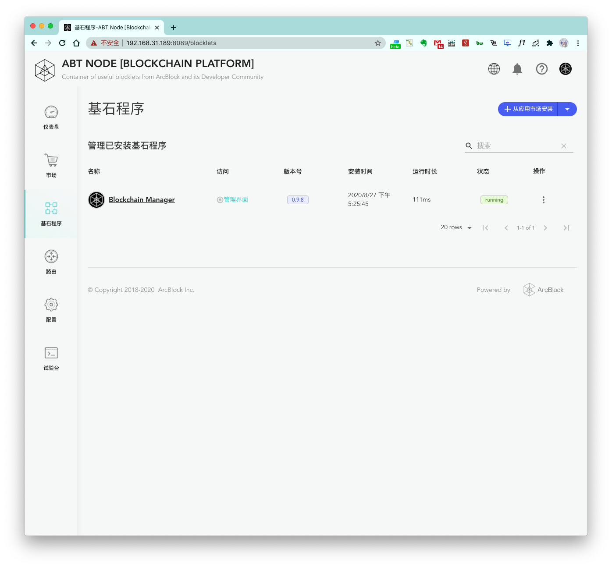
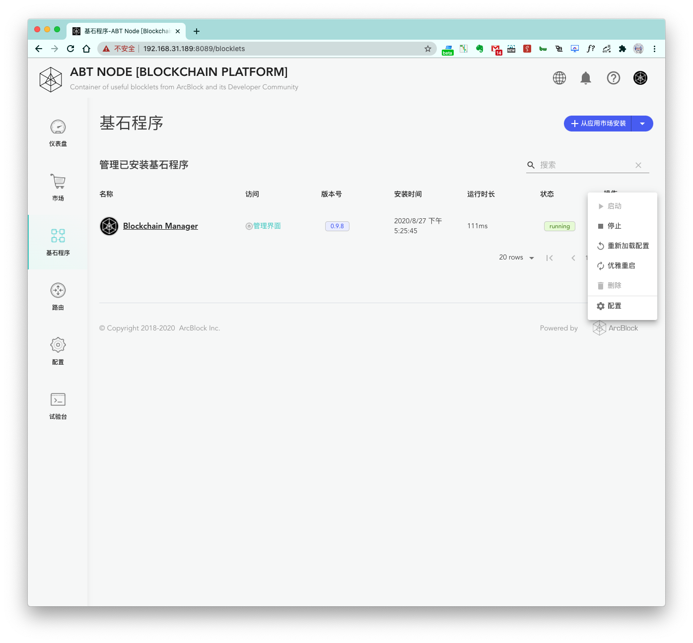
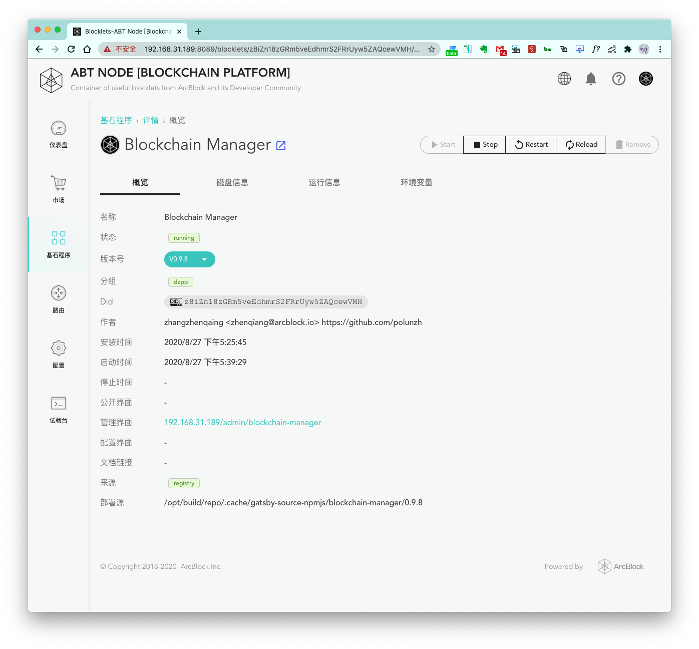

首先，我们先从 Blocklet 市场安装一个 Blocklet，成功安装之后，我们打开 `基石程序` 。

## Blocklet 列表页面

基石程序列表页面，我们可以看到当前 Blocklet 的一系列属性：

1. 名称
2. 访问链接
3. 版本号
4. 安装时间
5. 运行时长
6. 状态

也可以在 `操作` 展开可以进行的操作列表：

1. 启动：启动 Blocklet
2. 停止：停止 Blocklet
3. 重新加载配置
4. 优雅重启：重新启动 Blocklet
5. 删除：删除 Blocklet（或者同时删除 Blocklet 的数据）
6. 配置：进入 Blocklet 配置页面

## Blocklet 详情页面

在详情页面，顶部右侧有一排操作按钮：

1. Start：启动 Blocklet
2. Stop：停止 Blocklet
3. Restart：重新启动 Blocklet
4. Reload：重新加载配置
5. Remove：删除 Blocklet（或者同时删除 Blocklet 的数据）
