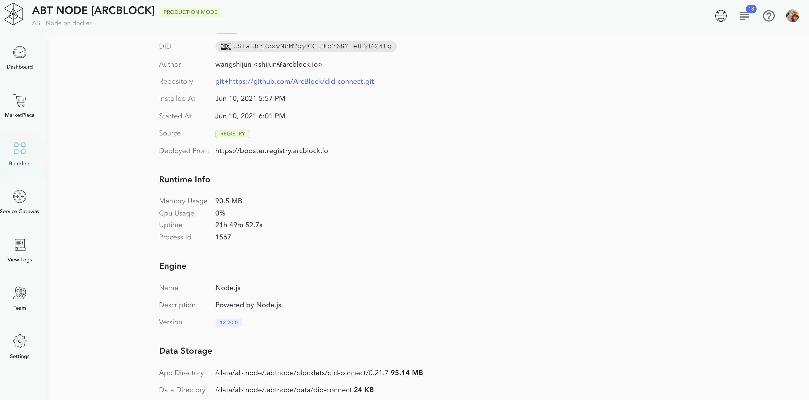

Click a Blocklet on the Blocklet Management page to arrive on the configuration page for the respective Blocklet. The page provides details about the installed Blocklet. The page allows you to control Blocklet operation and update its configuration.

On the details page, there is a row of operation buttons on the top right:

1. `Start`
2. `Stop`
3. `Restart`
4. `Reload`: Reload the configuration
5. `Remove` (as stated earlier, you will be prompted to choose whether to delete the blocklet data as well)

There are the following three tabs that provide further details about the Blocklet

### Overview Tab

The *Overview* tab provides details like version, status, location, source, etc, for the installed Blocklet binary. It also captures basic usage metrics like uptime, CPU, and memory usage.

The page also shows different data locations for the different types of files used by the Blocklet.
- APP Directory: The location to store Blocklet binary.
- Data Directory: The location to store all data processed by a Blocklet.
- Log Directory: The location for the logs generated by the Blocklet
- Cache Directory: The location used for caching data by the blocklet.

You may prefer to monitor the logs and backup all data for the required directories.

### Access URLs Tab

The *Access URLs* tab provides various access locations for a running Blocklet.

These URL are specified by the interfaces provided in the Blocklet configuration.

### Configuration Tab

The *Configuration* tab displays different user defined,  Blocklet defined and Blocklet Server defined environment variables.

#### User Defined Variables

The Blocklet uses the user-defined variables to customize its behavior as per the provided configuration. These variables are defined by the Blocklet developer and updated by the user as per the required usecase. Please refer to Blocklet documents to determine the supported user-defined variables.

The following variables are from *kitchen Sink* blocklet.

1. `FORGE_RELEASE_MIRROR` :	https://releases.arcblockio.cn
2. `ONLY_START_IN_EVEN_MINUTES` :	no
3. `ONLY_YES_OR_NO` :	no

User defined variables can be updated by clicking the corresponding `pencil`(edit) icon. This converts the value field into an editable text box. The value updates are not auto saved, and a user must confirm or reject the changes by clicking the `tick` or the `cross` icon.

#### Blocklet Variables

These variables area defined by Blocklet Server to specify an installed blocklet configuration. Most of these variables are immutable. Only a few of these variables can be updated to configure blocklets.

1. `BLOCKLET_PORT`: Blocklet port
2. `BLOCKLET_APP_DIR`: Blocklet application directory
3. `BLOCKLET_MAIN_DIR`: Blocklet main directory
4. `BLOCKLET_DATA_DIR`: Blocklet data directory
5. `BLOCKLET_LOG_DIR`: Blocklet log directory
6. `BLOCKLET_CACHE_DIR`: Blocklet cache directory
7. `BLOCKLET_APP_SK`: Blocklet app sk
8. `BLOCKLET_APP_ID`: Blocklet app id
9. `BLOCKLET_BASE_URL`: Blocklet base URL
10. `BLOCKLET_REAL_DID`: Blocklet prefix
11. `BLOCKLET_DID`: Blocklet prefix
12. `BLOCKLET_APP_NAME`: Blocklet prefix
13. `BLOCKLET_APP_DESCRIPTION`: Blocklet prefix

#### System Variables

These are immutable variables that provide Blocklet Server related information.

1. `ABT_NODE_DID`: Blocklet Server did
2. `ABT_NODE_PK`: Blocklet Server pk
3. `ABT_NODE`: Blocklet Server Version
4. `ABT_NODE_PORT`: Blocklet Server port
5. `ABT_NODE_SERVICE_PORT`: Blocklet Server service port
6. `ABT_NODE_EVENT_PORT`: Blocklet Server Event port
