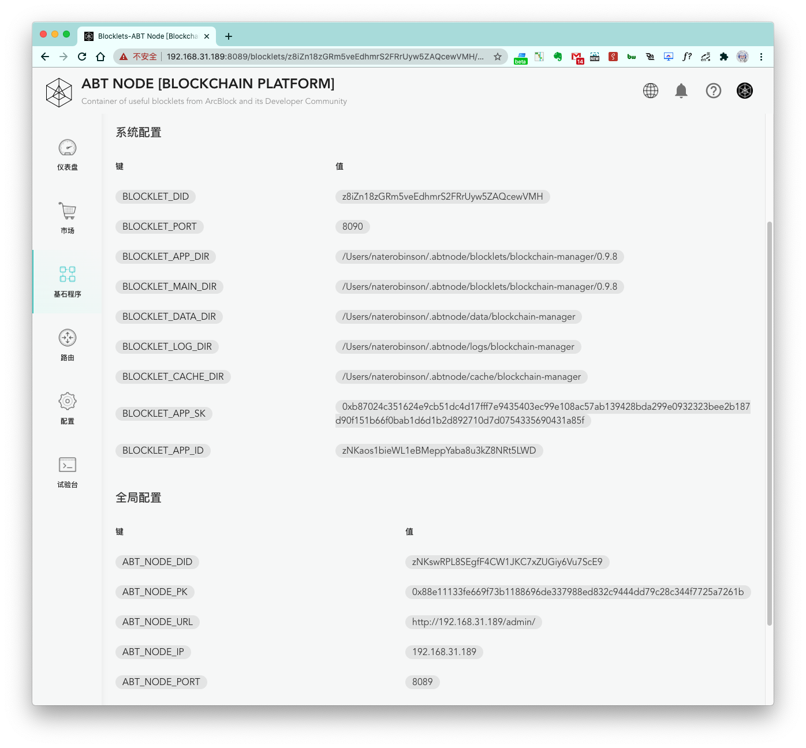

Blocklet Server 会为运行在节点里面的 Blocklet 提供一系列可访问的变量。

### 系统配置

1. `BLOCKLET_PORT`：Blocklet 运行端口
2. `BLOCKLET_APP_DIR`：Blocklet 存储目录
3. `BLOCKLET_MAIN_DIR`：Blocklet 存储目录
4. `BLOCKLET_DATA_DIR`：Blocklet 数据目录
5. `BLOCKLET_LOG_DIR`：Blocklet 日志目录
6. `BLOCKLET_CACHE_DIR`：Blocklet 缓存目录
7. `BLOCKLET_APP_SK`：Blocklet app sk
8. `BLOCKLET_APP_ID`：Blocklet app id
9. `BLOCKLET_BASE_URL`：Blocklet base url
10. `BLOCKLET_PREFIX`：Blocklet prefix

### 全局配置

1. `ABT_NODE_DID`：Blocklet Server  did
2. `ABT_NODE_PK`：Blocklet Server  pk
3. `ABT_NODE_URL`：Blocklet Server  url
4. `ABT_NODE_IP`：Blocklet Server  ip 地址
5. `ABT_NODE_PORT`：Blocklet Server 端口
6. `ABT_NODE_PROTOCOL`：Blocklet Server 协议
7. `ABT_NODE_DOMAIN`：Blocklet Server  Domain
