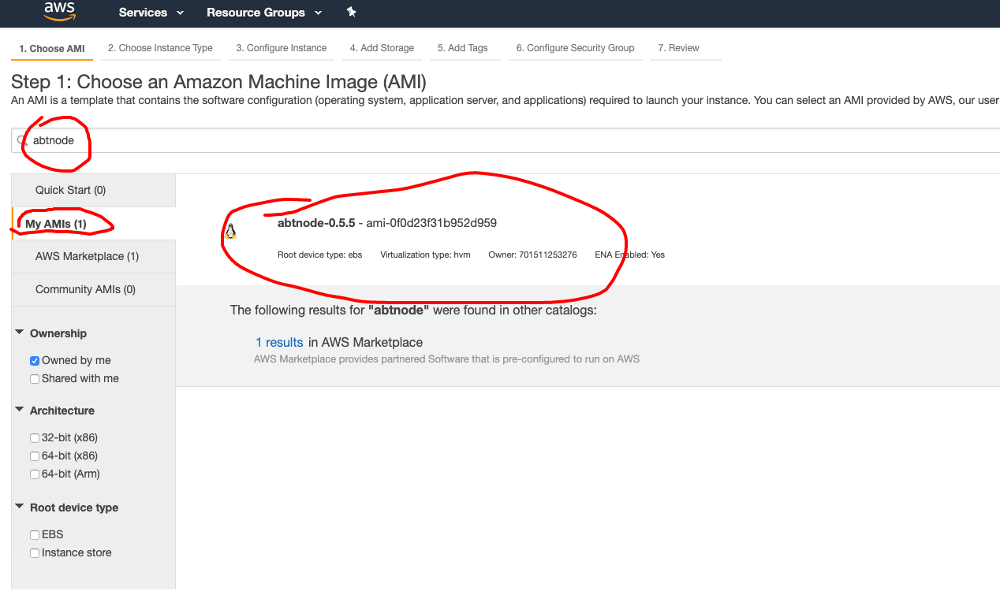
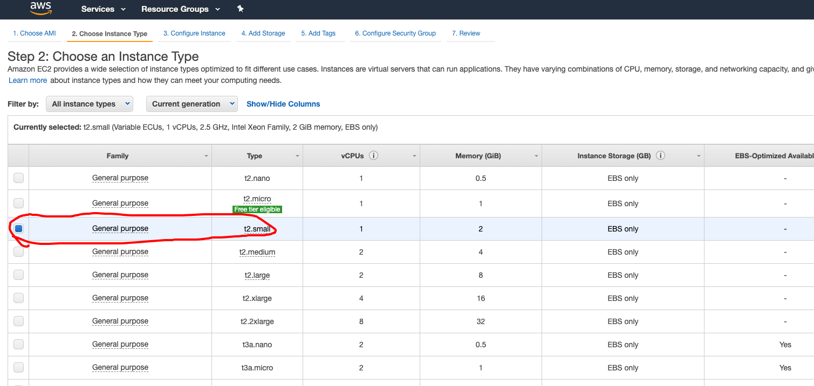
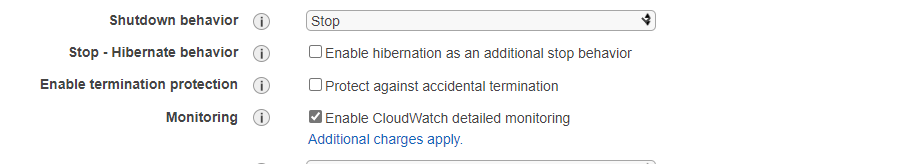
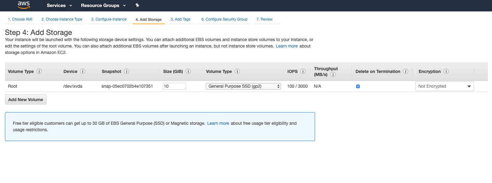
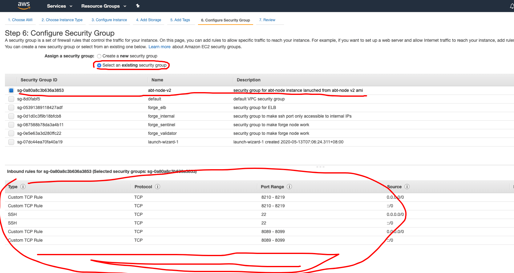
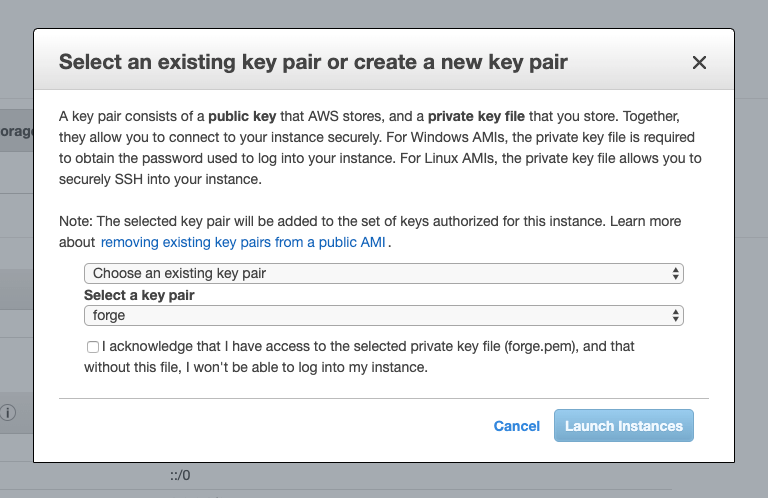
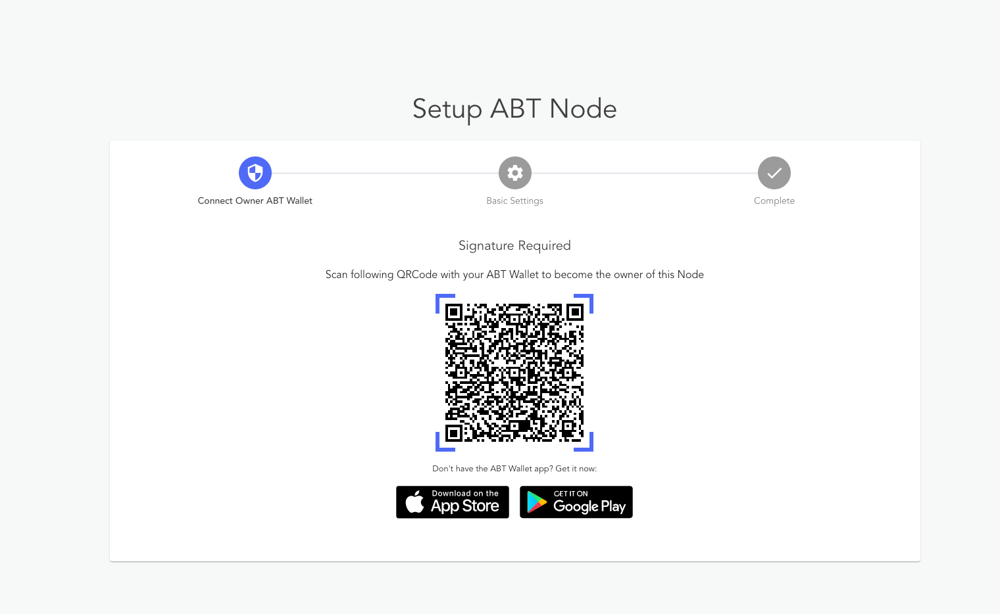

## 1. Login to AWS Console

## 2. Find EC2 Dashboard

Select "instance" on the left, then click the "Launch" button.

## 3. Find and Select Blocklet Server AMI

Select "My AMIs" on the left, then search by keyword "blocklet server," you should see something similar to the following screenshot. We recommend that you use the latest version of Blocklet Server when launching new Blocklet Server instances.

## 4. Select Instance Type

We recommend that your node size is at least a **t4.small** instance. _Note, free tier instances work for small, non-production workloads but the number of blocklets you can install will be limited.

## 5. Config Instance

You can use the default settings, or customize your instance to match your requirements. Note, please remember to enable public IP for the instance.

During configuration, it is recommended that you enable **Cloud Watch** monitoring for your instance. _Note, there may be added costs to enable this feature depending on your instance size._

## 6. Config Storage

For non-production workloads, a small root disk (10GB) is okay, but if you plan run your node in production or to start ArcBlock-powered chains,
we recommend that you use a larger drive. _Note, note that Blocklet Stores all data on the root disk by default, but you can change this
behavior._

## 7. Add tags

You can add tags to your Blocklet Server instance if you want to include any customer attributes or searchable keywords.

## 8. Config Security Group

**This step is critical.** If not correctly configured, your node will not be accessible from the web.

By default, Blocklet Server AMI requires the following ports to open:

- 443: for https access
- 80: for http access

We do not recommend enabling port 22 for SSH unless required by your organization.

## 9. Select KeyPair and Launch

If you do not need SSH access to the instance, you can choose no key pair.

Then, you are all set up, hit the "Launch" button on the right bottom, and wait for the instance to be ready.

## 10. Setup the Blocklet Server

Grab your instance public hostname as illustrated in the following screenshot.

Once install, you have a few options to open your Blocklet Server. You can use `https://Your-Public-IP.ip.abtnet.io` if you want to login using https, or simply use your `http://You_Public_IP` or `EC2 Hostname as domain` to set up your node; this step requires you have [DID Wallet](
https://abtwallet.io) installed.

## 11. Install blocklets and enjoy!

After logging int to your Blocklet Server, we recommend getting started with some Blocklets. You can easily deploy a new blockchain with our **Blockchain Manager** Blocklet, or launch your very own **Decentralized Identity** service with DID\:CONNECT.  We can't wait to see what you build.

Enjoy!
