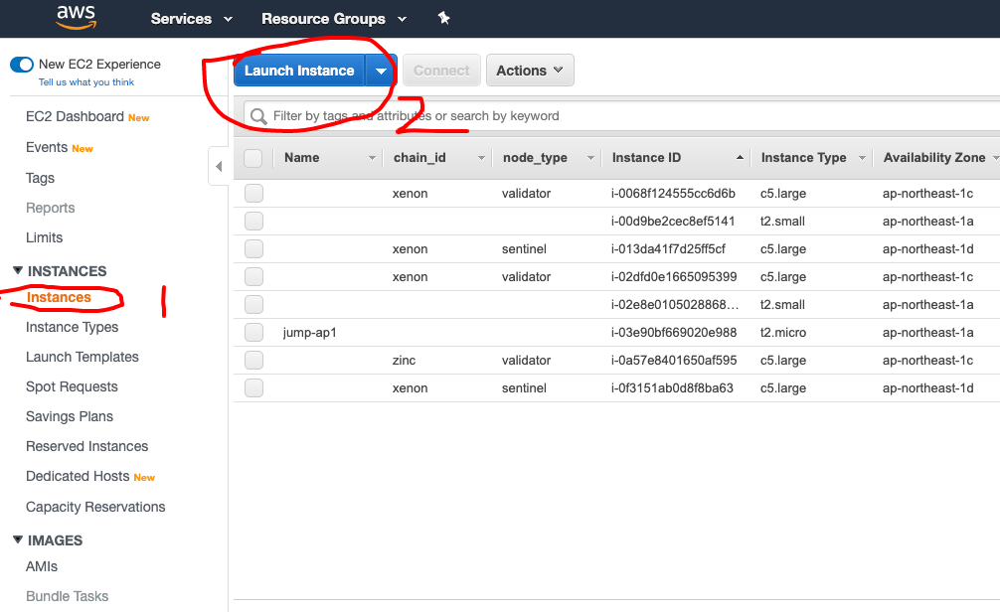
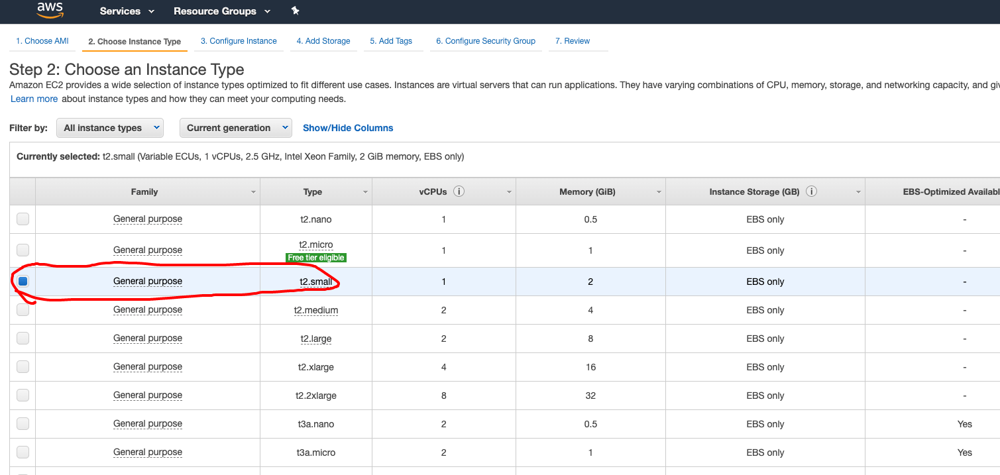
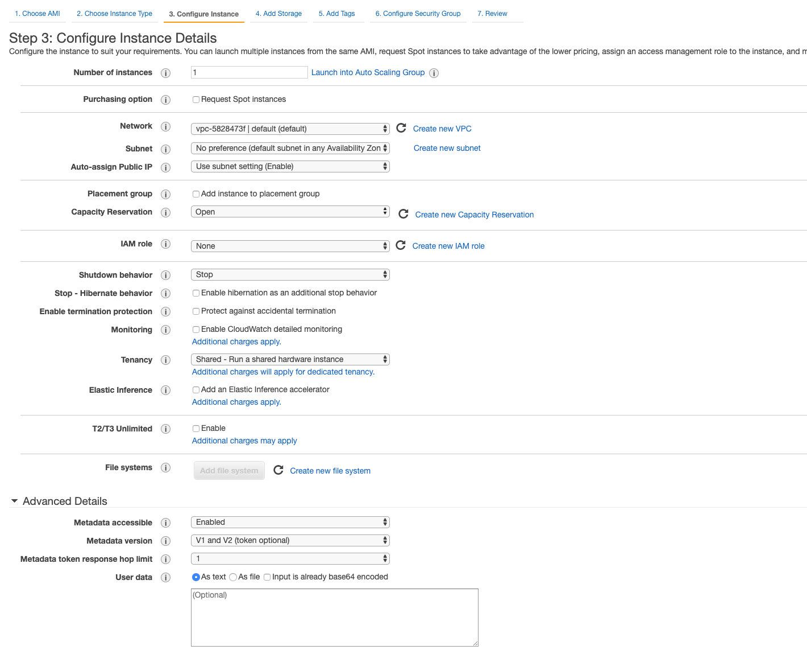
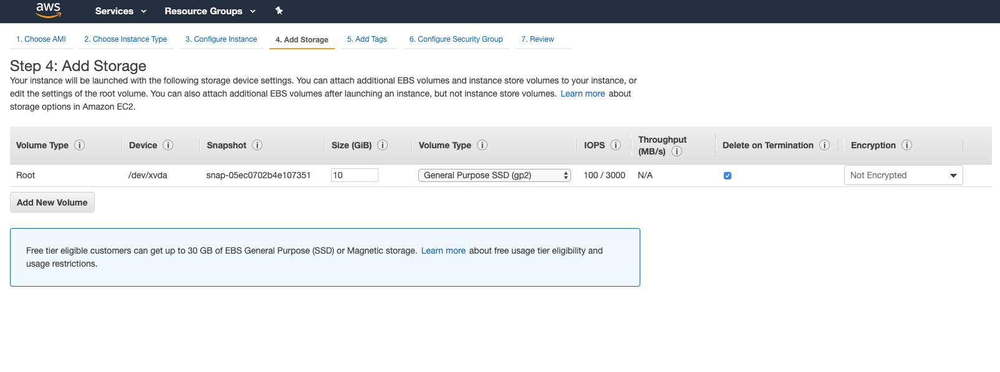
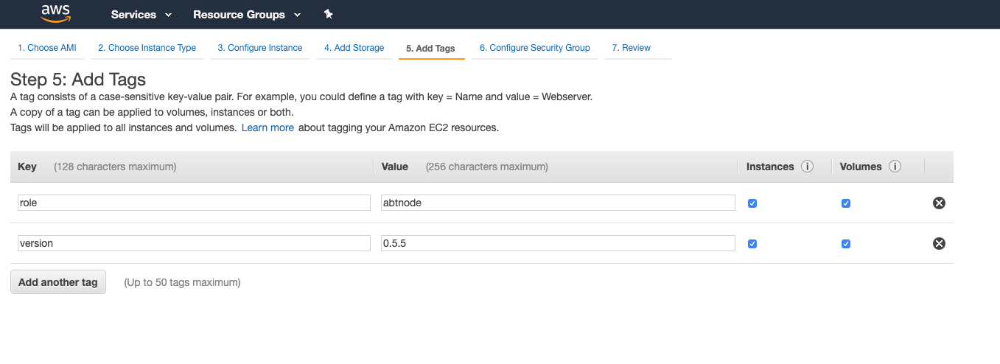
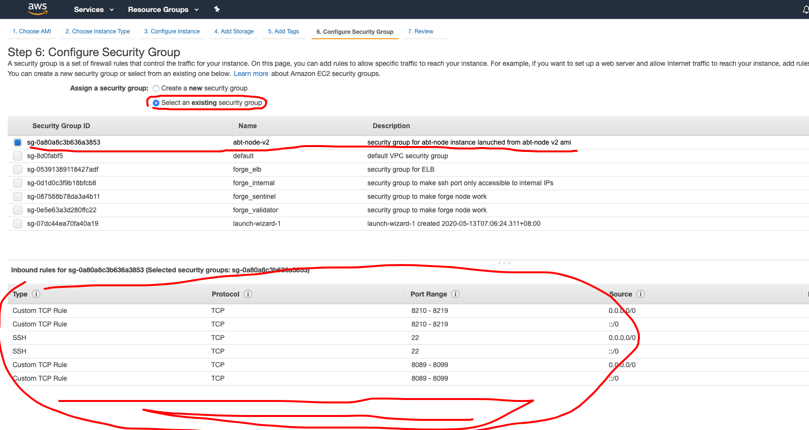
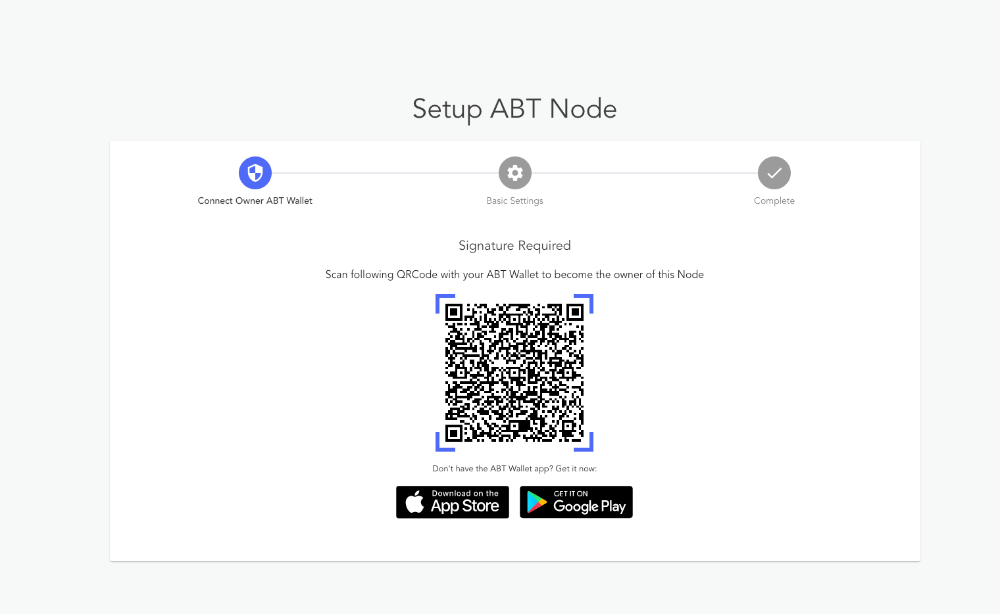

## 1. 登录 AWS 控制台

## 2. 找到 EC2 页面

在左侧选择 `instance`，然后点击 `Launch` 按钮。

## 3. 寻找并选择 Blocklet Server AMI

在左侧选择 `My AMIs`, 然后通过关键字 `abtnode` 搜索，你会看到下面的结果。请牢记在你安装 Blocklet Server 实例的时候一定要选择最新的 Blocklet Server 版本。

## 4. 选择实例类型

`t4.small` 就可以满足要求。

## 5. 配置实例

保持所有的配置都是用默认应该也是可以工作的，请记得为实例开启公共 IP。

## 6. 配置存储

如果你想要体验 Blocklet Server ，一个 10GB 左右的磁盘即可满足要求，但是如果你如果打算在 Blocklet Server 里面启动链，那么需要选择一个更大的磁盘。并且 Blocklet Server 默认是会把数据都存储在 root 磁盘上的，你可以自定义这个配置。

## 7. 添加标签

你可以为你的 Blocklet Server 实例打上标签方便后面更容易找到它。

## 8. 配置安全组

**这一步非常重要。** 如果你没有正确配置，你的节点将会无法从浏览器访问。

默认情况下，Blocklet Server AMI 需要下面的端口被开放：

- 22: 给 ssh 访问，如果你没有手动更改节点配置的打算可以关闭它。
- 8089~8099: 用来运行 Blocklet Server 控制台和 Blocklet 服务，默认情况下这也会限制你安装 blocklets 的数量。
- 8210~8219: 用来运行链的 GraphQL 接口，默认情况下最多支持 10 个链。

## 9. 选择 KeyPair 并启动

如果你不需要 ssh 访问实例，可以选择无 key pair 的配置。

到此，你就都配置好了，点击底部右侧的 `Launch` 按钮，等待实例准备好。

## 10. 设置 Blocklet Server 

获取你的实例公共主机名，如下面的屏幕截图所示

打开 `http://YOUR_PUBLIC_HOSTNAME:8089` 来完成节点的配置工作。这一步需要你已经安装并初始化了 [ABT 钱包](https://abtwallet.io)。

## 11. 安装 blocklet 并体验！

目前我们已经发布了一系列 blocklets 到 ArcBlock 官方的 blocklet 仓库。你可以在 `市场` 页面下载安装并启动他们。

尽情体验吧!
