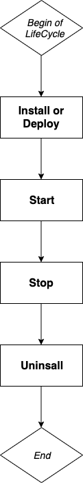

> <p style={{color:"red"}}>This page is outdated and must be updated</p>

## What is Blocklet?

Blocklet is an application protocol and software architecture. As a protocol, it describes the way to build the Blocklet Server platform; as software architecture, an independent blocklet is a reusable software module, which may be an HTTP service or a function library, etc.; when multiple When blocklets run together, they need a platform to combine them to form an independent service, such as Blocklet Server.

## How to define a Blocklet?

We use JSON data format to describe the protocol of blocklet.

## Define basic information

```json
{
  "name": "blocklet name, can be same as npm package name",
  "description": "blocklet description, can be same as npm package description",
  "version": "blocklet version, can be same as npm package version",
  "group": "only `dapp|static` are allowed and supported"
}
```

`name, description, version, group` describes the basic information of the blocklet. Among them, `group` is divided into two types of `dapp` and `static`. `dapp` is a regular dapp. `static` is a web application that only contains front-end static resources. Blocklet Server will use an HTTP Server to serve `static` Blocklet.

## Define runtime configuration

```json
{
  "main": "the entrypoint to bundle the blocklet or the static folder",
  "requiredEnvironments": {
    "name": "string, name of the environment",
    "description": "string, description of the environment",
    "required": "bool, is required",
    "default": "Any type, default value"
  }
}
```

In addition to the description of the basic information of the blocklet, the blocklet also defines the `main` field to describe how the blocklet starts to run, which is the description of the so-called entry file. This field is closely related to the operation of the blocklet. `main` defines the entry file or static resource directory of dapp or static type blocklet. So for Blocklet Server, the `main` field is necessary; otherwise, Blocklet Server has no way to start Blocklet.

In addition to the `main` field, we also need to define the `requiredEnvironments` field to declare the environment variables that the blocklet needs to run. There are four attributes that describe an environment variable: name, description, required, default. If the variable is set to required, and no default value is provided, the user must set the variable before starting.

`requiredEnvironments` is not necessary, but a blocklet can use this field to request blocklet users to provide corresponding information through this field. For example, a blocklet that depends on the MongoDB database can use requiredEnvironments to ask users to fill in the MongoDB connection string.

`capabilities` is used to tell Blocklet Server what the blocklet is capable of, if your blocklet can not serve on dynamic path prefix, please set it as following:

```json
  "capabilities": {
    "dynamicPathPrefix": false
  }
```

## Other configuration

```json
{
  "provider": "arcblock|community",
  "public_url": "public page url, should at least specify one",
  "admin_url": "administrator page url, default to empty",
  "config_url": "configuration page url, default to empty",
  "doc_url": "public document url, if not specified, will use store detail page"
}
```

Here are other configuration items. For a blocklet, these fields are optional. Let’s briefly introduce these fields.

- provider: The `provider` is the source of the declared blocklet. There are two optional values: arcblock|community. `arcblock` represents the official development of ArcBlock, and the community develops `community`.
- public_url: The `public_url` is the public address of the blocklet.
- admin_url: The `admin_url` is the address of the management end of the Blocklet.
- config_url: The `config_url` is the address of the blocklet configuration page.
- doc_url: The `doc_url` is the document address of the blocklet. If this address does not exist, Blocklet Server will use the README of the blocklet as the document page.

## Blocklet life cycle

## Life cycle



In Blocklet Server, the complete life cycle of a blocklet includes four stages: installation (or deployment), start, stop, and uninstall. Blocklets can be installed in two ways: one is to download and install it from the Store, and the other is to deploy and install it directly with Blocklet Server CLI. The CLI is mainly for development and testing. Therefore, in the first phase of the life cycle, there are two installation and deployment situations.

## Hooks


In these stages, Blocklet Server provides the hook function, which is used to do something during the execution of the life cycle. Currently includes pre-deploy, post-install, pre-start, pre-stop, pre-install, pre-uninstall hook.

For example, a blocklet has hardware requirements for the running machine: the memory cannot be lower than 1G, and the available disk capacity cannot be lower than 500 MB. You can use the pre-install hook to check whether the target machine has met the demand. If it meets, install normally, otherwise throw an error message and terminate the installation.

Hooks are Shell scripts, and these scripts may refer to the files in the blocklet. In the process of packaging the blocklet, the Blocklet Server packaging tool (Blocklet Server CLI) will package the files used by the hook separately, so developers need to declare which files are referenced by hooks in `hookFiles`.

## Creating a Blocklet

After understanding some basic Blocklet concepts and protocols, it's time to learn how to create a blocklet.

## Initialize the blocklet

Blocklet Server CLI provides `blocklet init` command to help developers quickly create a blocklet project. This command will help developers create related configuration files and directories.

### Blocklet project structure

```shell
├── blocklet.json
├── blocklet.md
└── package.json
```

After the project is created, we can see that a Blocklet project mainly contains two parts: blocklet description information and source code.
Blocklet Server currently only supports the Node.js blocklet projects, so the description of the blocklet will generally contain two parts: Node.js’s package.json and blocklet’s blocklet.json. The content of the blocklet spec we mentioned earlier is in blocklet.json. Of course, blocklet also allow the contents of blocklet.json to be placed in the `blocklet` field of package.json.

### blocklet.json

All description information of the blocklet is placed in the blocklet.json file.
As stated earlier, a blocklet is a Node.js project. We know that Node.js package.json file also contains information such as name, description, and version. For a blocklet, These fields have the same values, so Blocklet Server will first read the configuration of blocklet.json. If blocklet.json does not have these values, Blocklet Server will use package.json's values.

The following is an example of blocklet.json.

```json
{
  "name": "static-demo-blocklet",
  "description": "Demo blocklet that shows how to serve a static html5 game with Blocklet Server",
  "version": "1.0.0",
  "group": "static",
  "color": "primary",
  "main": "app/",
  "provider": "arcblock",
  "requiredEnvironments": {
    "name": "DEBUG",
    "description": "Enable test flag",
    "required": false,
    "default": "arcblock*"
  },
  "capabilities": {
    "dynamicPathPrefix": true
  }
}
```

## Blocklet Environment variables

The subsequent development work is a normal Web application development. Because blocklets run on Blocklet Server, blocklets depend on the environment of Blocklet Server. Blocklet Server now provides some environment variables for development.

### Private environment variables

- BLOCKLET_PORT
- BLOCKLET_APP_DIR
- BLOCKLET_DATA_DIR
- BLOCKLET_LOG_DIR
- BLOCKLET_CACHE_DIR
- BLOCKLET_APP_SK
- BLOCKLET_APP_ID

## Global environment variables

- ABT_NODE_DID
- ABT_NODE_PK
- ABT_NODE_URL
- ABT_NODE_DOMAIN
- ABT_NODE_PROTOCOL

These variables mean what their names indicate. During the development of a blocklet, some values of these variables are environment variables.

## How to package Blocklet?

After the blocklet is created, the code needs to be packaged for deployment. The ABT CLI provides the `blocklet bundle` command to package the source code.

### Test in Blocklet Server

In the blocklet declaration cycle section, we mentioned the Deploy phase. This phase deploys the packaged project to the local Blocklet Server node to test the blocklet.

## How to release Blocklet?

First, publish the developed Blocklet to NPM. The `blocklet bundle` command will put the packaged code in the `.blocklet` directory of the current directory. When publishing or testing, you need to package and release the code in `.blocklet/bundle`.

Then fork the https://github.com/arcblock/blocklets repository (create Github account first if you don't have one).
Modify the project's registry.yml file and put your blocklet NPM package address in the registry.yml list. Then give a pull request to ArcBlock’s repository: https://github.com/arcblock/blocklets.

If there are no problems are detected, the PR will be merged into the main branch of the blocklet repository, completing the release.
