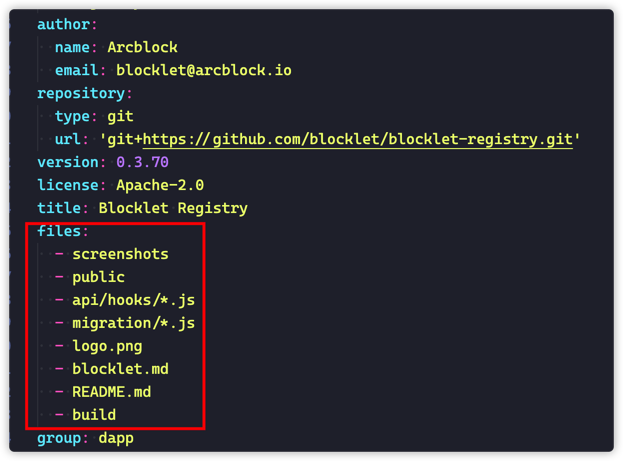

## Publish Steps

1. Make sure your blocklet can be bundled and deployed to your local Blocklet Server
2. Register as a developer from [blocklet store](https://store.blocklet.dev/) or [blocklet store(dev)](https://dev.store.blocklet.dev/)
   - Need to apply for a developer first, after the administrator has approved, you can proceed to the next step
3. Go to the access key page, create a new access key
4. Configure the host to publish blocklet store related configuration
   - Use `blocklet config set store [storeUrl]` command to configure the target Blocklet Store
   - Use `blocklet config set accessToken [accessToken]` command to configure the access key (access key is obtained from the administrator in the management console)
5. Develop a blocklet and upload it
   - Recommended to use [create-blocklet](https://www.npmjs.com/package/create-blocklet) tool to quickly create a blocklet
   - Usually, before `blocklet upload` you need to bundle the blocklet
6. Login to the uploaded Blocklet Store, you can see the uploaded Blocklet in the "Blocklet" page
7. The uploaded Blocklet is still in the "draft" status, click the "publish" button to publish
8. Verify in the store: [blocklet store](https://store.blocklet.dev/) or [blocklet store(dev)](https://dev.store.blocklet.dev/)
9. Verify in the market: install your Blocklet to your Blocklet Server

## Publish Config

- `publishConfig`: define the directory which will be published.
- `files`: define the files which will be published.
