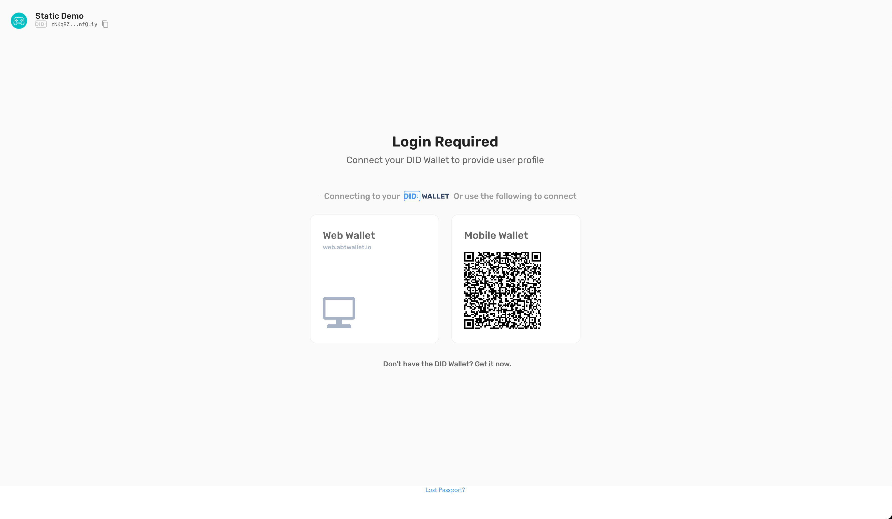
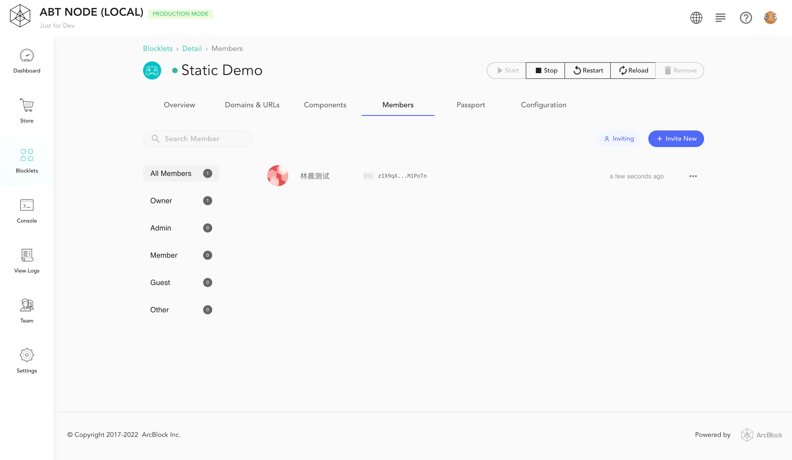

Blocklet Server 为 Blocklet 提供了通用 Auth 服务。

Auth 服务提供以下能力
- 获取用户身份
- 获取用户权限
- 拦截未登录的请求（默认不拦截）
- 拦截无权限的请求（默认不拦截）
- 设置邀请登录和开放登录（默认为开放登录）

## 入门
[static-demo-blocklet](https://github.com/blocklet/html-2048-sample) 是一个可以运行在 Blocklet Server 上的 html5 游戏。下面将介绍如何制作一个只允许登录后可访问的 static-demo-blocklet.

0. 前置条件: 本地安装并且运行 v1.7.0 以上版本的 Blocklet Server

1. 下载项目源代码 [html-2048-sample](https://github.com/blocklet/html-2048-sample)

2. 打开项目根目录下 `blocklet.yml`, 找到 name 为 publicUrl 的 interface, 并添加 Auth 配置

``` yml
interfaces:
  - type: web
    name: publicUrl
    path: /
    prefix: '*'
    port: BLOCKLET_PORT
    protocol: tcp
+   services:
+     - name: 'auth'
+       config:
+         blockUnauthenticated: true
```

3. 在项目根目录下执行 `blocklet bundle`. 执行成功后, 在 `.blocklet/bundle` 中会看到被成功创建的 blocklet bundle.

```
linchen@LinkdeMacBook-Pro html-2048-sample % blocklet bundle

ℹ Bundling in zip mode for blocklet static-demo-blocklet...

✔ Creating blocklet bundle in .blocklet/bundle... Done in 0.018s
✔ Blocklet static-demo-blocklet@1.1.21 is successfully bundled!
```

4. 在项目根目录下执行 `blocklet deploy .blocklet/bundle`, 将 blocklet bundle 发布到本地运行的 Blocklet Server.

```
linchen@LinkdeMacBook-Pro html-2048-sample % blocklet deploy .blocklet/bundle
ℹ Try to deploy blocklet from /Users/linchen/code/blocklet/html-2048-sample/.blocklet/bundle to Local Blocklet Server
ℹ Node did from config zNKqGAvUzcCowxtNA5r5gKQYUm2hR4X2SE2o
ℹ Load config from /Users/linchen/code/arcblock/andata/.abtnode/abtnode.yml
✔ Blocklet static-demo-blocklet@1.1.21 was successfully deployed!
```

5. 在 Blocklet Server dashboard 启动 Static Demo


6. 访问 Static Demo, 会看到登录页, 也就是说 Static Demo 已经拥有了 Auth 能力.



7. 登录成功后, 会成功看到游戏页面. 此时, 在 Blocklet Server dashboard 中会看到登录用户的信息.



恭喜!

## Demo

[https://github.com/blocklet/auth-demo](https://github.com/blocklet/auth-demo): 使用 Auth 服务实现了登录，登出，显示用户信息，认证，授权功能

## 配置 Auth 服务
所有 blocklet 安装后即具备了 Auth 能力. 你也可以在 `blocklet.yml` 中配置 Auth 服务

e.g.

```yml
interfaces:
  - type: web
    name: publicUrl
    # ... other interface config
    services:
      - name: 'auth'
        config:
          invitedUserOnly: no
          profileFields:
            - fullName
            - email
            - avatar
          webWalletUrl: https://web.abtwallet.io
          ignoreUrls:
            - /path/to/**
          blockUnauthenticated: false
          blockUnauthorized: false
```

- invitedUserOnly: 是否只能通过邀请链接登录
  - default: no
- profileFields: 登录时需要提供的身份信息
  - default: [fullName, email, avatar]
- blockUnauthenticated: Auth 服务是否自动拦截未登录的请求, 并跳转到登录页
  - default: false
- blockUnauthorized: Auth 服务是否自动拦截未授权的请求
  - default: false
- ignoreUrls: Auth 服务不会拦截哪些 url
  - default: none
- webWalletUrl: 通过 Auth 服务登录时的 Web Wallet 地址
  - default: https://web.abtwallet.io

## 设置登录可访问
设置登录可访问后，Auth 服务会自动拦截未登录的请求, 并跳转到登录页

```yml
interfaces:
  - type: web
    name: xxxx
    # ... other interface config
    services:
      - name: 'auth'
        config:
          blockUnauthenticated: true
```

## 设置授权可访问

After setting authorized access, Auth Service automatically intercepts unauthorized requests

```yml
interfaces:
  - type: web
    name: xxxx
    # ... other interface config
    services:
      - name: 'auth'
        config:
          blockUnauthorized: true
```

设置 Auth Service 自动拦截后，需要在 Blocklet Server dashboard 中为 user 绑定相应接口的权限。（Blocklet Server 的权限控制基于 [RBAC](https://en.wikipedia.org/wiki/Role-based_access_control)）


## 设置邀请登录和开放登录
通过 `invitedUserOnly` 配置邀请登录和开放登录

```yml
interfaces:
  - type: web
    name: xxxx
    # ... other interface config
    services:
      - name: 'auth'
        config:
          invitedUserOnly: yes
```

- invitedUserOnly
  - no: 开放登录 (默认)
  - yes: 只能通过邀请链接登录