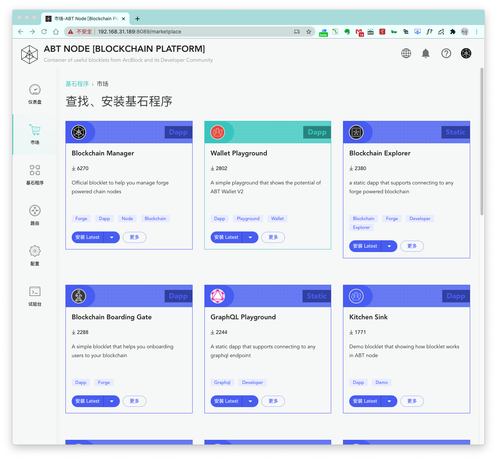
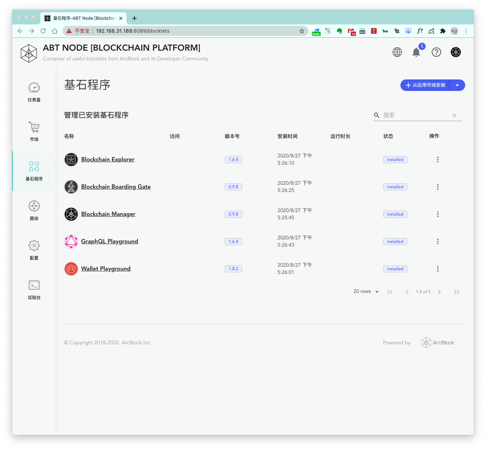
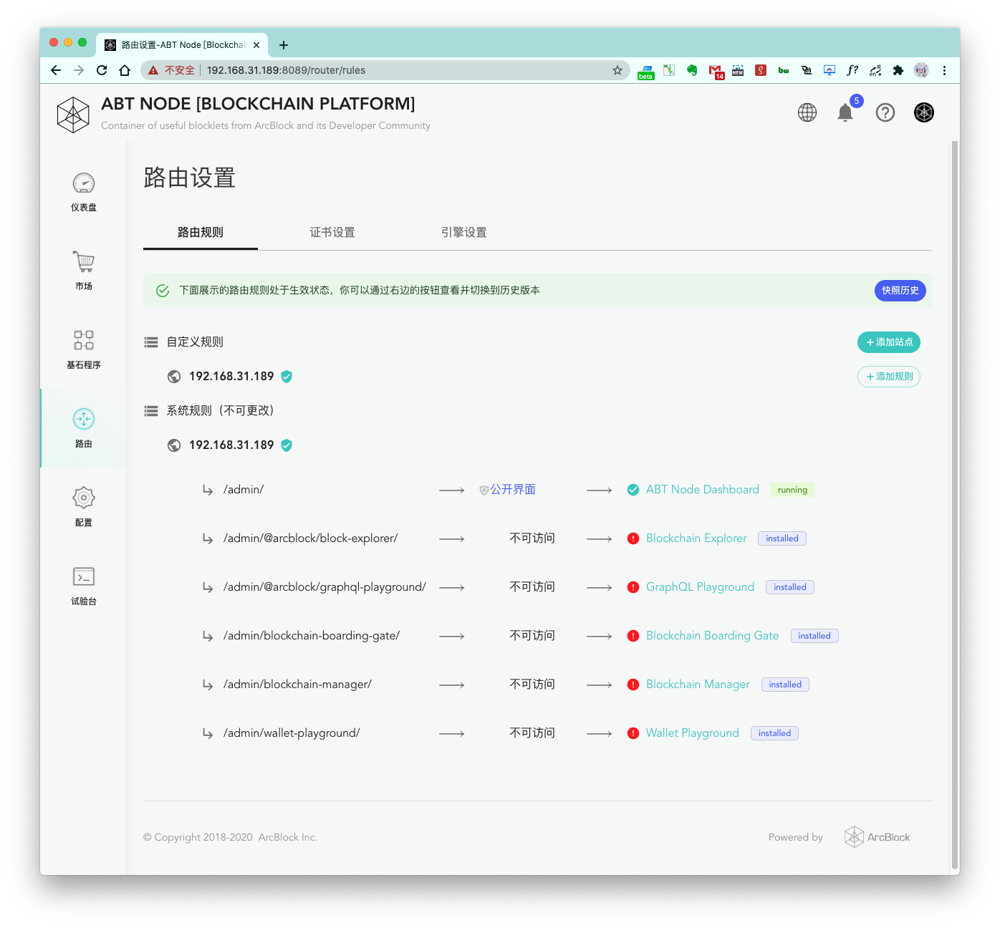

跟随上面的步骤，我们已经完成了 Blocklet Server 的获取，安装，配置和运行操作，下面我们来整体看一下 Blocklet Server 有哪些功能吧。

## 仪表盘

Blocklet Server 状态属性的仪表盘。

## 市场

Blocklet Server  Blocklet 市场，用户可以在这个页面寻找可安装的 Blocklet。

## 基石程序

Blocklet Server 已安装的 Blocklet 列表。

## 路由

Blocklet Server 的路由配置。详细功能请前往：[路由管理](/zh/router)

