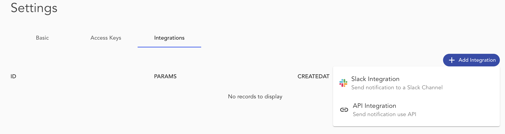

Integrations allow outgoing messages from Blocklet Server. These messages are related to Blocket updates, Blocklet Server configuration changes, and Alerts. You can integrate Blocklet Server with Slack and custom webhooks to receive the notifications.

Perform the following steps for Slack integration :

1. Log into your Slack team and [set up incoming WebHooks](https://my.slack.com/services/new/incoming-webhook).
2. Identify the Slack channel where notifications should be sent to by default. Select Add Incoming WebHooks integration to add the configuration.
3. Copy the URL of the Webhook. It will be used to configure the Blocklet Server.
4. Open Slack integration in Blocklet Server settings console and Specify the copied Webhook URL.
