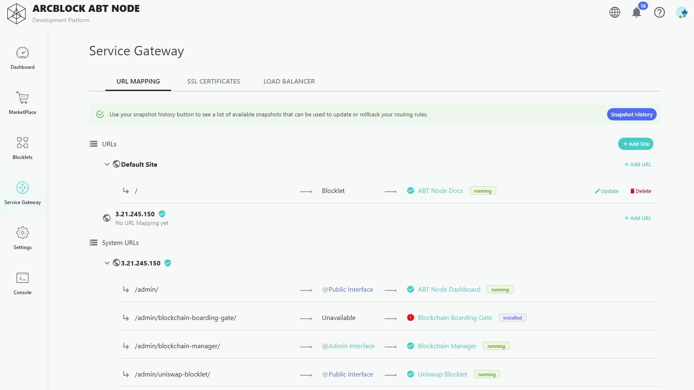
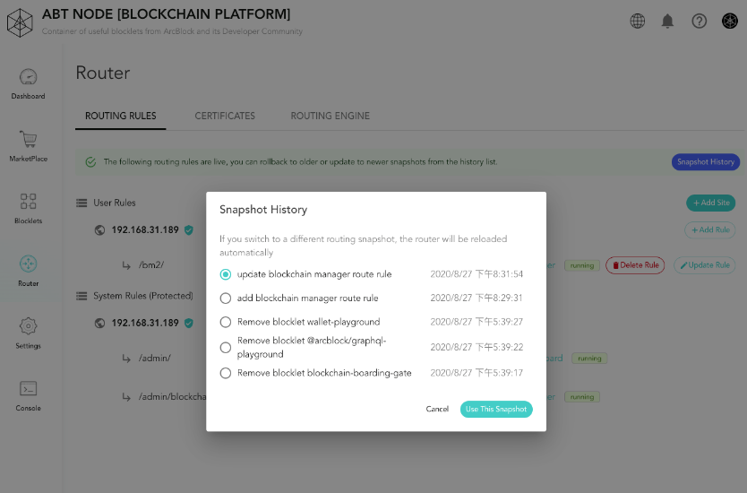

## Get Started with Service Gateway

### Load Balancer

The Service Gateway's default provider for the routing layer and load balancing is NGINX. _Note, when viewing Load Balanacer, you can view NGINX's current status (Running/Stopped) and that it is available to Blocklet Server._

### URL Mapping

By default, Blocklet Server will automatically add a default site for your Blocklet Server.

You can also add a domain or specific IP address by:

1. Clicking on `Add Site`
2. Adding your domain or IP address
3. Assign the domain or IP address to a Blocklet or setup your redirect
4. Save and click on **Save and Apply**

#### The root directory of the site default request forwarded to which service

By default, the root directory of a site will be forwarded to the selected Blocklet Server Blocklet or Redirect.

#### Automatic Port Configurations

Blocklet Server will automatically assign the correct port number for any service. You can verify a Blocklet port number by visiting the Blocklet overview page -> select **Configuration** -> and review the **values**.

#### System URLs

System URLs (Routing rules) are automatically generated for any Blocklet you install on your Blocklet Server _Note, Blocklet Server will automatically remove routing rules if a Blocklet is removed from your node. No additional configuration is required._

### Configure a certificate for custom domain

Once you have added a domain to your Service Gateway you will see a configuration similar to the below image:

Here we've used the domain name `books.arcblockio.cn` for testing, and prepared a HTTPS certificate for this domain name in
advance. After adding the  When the domain name go ahead and click on **Certificates** and select the button **+ Add Certificate**. Click it to add your
certificate.

After selecting the certificate file and certificate private key, click on **save**. You can verify that the certificate was configured correctly by viewing the status symbol next to the site domain name will also change from red to green similar to the image below.

_Note, Blocklet Server's Service Gateway supports single domain SSLs (ex. arcblock.io) and **wildcard SSLs** to support a single site and all related subdomains (ex. shop.arcblock.io, test.arcblock.io, etc). Blocklet Server does not support partial or multi-domain wildcard SSLs.

## Things to Know

#### Discard Changes

When rules and sites are added, you will have the ability to discard all changes you have made by using the **Discard Changes** button.

#### Save and Apply

This option will save the changes you've made and put them into effect. Name your change and click `Apply and Reload`,
which will save your changes as a snapshot and put them into effect.

#### Snapshot History

Each time you save your changes, a snapshot is created. To restore to a snapshot, click on `Snapshot History` and select
the desired snapshot that you want to apply.

Click on `Use This Snapshot`, and the selected snapshot would be put into effect immediately.
