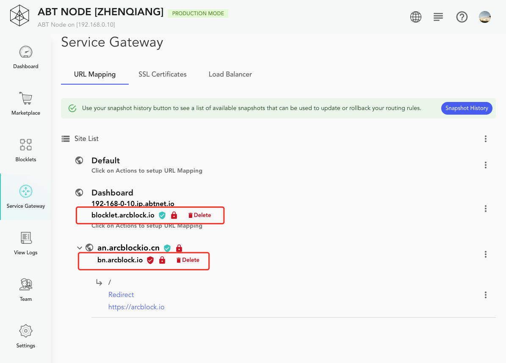
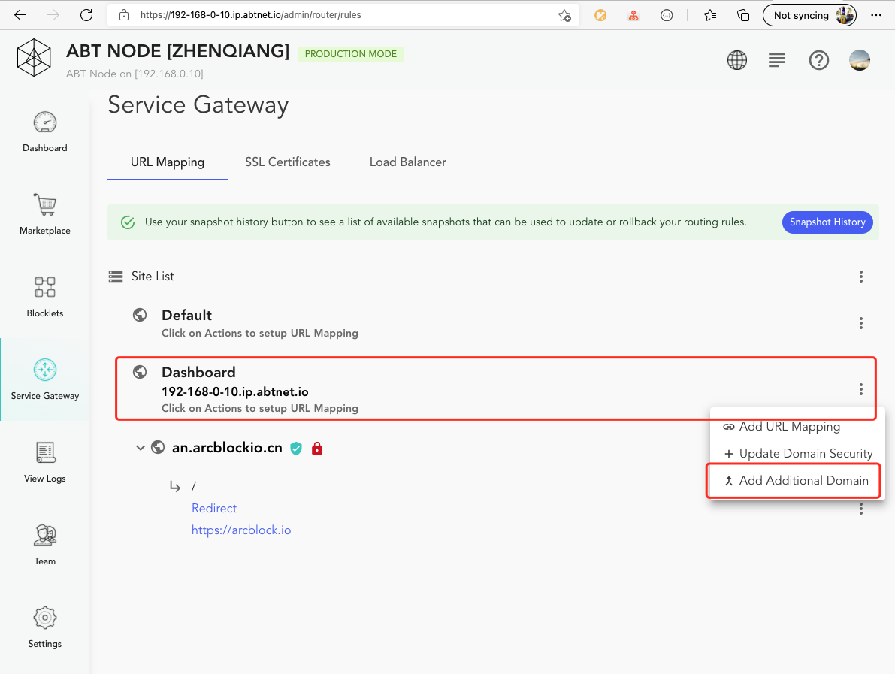
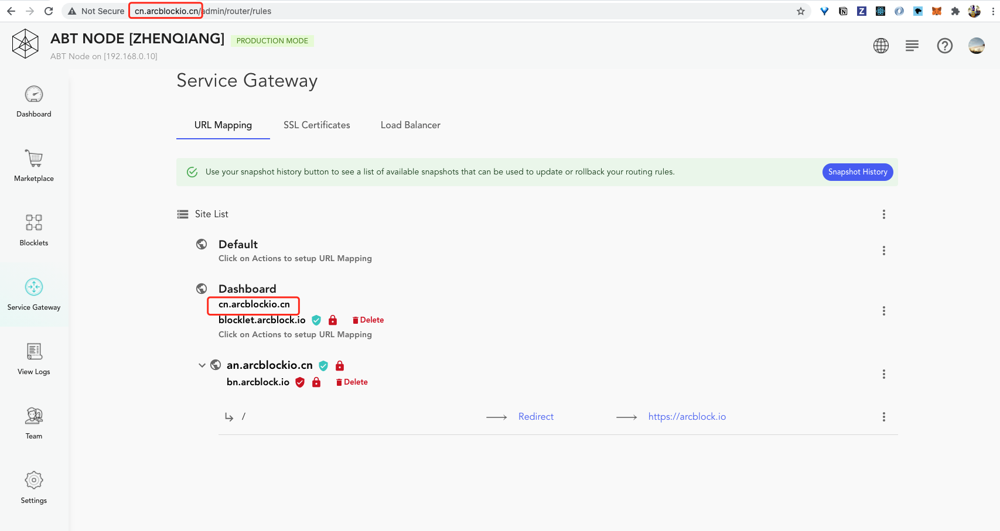
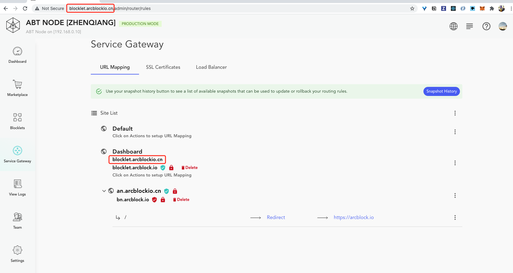

Blocklet Server will assign each node an HTTPS address: `https://{public IP}.ip.abtnet.io`, for example: if the IP is 192.168.1.100, then this address is: `https://192.168.1.100.ip.abtnet.io`. But in more cases this domain name does not meet the needs, this time we can bind a custom domain name by adding `Additional domain` to the node.

## Additional domain

In Blocklet Server, you can bind multiple domains to a site or node itself. All domains other than the original domain name of the site (node) are called `Additional Domain`. For example, `blocklet.arcblock.io` and `bn.arcblock.io` in the following figure are additional domains:

## Customized node domain name

1. Click on the action list on the right side of the Dashboard

2. Then click `Add Additional Domains` again:

3. Then enter the domain name in the input box that pops up

4. Final Application Routing: Click to deploy URL mapping

This is how to customize the domain name for the node, and you can use it to access the node once it is added. If you need to enable HTTPS, you can refer to: [Bind a domain name to a site and enable SSL](/settings/router/bind-domain-and-ssl).

## Attention

There are two things to keep in mind when adding additional domains to a node or site.

1. The domain name of the currently visited address is displayed in the route list. For example, `cn.arcblockio.cn` in the image below is not the domain name of the node, nor is it an additional domain name for the node, but because the current node is accessed using `cn.arcblockio.cn`, it is displayed here as well. In addition, this domain name is listed here, but it does not affect adding it as an additional domain name.

2. It is not possible to delete additional domains to the currently accessed domain. For example, if `blocklet.arcblock.io` in the image below is an additional domain name of a node and is a node accessed using this domain name, then you cannot delete `blocklet.arcblock.io` at this time:

