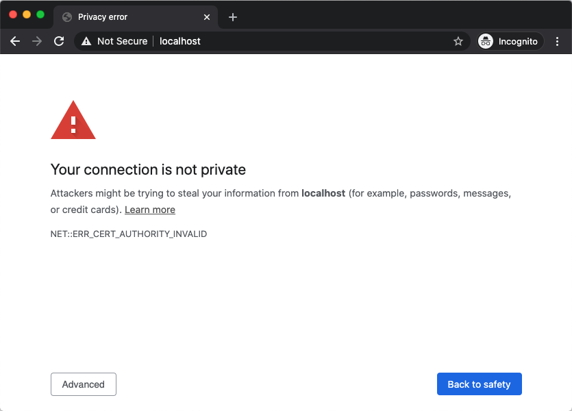
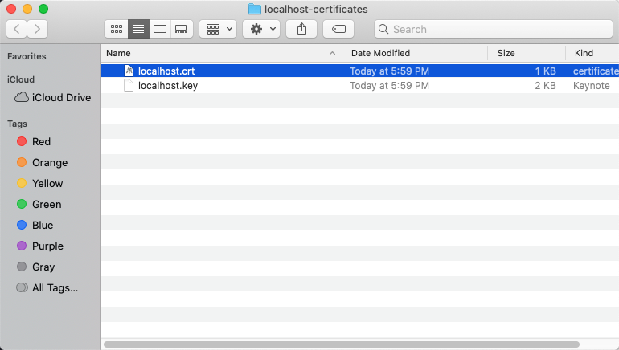
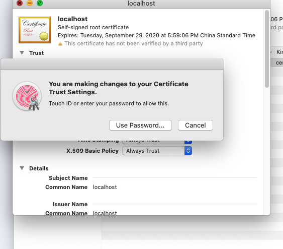

为了方便本地开发测试，我们可以生成一个只用于本地的证书。除了本机，该证书不会被其他任何人信任，对于开发来说已经够用了。

## 使用 openssl 生成 localhost 证书

我们使用 `openssl` 生成证书，命令如下：

```bash
openssl req -x509 -out localhost.crt -keyout localhost.key \
  -newkey rsa:2048 -nodes -sha256 \
  -subj '/CN=localhost' -extensions EXT -config <( \
   printf "[dn]\nCN=localhost\n[req]\ndistinguished_name = dn\n[EXT]\nsubjectAltName=DNS:localhost\nkeyUsage=digitalSignature\nextendedKeyUsage=serverAuth")
```

## 测试证书

生成好了证书后，我们可以将证书放在 Nginx 中测试一下，测试配置如下：

**将 \<your directory\> 替换为真实的目录**

```nginx
worker_processes auto;

events {}

http {
    server {
        listen              443 ssl;
        server_name         localhost;

        ssl_certificate     <your directory>/localhost.crt;
        ssl_certificate_key <your directory>/localhost.key;

        root <your directory>/localhost-certificates;

        location / {
          index index.html;
        }
    }
}
```

然后在浏览器中输入 `https://localhost`:



我们可以看到，在 Chrome 中会提示证书有问题（在 Safari 中会提示网站无法访问），因为这个时候证书还不被系统信任，我们需要通过设置让系统信任。

## 信任证书 (Mac OS)

证书生成后还无法直接使用；需要在系统中**信任**刚生成的证书，我们以 Mac OS 为例，展示一下如何在系统中**信任**证书。

生成好的证书在当前目录下，我们在文件管理器(Finder)中双击`localhost.crt`文件：



双击后，会出现 `Keychains Access` 的设置页面，然后双击 `localhost` 证书：


双击证书后，在 `Trust` 的设置项中，将 `When using this certificate` 设置为 `Always Trust`:


然后点击左上角的 `关闭` 按钮，在窗口关闭前，系统会提示保存设置，输入密码后保存设置：



然后在浏览器中重新访问 `https://localhost`，这个时候我们可以看到测试网站已经可以正常访问了：


完成设置。

## 参考

- [Let's Encrypt] localhost 证书: https://letsencrypt.org/zh-cn/docs/certificates-for-localhost/
