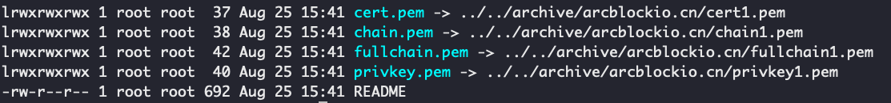

如果需要为每一个 Blocklet 配置一个子域名，并且都在相同的二级域名下。那么可以为这些子域名生成通配符证书。比如说，假如我们这些 Blocklet 的二级域名都是 `arcblockio.cn`, 那么我们可以生成一个域名为 `*.arcblockio.cn` 的证书。

本文介绍如何在 CentOS 系统中，使用 [Certbot](https://certbot.eff.org/) 和阿里云 DNS 生成一个 [Let’s Encrypt’s](https://letsencrypt.org/) 通配符证书。

## 注意

`*.arcblockio.cn` 只会匹配像这样的域名：

- `a.arcblockio.cn`
- `b.arcblockio.cn`

不会匹配更多级域名，比如：

- `c.a.arcblockio.cn`
- `d.a.arcblockio.cn`

## 安装 Certbot

因为 Certbot 的官方插件列表中没有阿里云 DNS, 所以这里只安装 certbot, DNS 需要手动配置一下。

```bash
sudo yum install certbot
```

其它平台的安装方式可以在[官网](https://certbot.eff.org/)找到。

## 手动生成证书

我们选择生成独立的证书，而不是直接和 Web 服务绑定，所以我们需要在命令行中指定 `certonly` 和 `--manual`:

### 1. 执行命令

```bash
sudo certbot certonly --manual -d '*.arcblockio.cn' -d arcblockio.cn --preferred-challenges dns-01 --server https://acme-v02.api.letsencrypt.org/directory
```

- `-d`: 这里指定了两个值: `*.arcblockio.cn, arcblockio.cn`, 如果只设置了 `*.arcblockio.cn`, 那么域名 `www.arcblockio.cn` 不会生效
- `--preferred-challenges`: 使用 dns 的方式进程域名的认证
- `--server`: 默认会使用 Let’s Encrypt’s 的生产服务器，如果是测试的话，且生成的证书比较多，可以使用该参数指定为测试服务器: `--server https://acme-staging-v02.api.letsencrypt.org/directory`

### 2. 输入邮箱，用来接收更新和安全通知


### 3. 同意协议

需要同意一些协议：


### 4. 验证域名

Certbot 会要求在 DNS 服务器配置两个 TXT 记录：


可以使用 `host` 命令校验记录是否生效了：


在 DNS 记录生效以后，再按`确认`键确认生成证书。

_阿里云 DNS 解析不能为一个记录添加多个值，所以只能添加两个相同的 TXT 记录(\_acme-challenge.arcblockio.cn)_

### 5. 生成证书

生成好的证书放在了 `/etc/letsencrypt/live/[域名]` 目录中:



### 6. 举例：在 Nginx 中配置证书

```nginx
server {
    server_name abtnode.arcblockio.cn;
    listen 443 http2 ssl;
    ssl on;
    ssl_certificate /etc/letsencrypt/live/arcblockio.cn/fullchain.pem;
    ssl_certificate_key /etc/letsencrypt/live/arcblockio.cn/privkey.pem;

    location / {
      proxy_pass http://127.0.0.1:8080;
    }
}
```
