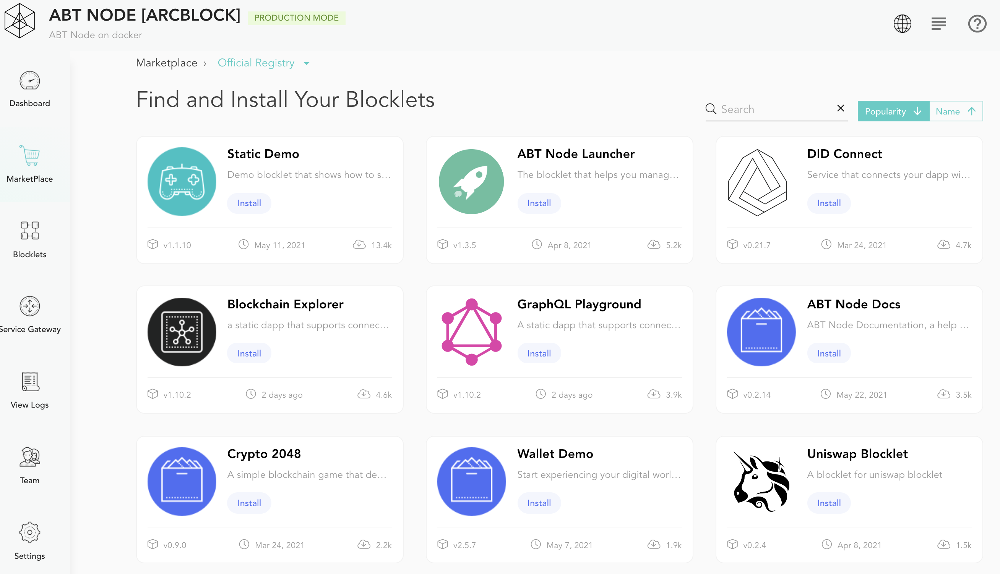

The Store is a digital catalog of Blocklets created by ArcBlock, ecosystem partners, and third-party vendors. These Blocklet are fetched from different Blocklet registries, analogous to development package registries like `npm registry`. Each of these Blocklets can offer out-of-box capabilities by using ArcBlock Platform. The Store allows you to filter and install Blocklets based on your selection criteria. The Blocklet details page servers as a product guide which shows all provided information.

