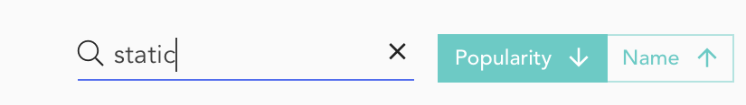
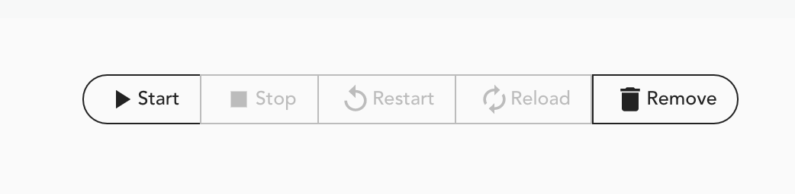
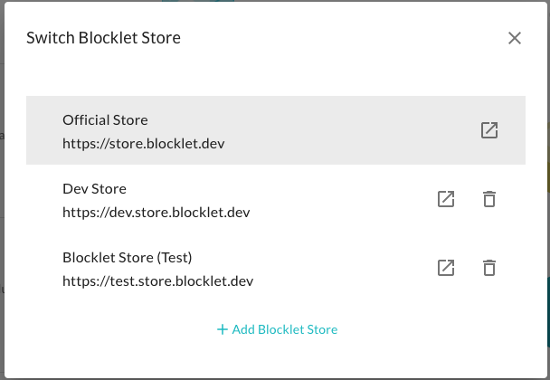

Blocklets通过使用ArcBlock平台的功能，为各种面向用户的功能提供可插拔的组件。ArcBlock生态系统的合作伙伴已经创建了许多Blocklets来提供各种功能。Blocklet Store允许您发现、购买和安装符合您需求的Blocklets。它还可以作为可用的Blocklet的产品细节文件。

## 什么是Blocklet商店？
该商店是由ArcBlock、生态系统合作伙伴和第三方供应商创建的Blocklet的数字目录。这些Blocklet是从不同的Blocklet注册处获取的，类似于开发包注册处，如`npm注册处`。这些Blocklet中的每一个都可以通过使用ArcBlock平台提供开箱即用的功能。商店允许你根据你的选择标准来过滤和安装Blocklets。Blocklet的详细信息页面作为产品指南，显示所有提供的信息。

##从商店安装小程序

### 找到一个小工具

要想开始，请到左边的行动栏，点击**商店**。它将显示由ArcBlock社区创建的Blocklets目录。Blocklet会显示最新的发布版本、发布日期、安装数量和项目标签等细节。你可以按照 _流行度_ 或 _名称_ 对目录进行排序。此外，还提供了一个 _搜索_ 框，以根据其名称和描述来过滤小程序。

### 审查一个小程序

商店仪表板显示了小程序的摘要，这可以作为你的选择标准。但在使用一个小程序时，你必须确定其设置指南、环境配置、许可证等。所有这些细节都在原始商店的细节页面上提供。点击一个特定的小程序将打开它的详细信息页面。

点击一个特定的小块，将打开它的详细信息页面。

### 安装一个小程序

安装一个小程序是非常容易的。找到一个你想添加到你的Blocklet服务器的Blocklet，然后点击_Launch_按钮。它将需要一些时间来完成安装。

仔细观察，你就会发现，在你的商店里，有很多的区块链。

一旦安装完成，商店仪表板将以通知信息的形式确认这一点。Blocklet的 _Launch_ 按钮也将变为 _Open_ 按钮。

安装过程并没有启动Blocklet。您必须访问Blocklet管理控制台以启动/停止/配置Blocklet。请参考Blocklet详情页，了解相关说明。

> 注意，有些Blocklet可能需要额外的配置才能正常工作，所以如果需要额外的步骤，请务必检查您的配置细节。

### 多个Blocklet商店

Blocklet服务器默认有以下2个由ArcBlock托管的blocklet商店。

1. [官方商店](https://store.blocklet.dev)。它为终端用户提供生产就绪的区块链的托管。
2. [开发商店](https://dev.store.blocklet.dev)。它为开发者提供样本/演示区块链，以学习区块链框架。

你可以通过点击**添加Blocklet商店**来添加一个自定义商店。你需要提供一个自定义商店的URL。
