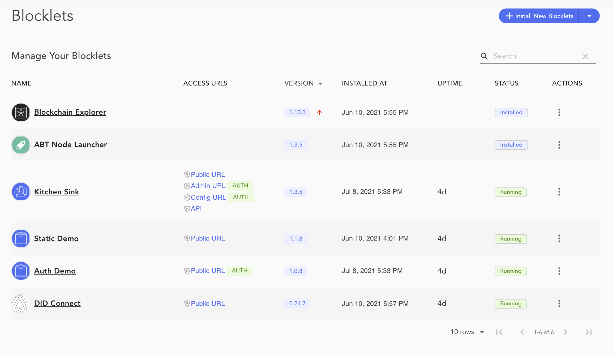
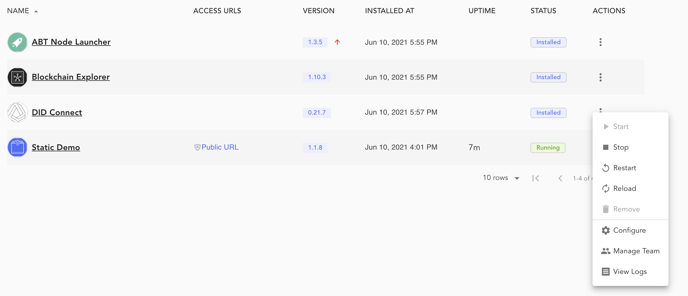

The *blocklets* page shows all blocklets installed on the blocklet server with the following attributes for each of the blocklets.

1. Name
2. Access URLs
3. Version
4. Installed At
5. Uptime
6. Status (`installed`/`running`/`stopped`)
7. Actions

## Blocklet Services

The Blocklet Server provides authentication and interface configuration services to every Blockets. The Blocklet developer specifies these services. Blocklet interfaces are displayed under the Access URLs. There are the following types of supported interfaces :
interfaces:
1. Public Url : Specifies HTTP URL for the Blocklet
2. Admin Url :  The URL is intended to provide Admin functions for the Blocklet.
3. Config Url : The URL is intended to provide configuration  to a Blocklet.
4. API : Specifies a web endpoint for the Blocket provided API.
5. Service : Specifies a TCP based service.

Developers can add authentication to any of the above URLs. The authentication is provided using the Blocklet Server Teams feature. Additionally, every blocket generates log for every served request. These logs are available as part of the [Logs view](/en/logs).

## Blocklet Operations

A list of operations can be viewed by clicking the three dots next to a Blocklet. Possible operations include the following:

1. `Start Blocklet`
2. `Stop Blocklet`
3. `Restart Blocklet`
4. `Reload Blocklet`
5. `Remove Blocklet` (you will be prompted to choose whether to delete the Blocklet data as well)
6. `Configure Blocklet`
7. `Manage Team`
8. `View Logs`

The `name` attribute orders all blocklet data by default.  Data can be ordered in a different direction or by selecting an other attribute. The data is paginated in sizes of 10. There are control actions at the bottom of the page to find next and previous set of data.

The page also presents a search box to lookup Blocklets using their name.

## Install Blocklet

The blocklets page enables the installation of adhoc Blocklets, which are not available on the Store. Click "Install New Blocklet" button and select "Install from URI".

Provide the URL for the required [blocklet.json](https://github.com/blocklet/html-2048-sample/releases/download/1.1.9/blocklet.json). Click next to review the details and install the blocklets.

## Upgrade Blocklet

The *blocklets* page generates notifications when a new version on an installed Blocklet is available. It is shown with a red uptick next to the Blocklet version.

You can click the red uptick for the upgrade, it will ask for a confirmation. Once confirmed the Blocklet Server will download and install the new version of the Blocklet.

