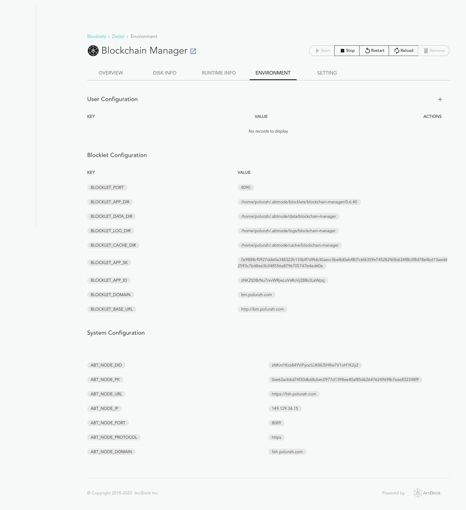

Because Blocklet Server may contain multiple Blocklets, and almost every Blocklet uses at least one port (not required for
static Blocklets), Blocklet Server and Blocklet will use multiple ports, so in production environments, a reverse proxy may be
needed. This document will use Nginx as an example reverse proxy to explain how to deploy ABT
Node with a reverse proxy server and bind a domain name to Blocklet Server Daemon and a blocklet, respectively.

::: warning
Make sure the latest version of Blocklet Server is installed
:::

## Preparation Requirements

- BT Node daemon service running on port 8089
- Blocklet Manager blocklet running on port 8090
- Proxy server: Nginx
- Two domain names:
  - Blocklet Server: abtnode.com
  - Blocklet Manager blocklet: blocklet.abtnode.com

## Nginx Configuration

Nginx configuration:

```
server {
    listen 80;
    server_name abtnode.com;

    location / {
        proxy_pass http://127.0.0.1:8089;
        proxy_set_header Host $host;
        proxy_set_header X-Real-IP $remote_addr;
        proxy_set_header X-Forwarded-For $proxy_add_x_forwarded_for;
    }
}
server {
    listen 80;
    server_name blocklet.abtnode.com;

    location / {
        proxy_pass http://127.0.0.1:8090;
        proxy_set_header Host $host;
        proxy_set_header X-Real-IP $remote_addr;
        proxy_set_header X-Forwarded-For $proxy_add_x_forwarded_for;
    }
}
```

This configuration binds the domain name `abtnode.com` to port 8089 and binds the domain name `blocklet.abtnode.com` to
port 8090. Make sure that Host header is passed to the upstream service through the proxy server.

## Update Blocklet Server Configuration

After configuring the proxy, you need to modify the configuration file of Blocklet Server and update the domain name of ABT
Node to the configuration file:

```yaml
node:
  name: 'Blocklet Server [polunzh]'
  description: Container of useful blocklets from ArcBlock and its Developer Community
  sk: >-
    0x4000d4f04d39c700003838f04e0eb7c4006a841a2f12ed762b577b2c8ab07acbe63acb6d74f30db68cbec0977d1398ee40af85d62647624969fb7eae832348f9
  pk: '0xe63acb6d74f30db68cb0c0907d1398ee40af85d62647624969fb7eae832348f9'
  did: zNKmYKcs84YViFyocUJKMJ5HRw001oH1K2y2
  dataDir: /home/demo/.abtnode
  domain: 'abtnode.com'
  ip: 192.168.0.1
  port: 8089
  https: true
  secret: '0xa5cd176753101e5f12e604b6a741fed382c19ecfe45cd9d32a5d231404b41f23'
  owner:
    pk: ''
    did: ''
blocklet:
  port: 8089
  registry: 'https://blocklet.arcblock.io'
  owner:
    pk: ''
    did: ''
```

::: success
If HTTPS is enabled, you need to set the `https` property in the configuration file to `true`, as in the configuration
file above.
:::

After modifying the configuration file, you need to restart the Blocklet Server and update the configuration. You can restart
it through the Blocklet Server CLI command:

```
blocklet server start -u
```

After restarting the service, you can use the domain name to access the node.

## Configure the domain name of the blocklet

On the **Blocklets -> Detail -> Setting** page, you can configure the domain name of the Blocklet, fill in the domain
name and click Save, then **Restart Blocklet**


::: warning
Restarting the blocklet will make the modified domain name take effect
:::

## Others

You can find all the environment variables when the blocklet is running, such as the port, current domain name, IP,
etc., on the **Blocklets -> Detail -> Environment** page.



## Important

- Currently, you can only modify the node's IP and domain name by manually modifying the node's configuration file.
- HTTPS needs to be enabled for Blocklet Server Daemon and all blocklets for HTTPS to work.
