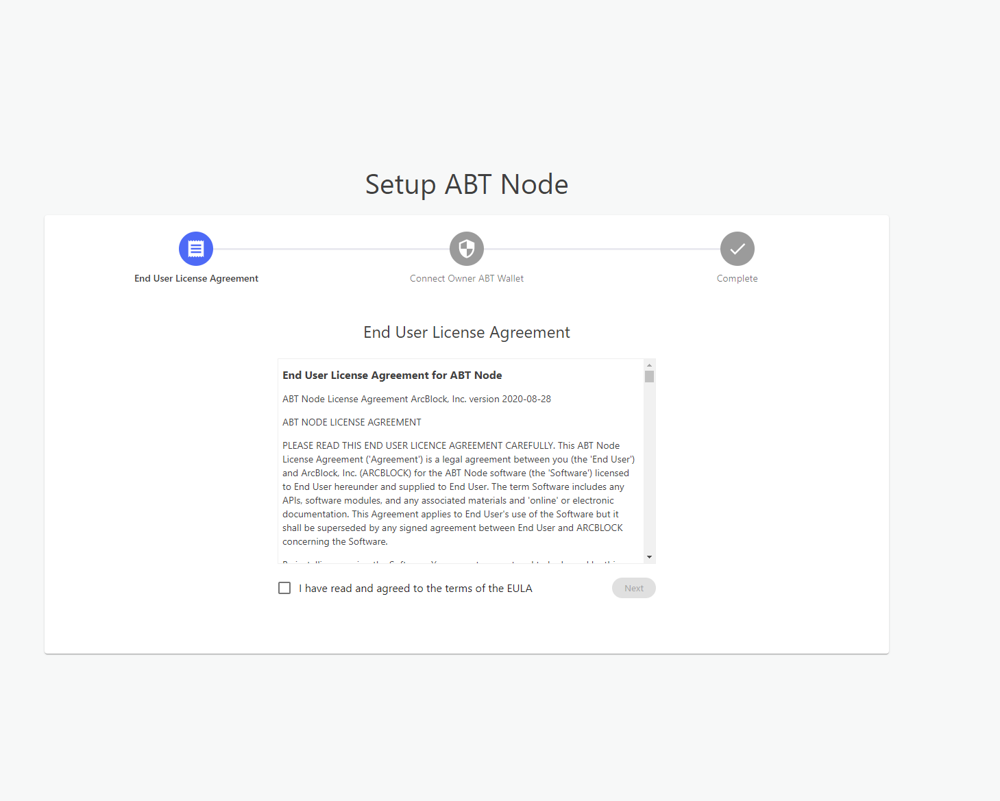
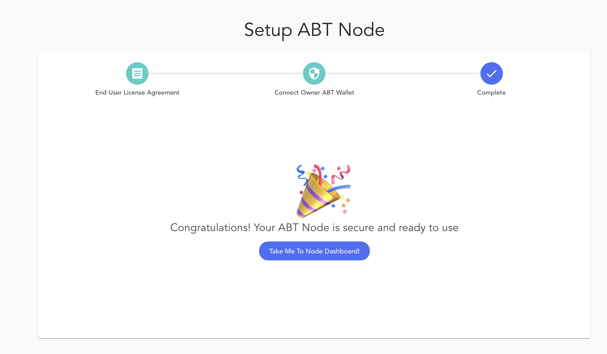

Once Blocklet Server has started you need to access the node dashboard to work with it. To do so, please make sure you are connected to the network of the deployed Blocklet Server.

## Install DID Wallet

Access to Blocklet Server is authorized using DID Wallet, ArcBlock’s decentralized identity solution. You can access [DID Wallet](https://abtwallet.io) in either of the following ways :
- Install the iOS / Android mobile app from [DID Wallet](https://abtwallet.io).
- Create your DID Wallet on https://web.abtwallet.io/

## Access Blocklet Server

Access the Blocklet Server from your browser; as a first step, you must accept ArcBlock's End-User Agreement.

Next, scan the generated QRCode using your ArcBlock DID Wallet. It will authorize access to the Blocklet Server from your wallet.

After authorization you will have ownership of the Blocklet Server. You will have full access to all components of the respective Blocklet Server. You can perform administration tasks not limiting to the following :
- Monitor Blocklet Server KPIs (CPU, memory, storage)
- Use the Store to install Blocklets
- Update and remove Blocklets
- Configure routing to the different apps
- Add and remove team member
- Troubleshoot using logs
- Provide SSH access to the Blocklet Server
- API Access keys

