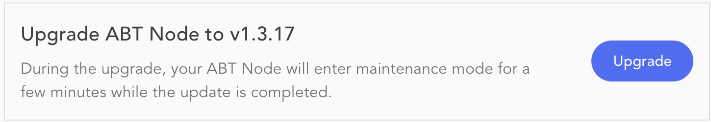

> 
This page is incomplete and must be updated

### Update Check

Blocklet Server can perform a daily check for an available newer version. Optionally, there is a _check for updates_ button to verify manually if a newer version is available.

Blocklet Server does not perform auto-upgrade. An admin user must confirm the upgrade process.

### Add to Blocklet Launcher
