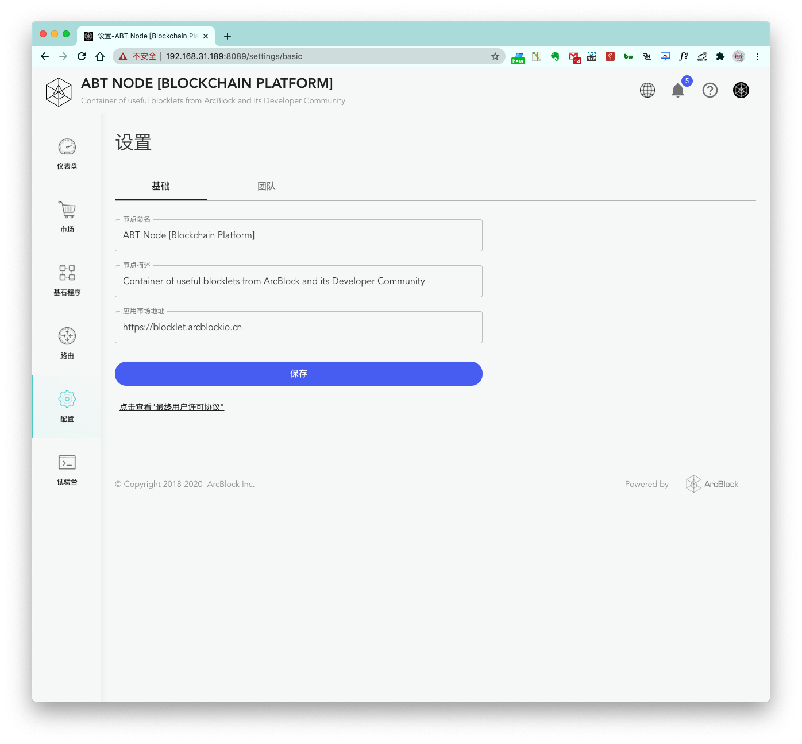

首先看一下节点配置页面的外观：

### 节点名称

用于节点控制台页面顶部的展示。

### 节点描述

用于节点控制台页面顶部的展示。

### Blocklet 市场地址

一般默认配置即可，用于配置 `市场` 页面获取 Blocklet 列表的数据源。目前，ArcBlock 官方提供了一个 Blocklet store 地址：

1. [https://store.blocklet.dev](https://store.blocklet.dev)
