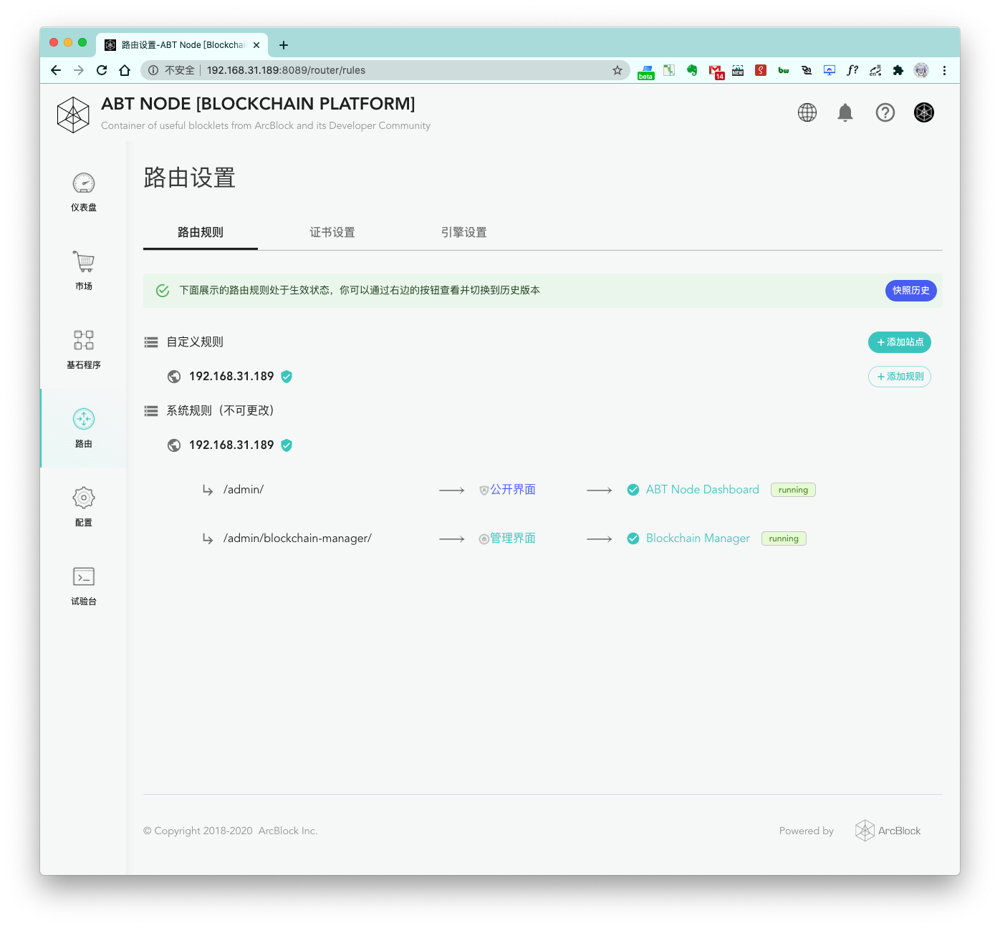
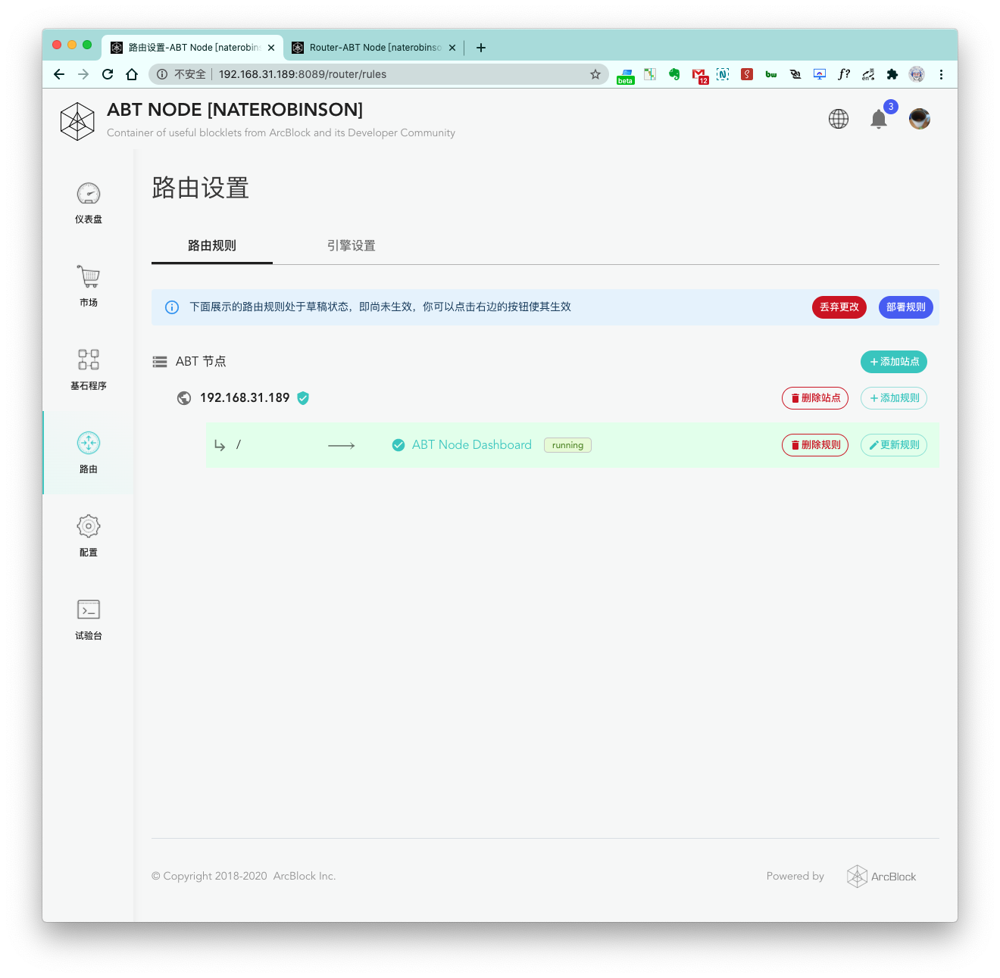
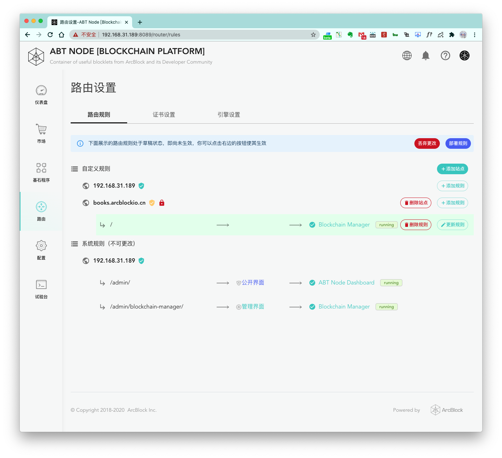
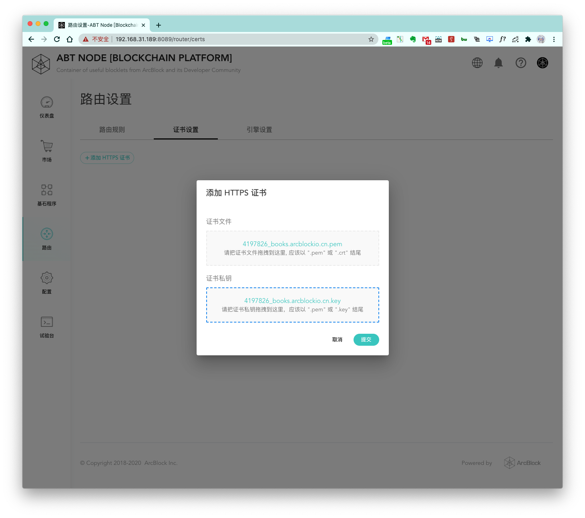
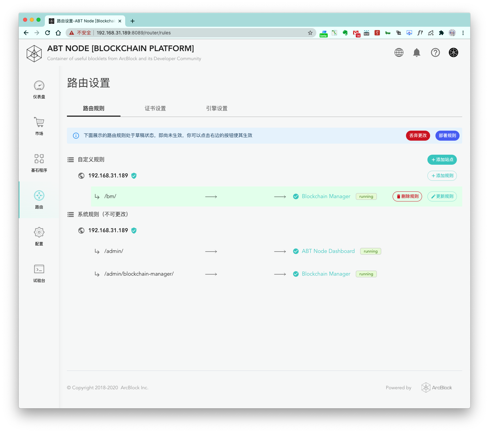
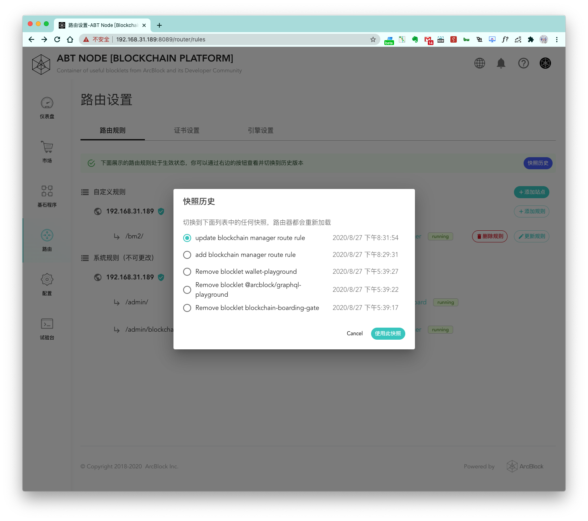

## 第一步，配置路由引擎

如果在初始化 Blocklet Server 时将 `none` 设置为路由引擎，Blocklet 的访问是以 `IP` 加 `端口` 的形式，当我们在路由引擎设置界面设置了路由引擎为 `Nginx` 之后，`路由规则` 栏目便会出现，我们需要点击 `路由规则` 切换到规则页面进行下面的步骤。


## 第二步，添加站点



首次进来的页面如图所示，目前还没有任何站点，我们动手添加第一个站点吧，点击 `+添加站点` 按钮，将会看到下面的页面：


#### 1. 站点域名或 IP 输入框

这边默认会将本机的对外访问 IP 填入，如果你想要配置域名的话，可以修改此处，填入你的域名名称

#### 2. 该站点根目录默认请求转发到哪个服务

默认的话，一个站点的根目录请求会转发给当前的 Blocklet Server 服务，你也可以在此做选择自定义

#### 3. 转发的服务的端口配置

这里默认会自动填入，一般无需做额外更改，除非你发现这边默认填入的端口号和你上面选择的被转发的服务的端口号不符再做修改

点击添加之后，默认情况下你将会看到下面的界面：



> 可以看到站点下面默认生成的一条路由规则有一个背景色，这个背景色即表示此路由规则还未真正部署生效

### 为域名站点配置证书

上面的步骤是使用的 IP 配置的站点，不过如果我们配置的是一个域名，生成的站点页面就会是下面这样：



这里我们用 `books.arcblockio.cn` 这个域名用来做测试，并且提前准备好了此域名的 HTTPS 证书，可以看到如果配置的是域名，会出来 `+更新 HTTPS 证书` 的按钮，点击进行更新配置:



选择好证书文件和证书私钥之后，即可完成提交。如果证书配置正确，站点域名旁边的状态符号也会从红色变成绿色。


## 第三步，添加路由规则

站点添加完成之后，就可以在站点下面配置自己的路由规则了。通过自定义的路由规则可以将在运行的 Blocklet 服务都自定义到对应的路由下面：


上图中，我们为本地已经在运行的 `BlockChain Manager` Blocklet 服务添加了一个路由规则为 `bm`, 端口号会默认填写好，一般无需额外的更改。点击 `添加` 之后即可完成一个路由规则的添加，添加完之后如下图：



此时路由规则还未真正生效，我们继续下面的步骤。

## 第四步，部署路由规则

可以看到，当我们新添加了站点或路由规则，在顶部会出现两个按钮：`丢弃更改` 和 `部署规则`。

#### 丢弃更改

会放弃此次的操作，将整个路由规则回到更改前的状态

#### 部署规则

点击 `部署规则` 并成功后，路由规则的更改才会真正的生效，点击之后页面如下图：


这里会要求我们做一个部署日志记录，方便后面我们维护以及做回滚路由规则等操作。最后，点击 `生成快照并部署` 完成路由规则部署。

## 第五步，验证路由规则


部署成功之后，即可进行点击进行访问验证：


可以看到访问 `http://[替换成你的 ip]/bm/?__t=1596508019533` 已经可以正常打开对应的 Blocklet 服务了，说明我们的部署已经生效。

## 其他一，更新或删除路由规则

#### 更新路由规则

将上面的 `bm` 路由规则更改成 `bm2` 试试吧


点击 `确认，更新吧` 按钮，并且执行一次 `部署规则` 操作，我们访问 `http://[替换成你的 ip]/bm2/?__t=1596508019533` 进行尝试：


可以更改的路由规则已经生效。

#### 删除路由规则

点击 `删除规则` 按钮即可触发删除操作，删除完成之后同样需要执行一次 `部署规则` 操作完成重新部署，部署完成之后，可以看到刚刚的删除的路由已经处于无法访问的状态。

## 其他二，快照历史

上面的实践步骤中，我们每次执行 `部署规则` 操作都会被要求做一次日志维护，这正是给 `快照历史` 使用的，快照历史可以方便的将我们每一次部署操作记录下来，同样也可以通过快照历史快速的将路由规则切回到之前的某一次更改，下面是使用快照历史的例子：



点击使 `使用此快照` 按钮，我们可以快速切回到之前的某一次部署。

## 其它三，必须的 Nginx 编译配置参数

Blocklet Server 依赖的 Nginx 必须包含下列配置参数：

- `--with-pcre`
- `--with-openssl`
- `--with-zlib`
- `--with-stream`
- `--with-http_ssl_module`
- `--with-stream_ssl_module`
- `--with-http_realip_module`
- `--with-stream_realip_module`

## 其他四，Nginx 问题排除

如果 Nginx 没有成功运行，试试下面的方法进行修复。

在成功修复之后，用下面的命令对 Blocklet Server 进行重启。

```bash
ubuntu@ubuntu:~$ blocklet server stop && blocklet server start
ℹ Load config from /home/ubuntu/.abtnode.yml
ℹ Node did from config zNKhAjw6ktz37Ysb3PqBbgaZqZ59Td9fXR7G
✔ abt-node-daemon is stopped successfully
✔ abt-node-db-hub is stopped successfully
✔ Routing engine is stopped successfully
✔ Done!
ℹ Load config from /home/ubuntu/.abtnode.yml
ℹ Node did from config zNKhAjw6ktz37Ysb3PqBbgaZqZ59Td9fXR7G
✔ Blocklet Server DB Hub was started successfully
✔ Blocklet Server Daemon started successfully: http://192.168.1.10:8089
```

### 无法绑定 80 端口

如果你遇到这个错误，说明 Nginx 没有访问 80 端口的权限（这个错误和 [另外一个错误](#port-already-in-use) 比较相似）

```
nginx: [emerg] bind() to 0.0.0.0:80 failed (13: Permission denied)
```

第一步，获取到 Nginx 的路径。

```bash
ubuntu@ubuntu:~$ which nginx
/usr/sbin/nginx
```

给予 Nginx 0-1024 端口的访问权限（如果你的 Nginx 路径不是 `/usr/sbin/nginx`, 用你的 Nginx 路径替换即可）

```bash
ubuntu@ubuntu:~$ sudo setcap 'cap_net_bind_service=+ep' /usr/sbin/nginx
[sudo] password for ubuntu:
```

如果执行完上面的操作，你还是得到一样的错误，那么可以先看看本地有所有的 Nginx 路径，然后对每一个都执行上面的解决步骤。

```bash
ubuntu@ubuntu:~$ which -a nginx
/usr/sbin/nginx
/sbin/nginx
```

### 没有写日志文件的权限

如果你遇到了下面其中一种错误，说明 Nginx 此时无法写日志文件。

```
nginx: [alert] could not open error log file: open() "/var/log/nginx/error.log" failed (13: Permission denied)
```

```
nginx: [alert] could not open error log file: open() "/var/log/nginx/access.log" failed (13: Permission denied)
```

默认情况下，日志文件存储在 `/var/log/nginx` 目录下。如果你自定义了日志文件存储路径，可以在 `/etc/nginx/nginx.conf` 找到此路径。（请记得用你自己的 Nginx 日志路径替换 `/var/log/nginx`）

```bash
ubuntu@ubuntu:~$ sudo chmod -R a+rw /var/log/nginx
[sudo] password for ubuntu:
```

### 80 端口已经被占用

如果遇到此错误，说明 80 端口此时正在使用中（这个错误和 [这个错误](#no-access-to-port-80) 类似）。

```
nginx: [emerg] bind() to 0.0.0.0:80 failed (98: Address already in use)
nginx: [emerg] bind() to 0.0.0.0:80 failed (98: Address already in use)
nginx: [emerg] bind() to 0.0.0.0:80 failed (98: Address already in use)
nginx: [emerg] bind() to 0.0.0.0:80 failed (98: Address already in use)
nginx: [emerg] bind() to 0.0.0.0:80 failed (98: Address already in use)
nginx: [emerg] still could not bind()
```

如果你确定当前的 80 端口是被另一个 Nginx 进程占用，可以执行下面的命令解决。

```bash
ubuntu@ubuntu:~$ sudo killall nginx
[sudo] password for ubuntu:
```

如果当前的 80 端口是被别的进程占用，请使用下面的命令解决。

```bash
ubuntu@ubuntu:~$ sudo fuser 80/udp 80/tcp
[sudo] password for ubuntu:
80/tcp:              329828 329829
```

复制这些 PID 然后用在下面的命令里面（请用您获得的 PID 替换 `329828 329829`）

```bash
ubuntu@ubuntu:~$ sudo kill 329828 329829
[sudo] password for ubuntu:
```

### 启动成功，但是无法通过 80 和 443 端口访问

这个可能和防火墙的设置有关，确保 80 和 443 端口可以通过防火墙。

还存在其它的可能，比如：如果是开发的环境下，防火墙的设置也没有问题，但是机器上安装了杀毒软件，可以尝试关掉杀毒软件再试一下。
